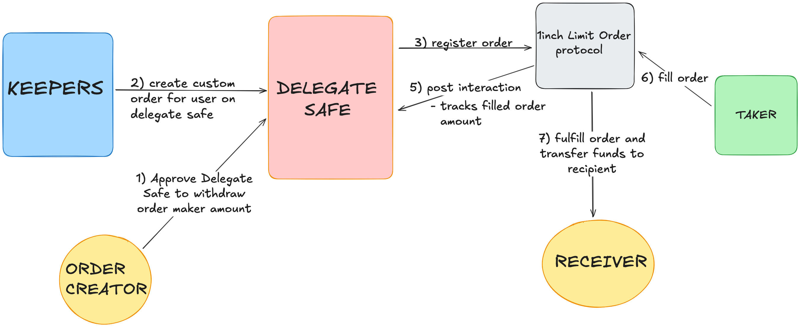

# 1edge Smart Contracts



## Overview

This directory contains the smart contracts for the 1edge protocol, primarily the `DelegateProxy` contract that enables users to create and manage limit orders on the 1inch Limit Order Protocol.

## Key Features

- **Gas Optimized**: ~30% reduction in gas costs through storage optimization
- **JIT Order Funding**: Uses pre/post interaction hooks for just-in-time fund transfers from user to 1inch
- **Batch Operations**: Efficient multi-order creation and status checking
- **EIP-1271 Support**: Contract-based signatures for 1inch integration
- **Storage Cleanup**: Automatic cleanup when orders are fully filled

## Quick Start

### Installation

```bash
bun install
```

### Compile Contracts

```bash
bunx hardhat compile
```

### Run Tests

```bash
# Run all tests
bunx hardhat test

# Run specific test file
bunx hardhat test tests/DelegateProxy.test.ts

# Run integration tests
bunx hardhat test tests/DelegateProxyIntegration.test.ts
```

### Deploy

```bash
# Make sure KEEPER_PK is set in .env
bunx hardhat run scripts/deployDelegateProxy.ts --network <network>
```

## Contract Details

### DelegateProxy.sol

The main contract that:

- Creates limit orders on behalf of users
- Manages order lifecycle with pre/post interaction hooks
- Implements EIP-1271 for signature validation
- Optimizes gas through packed storage structures

### Gas Optimization

The contract uses a single packed struct mapping instead of multiple mappings:

```solidity
struct OrderInfo {
    address maker;
    uint256 remainingAmount;
    bool signed;
}
mapping(bytes32 => OrderInfo) private orders;
```

This reduces:

- Storage slots from 3 to 2 per order
- Order creation gas from ~150k to ~110k
- Deployment size by ~30%

## Testing

The test suite includes:

- Unit tests for all contract functions
- Integration tests simulating the full order flow
- Gas optimization verification
- Security constraint testing

Test results show:

- Order creation: ~107k gas
- Batch 5 orders: ~314k gas
- Deployment: ~1M gas

## Environment Variables

Required in `.env`:

- `KEEPER_PK`: Private key for the keeper account
- `ETH_RPC_URL`: Ethereum RPC endpoint (for mainnet deployment)

## Development

This project uses:

- **Bun** as the JavaScript runtime and package manager
- **Hardhat** for smart contract development
- **Solidity 0.8.30** with optimizer settings (200 runs)
- **TypeScript** for tests and scripts

Always use `bunx` instead of `npx` when running Hardhat commands.

## Network Configuration

The Hardhat configuration automatically loads network settings from `back/1edge.config.json`, which includes:

- Ethereum, Polygon, BSC, Arbitrum, Optimism, Avalanche, and Base networks
- RPC endpoints can be overridden using environment variables (e.g., `BASE_RPC_URL`)
- Tests run on a **Base fork by default** (block 22500000) for consistency

### Available Networks

```bash
# Deploy to specific network
bunx hardhat run scripts/deployDelegateProxy.ts --network ethereum
bunx hardhat run scripts/deployDelegateProxy.ts --network base
bunx hardhat run scripts/deployDelegateProxy.ts --network arbitrum

# Run tests on different forks (modify hardhat.config.ts forking section)
bunx hardhat test --network hardhat
```

### Network Details

| Network   | Chain ID | RPC Endpoint                          |
| --------- | -------- | ------------------------------------- |
| Ethereum  | 1        | https://eth.llamarpc.com              |
| Polygon   | 137      | https://polygon-rpc.com               |
| BSC       | 56       | https://bsc-dataseed.binance.org      |
| Arbitrum  | 42161    | https://arb1.arbitrum.io/rpc          |
| Optimism  | 10       | https://mainnet.optimism.io           |
| Avalanche | 43114    | https://api.avax.network/ext/bc/C/rpc |
| Base      | 8453     | https://mainnet.base.org              |
