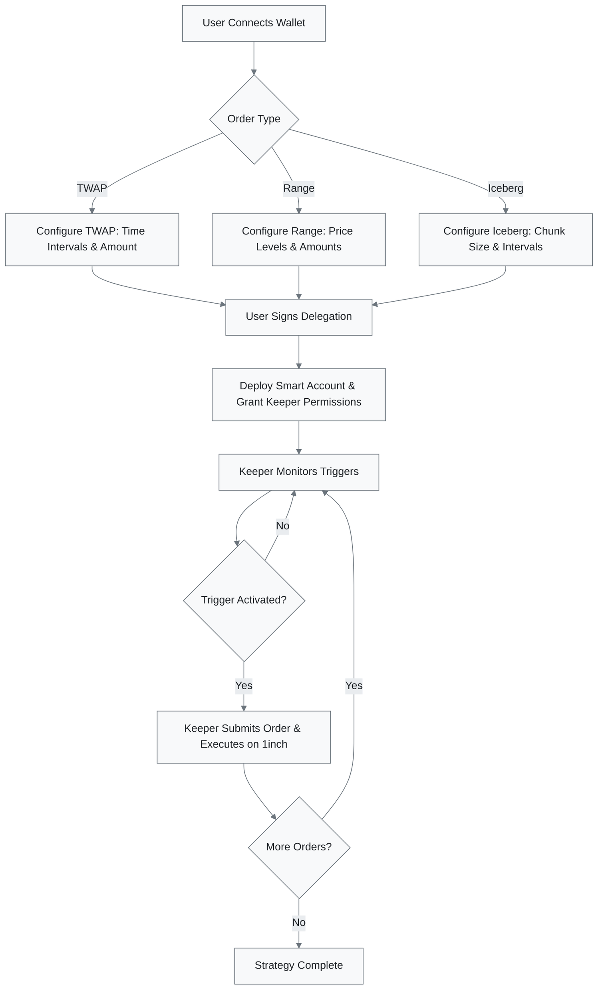
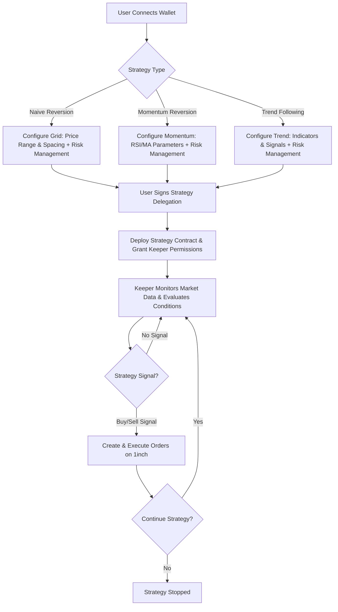
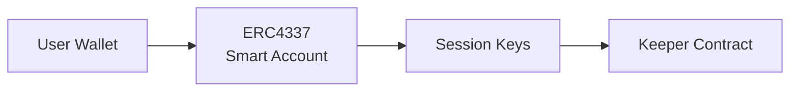
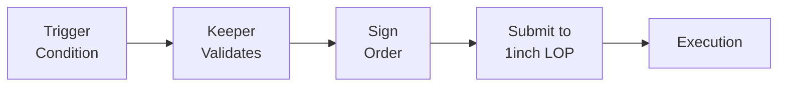

# 1edge Documentation

> **Alpha Software**: This platform is in active development. Use with caution and never risk funds you cannot afford to lose.

## Overview

1edge is an advanced trading platform built on top of 1inch's Limit Order Protocol (LOP) that enables users to create sophisticated order types and implement automated market making strategies. The platform combines on-chain smart contracts with off-chain keeper infrastructure to provide a seamless trading experience.

## Architecture

### Core Components

| Component | Description | Implementation |
|-----------|-------------|----------------|
| **Advanced Order Types** | TWAP, Range Orders, Iceberg Orders | TypeScript order watchers with 1inch SDK integration |
| **Market Making Strategies** | Naive Reversion, Momentum Reversion, Trend Following | Strategy contracts with technical indicator triggers |
| **Delegation System** | ERC4337 Smart Accounts with session keys | Gasless execution with keeper permissions |
| **Keeper Infrastructure** | Off-chain monitoring and order execution | Microservices architecture with real-time monitoring |
| **Trigger System** | Price, time, volume, and technical indicator triggers | Event-driven architecture with 5-second polling |
| **Frontend Interface** | User-friendly strategy configuration and monitoring | Next.js 15 with React 19 and ShadCN UI |

## User Flows

### Advanced Orders Flow

### Market Making Strategy Flow

## Technical Implementation

### On-Chain Components

#### Smart Account Architecture

#### Order Execution Flow

### Off-Chain Components

#### Keeper Infrastructure

| Component | Function | Implementation |
|-----------|----------|----------------|
| **Market Data Aggregation** | Real-time price feeds from multiple sources | CCXT integration with weighted price aggregation |
| **Trigger Monitoring** | Continuous evaluation of user-defined conditions | 5-second polling with event-driven architecture |
| **Order Management** | Queue and batch order submissions | Asynchronous processing with retry mechanisms |
| **Risk Management** | Position sizing and exposure limits | Configurable limits with automatic position tracking |

#### Data Sources

| Type | Source | Purpose |
|------|--------|----------|
| **Primary** | Binance, Bybit, OKX, Bitget APIs | Real-time market data via CCXT |
| **Secondary** | 1inch Orderbook API | Order status and execution tracking |
| **On-chain** | Ethereum, Polygon, Arbitrum RPCs | Price oracles and contract events |

## Order Types Specification

### TWAP (Time-Weighted Average Price)

**Purpose**: Execute large orders over time to minimize market impact

| Parameter | Description | Type |
|-----------|-------------|------|
| `totalAmount` | Total amount to trade | Number |
| `timeWindow` | Duration over which to execute | Duration |
| `intervalCount` | Number of sub-orders | Integer |
| `priceLimit` | Maximum acceptable price deviation | Percentage |

**Trigger**: Time-based intervals

### Range Orders

**Purpose**: Single-sided grid orders for specific price ranges

| Parameter | Description | Type |
|-----------|-------------|------|
| `baseAsset` | Asset to trade | Token Address |
| `quoteAsset` | Quote currency | Token Address |
| `priceRange` | [minPrice, maxPrice] | Price Range |
| `gridLevels` | Number of price levels | Integer |
| `amountPerLevel` | Amount allocated per level | Number |

**Trigger**: Price crossing threshold levels

### Iceberg Orders

**Purpose**: Hide large order size by revealing only small portions

| Parameter | Description | Type |
|-----------|-------------|------|
| `totalAmount` | Total order size | Number |
| `visibleAmount` | Amount visible at any time | Number |
| `priceLimit` | Limit price for execution | Price |
| `refreshThreshold` | When to refresh visible portion | Threshold |

## Market Making Strategies

### Strategy Overview

| Strategy | Assumption | Implementation Status |
|----------|------------|----------------------|
| **Naive Reversion** | Prices mean-revert around a central value |  Available |
| **Momentum Reversion** | Incorporate momentum indicators for enhanced reversion |  Available |
| **Trend Following** | Follow established market trends with confirmations | In Development |

### Naive Reversion

| Feature | Implementation |
|---------|----------------|
| **Order Placement** | Buy orders below current price, sell orders above |
| **Grid Adjustment** | Dynamic spacing based on volatility metrics |
| **Risk Management** | Position limits and exposure controls |

### Momentum Reversion

| Feature | Implementation |
|---------|----------------|
| **RSI Integration** | Grid adjustment based on RSI overbought/oversold levels |
| **Trend Confirmation** | Moving average trend validation before order placement |
| **Dynamic Spreads** | Automatic spread adjustment based on market conditions |

### Trend Following

| Signal Type | Implementation |
|-------------|----------------|
| **Moving Average Crossovers** | Golden cross and death cross detection |
| **Breakout Confirmations** | Volume-weighted breakout validation |
| **Volume Validation** | Minimum volume thresholds for signal confirmation |

## Risk Management

### Position Limits

| Limit Type | Description | Status |
|------------|-------------|--------|
| **Per Asset Exposure** | Maximum exposure limit per individual asset |  Implemented |
| **Portfolio Risk** | Total portfolio risk limits and diversification |  Implemented |
| **Leverage Constraints** | Maximum leverage ratios per strategy type |  Implemented |

### Stop Loss Mechanisms

| Mechanism | Trigger | Implementation |
|-----------|---------|----------------|
| **Price-based Stops** | Price threshold breaches |  Automated |
| **Time-based Exits** | Maximum position duration |  Automated |
| **Drawdown Limits** | Portfolio drawdown thresholds |  Automated |

### Emergency Controls

| Control | Access Level | Status |
|---------|-------------|--------|
| **User Override** | Individual user control |  Available |
| **Keeper Pause** | Keeper service level |  Available |
| **Contract Upgrades** | Multi-signature admin control |  Available |

## Gas Optimization

### Batch Operations

| Optimization | Description | Gas Savings |
|--------------|-------------|-------------|
| **Multi-Order Submissions** | Bundle multiple orders in single transaction | ~40-60% |
| **Efficient Storage** | Optimized storage patterns and data packing | ~20-30% |
| **External Call Minimization** | Reduced external contract interactions | ~15-25% |

### Session Keys

| Feature | Benefit | Implementation |
|---------|---------|----------------|
| **Signature Reduction** | Fewer user signatures required |  ERC4337 Integration |
| **Automated Execution** | Gasless keeper operations |  Session Key Management |
| **Granular Permissions** | Fine-grained access controls |  Permission System |

## Security Considerations

### Smart Contract Security

| Security Measure | Implementation | Status |
|------------------|----------------|--------|
| **Testing Suite** | Comprehensive unit and integration tests |  Implemented |
| **Formal Verification** | Mathematical proofs for critical functions | 🚧 In Progress |
| **Multi-signature Controls** | Admin operations require multiple signatures |  Implemented |

### Keeper Security

| Security Layer | Implementation | Status |
|----------------|----------------|--------|
| **Key Management** | Hardware security modules and encrypted storage |  Implemented |
| **Rate Limiting** | API and execution rate limits with monitoring |  Implemented |
| **Fail-safe Mechanisms** | Automatic shutdown on anomaly detection |  Implemented |

### User Security

| Security Feature | Description | Status |
|------------------|-------------|--------|
| **Non-custodial** | Users maintain full control of their assets |  Core Design |
| **Transparent Execution** | All operations visible on-chain |  Implemented |
| **Revocable Permissions** | Users can revoke keeper access anytime |  Implemented |

## Getting Started

| User Type | Getting Started | Documentation |
|-----------|----------------|---------------|
| **End Users** | Visit web interface to configure trading strategies | [User Guide](./user-guide.md) 🚧 |
| **Developers** | Check API documentation and smart contract interfaces | [Developer Docs](./developer-guide.md) 🚧 |
| **Integrators** | Review SDK documentation and example implementations | [Integration Guide](./integration-guide.md) 🚧 |

## API Reference

| Documentation | Description | Status |
|---------------|-------------|--------|
| [1inch LOP Documentation](./1inch%20LOP/) | Complete 1inch Limit Order Protocol integration guide |  Available |
| [Orderbook API Reference](./Orderbook%20API/) | 1inch Orderbook API endpoints and examples |  Available |
| Smart Contract Interfaces | Contract ABIs and interaction patterns | 🚧 Coming Soon |
| Keeper API Documentation | Keeper service API and webhook endpoints | 🚧 Coming Soon |

## Contributing

| Contribution Type | Guidelines | Status |
|-------------------|------------|--------|
| **Code Contributions** | See [CONTRIBUTING.md](../CONTRIBUTING.md) for development guidelines |  Open |
| **Bug Reports** | Use GitHub issues with detailed reproduction steps |  Welcome |
| **Feature Requests** | Submit enhancement proposals via GitHub discussions |  Welcome |
| **Documentation** | Help improve docs and examples |  Needed |

## License

| License | Details |
|---------|---------|
| **MIT License** | See [LICENSE](../LICENSE) for complete terms |  Open Source |
