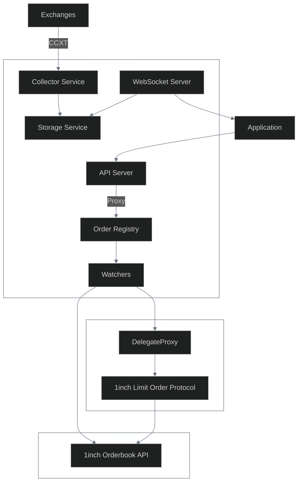
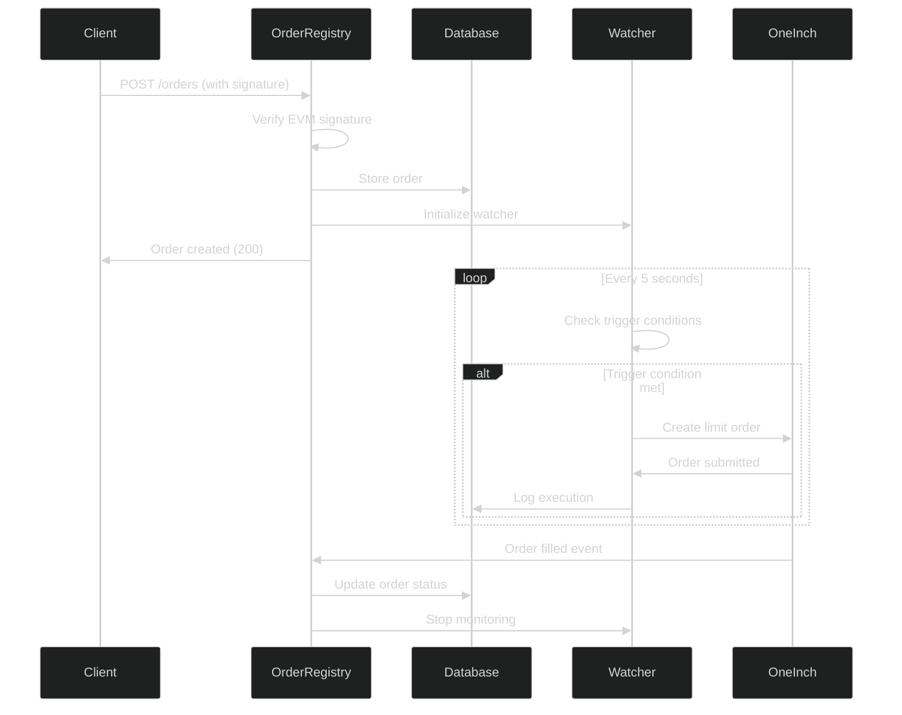

# 1edge Architecture

Technical overview of the 1edge trading platform architecture, services, and integrations.

## Project Overview

1edge is a trading platform built on 1inch's Limit Order Protocol (LOP) that enables users to create order types and implement automated market making strategies. The platform combines on-chain smart contracts with off-chain keeper infrastructure.

## Architecture Overview

### Technology Stack

| Component             | Technology                                              |
| --------------------- | ------------------------------------------------------- |
| **Runtime**           | Bun (JavaScript/TypeScript runtime and package manager) |
| **Backend**           | TypeScript with microservices architecture              |
| **Frontend**          | Next.js 15 with React 19, ShadCN UI, and Tailwind CSS   |
| **Database**          | SQLite with Bun's native SQLite support                 |
| **Market Data**       | CCXT for computing high frequency index prices          |
| **Smart Contracts**   | Hardhat development environment                         |
| **1inch Integration** | Official 1inch Limit Order SDK v4                       |

### Monorepo Structure

| Directory    | Purpose                                |
| ------------ | -------------------------------------- |
| `common/`    | Shared types, constants, and utilities |
| `back/`      | Backend services                       |
| `front/`     | Frontend application                   |
| `contracts/` | Smart contracts (Hardhat project)      |
| `docs/`      | Documentation                          |
| `scripts/`   | Build and utility scripts              |
| `data/`      | Local database and cache files         |

## Backend Architecture

The backend implements a microservices architecture with isolated services communicating via HTTP and WebSocket protocols.

### Core Services

| Service              | File                 | Purpose                               | Port  |
| -------------------- | -------------------- | ------------------------------------- | ----- |
| **Collector**        | `collector.ts`       | Price data aggregation from exchanges | 40008 |
| **Order Registry**   | `orderRegistry.ts`   | Order lifecycle management            | 40009 |
| **API Server**       | `apiServer.ts`       | RESTful API for frontend              | 40005 |
| **WebSocket Server** | `websocketServer.ts` | Real-time price streaming             | 40007 |
| **Status Checker**   | `statusChecker.ts`   | Health monitoring                     | 40011 |

#### Collector Service

- Aggregates price data from multiple exchanges via CCXT
- Updates weighted averages for configured ticker symbols
- Caches market data with configurable TTL
- Performs technical analysis on OHLCV data

#### Order Registry Service

The Order Registry is the core service responsible for all order lifecycle management and execution. It operates as an isolated HTTP service.

- Standalone HTTP service for order management and execution
- Integrates with 1inch Limit Order SDK for order creation
- Manages complete order lifecycle (creation, monitoring, execution)
- Supports multiple order types (TWAP, Range, Iceberg, Stop-Limit, DCA)
- Automatic watcher recovery on service restart
- EVM signature verification for order authentication
- Isolated from main API server for DDOS protection

#### API Server

- RESTful API for frontend communication
- Proxies order requests to OrderRegistry service
- Real-time market data endpoints
- CORS support for development and production
- Request/response validation and error handling

#### WebSocket Server

- Real-time price streaming to frontend clients
- WebSocket connection management
- Live market data broadcasting

#### Status Checker Service

- Health monitoring for all services including OrderRegistry
- Latency tracking and performance metrics
- Service availability reporting

### Supporting Infrastructure

| Service                 | Purpose                                                                                |
| ----------------------- | -------------------------------------------------------------------------------------- |
| **Storage Service**     | SQLite database abstraction with order, position, strategy, and market data management |
| **Config Service**      | Configuration management with environment variable overrides                           |
| **Market Data Service** | CCXT integration and price feed aggregation                                            |
| **Analysis Service**    | Technical indicator calculations using the `technical-indicators` library              |

### Data Flow



## Frontend Architecture

The frontend is built with Next.js 15 and React 19.

### Key Components

| Component       | Purpose                       | Status |
| --------------- | ----------------------------- | ------ |
| **StatusPanel** | Service health monitoring     | Active |
| **FeedsPanel**  | Market data display           | Active |
| **OrdersPanel** | Order management and tracking | Active |
| **DocsLayout**  | Documentation interface       | Active |

### UI Framework

| Component      | Technology                                 |
| -------------- | ------------------------------------------ |
| **Base**       | Next.js 15 with React 19                   |
| **Components** | ShadCN UI (Radix UI primitives + Tailwind) |
| **Icons**      | Lucide React                               |
| **Forms**      | React Hook Form with Zod validation        |
| **Charts**     | Recharts for data visualization            |
| **Theming**    | CSS variables with dark/light mode support |

## Smart Contracts Integration

Integration with 1inch's Limit Order Protocol v4.

### 1inch Limit Order Protocol

The platform integrates with 1inch's Limit Order Protocol v4:

| Feature              | Implementation                                          | Status |
| -------------------- | ------------------------------------------------------- | ------ |
| **Order Creation**   | Using the 1inch SDK to create properly formatted orders | Active |
| **Order Signing**    | EIP-712 signature generation for gasless order creation | Active |
| **Order Submission** | Direct submission to 1inch orderbook                    | Active |
| **Event Monitoring** | Real-time tracking of order fills and cancellations     | Active |

### Multi-Network Support

| Network              | Chain ID | Status    |
| -------------------- | -------- | --------- |
| **Ethereum Mainnet** | 1        | Supported |
| **Polygon**          | 137      | Supported |
| **BSC**              | 56       | Supported |
| **Arbitrum**         | 42161    | Supported |
| **Optimism**         | 10       | Supported |
| **Avalanche**        | 43114    | Supported |
| **Base**             | 8453     | Supported |

## Order Registry Architecture

The Order Registry operates as an isolated HTTP service.

### Service Isolation Benefits

| Benefit                 | Description                                                | Status      |
| ----------------------- | ---------------------------------------------------------- | ----------- |
| **DDOS Protection**     | Order processing isolated from main API server attacks     | Implemented |
| **Independent Scaling** | Can be deployed and scaled separately from other services  | Implemented |
| **Fault Tolerance**     | API server failures don't affect ongoing order monitoring  | Implemented |
| **Service Recovery**    | Automatic restoration of order watchers on service restart | Implemented |

### HTTP API Endpoints

| Method | Endpoint              | Purpose                                            | Status |
| ------ | --------------------- | -------------------------------------------------- | ------ |
| `GET`  | `/ping`               | Health check                                       | Active |
| `GET`  | `/orders`             | Get all orders (optional `?maker=address` filter)  | Active |
| `GET`  | `/orders/{id}`        | Get specific order                                 | Active |
| `POST` | `/orders`             | Create new order (with EVM signature verification) | Active |
| `PUT`  | `/orders/{id}`        | Modify existing order (cancel + create new)        | Active |
| `POST` | `/orders/{id}/cancel` | Cancel order                                       | Active |

### Order Lifecycle Management



### Order Watchers

Each order type implements the `OrderWatcher` interface:

```typescript
interface OrderWatcher {
  shouldTrigger(order: Order): Promise<boolean>;
  trigger(
    order: Order,
    makerAmount: string,
    takerAmount: string,
  ): Promise<void>;
  updateNextTrigger?(order: Order): void;
}
```

### Supported Order Types

| Order Type            | Purpose                                      | Status  |
| --------------------- | -------------------------------------------- | ------- |
| **TWAP**              | Time-weighted average price execution        | Active  |
| **Stop-Limit**        | Price trigger with limit execution           | Active  |
| **Range Orders**      | Grid-style orders within price ranges        | Active  |
| **DCA**               | Dollar-cost averaging with intervals         | Active  |
| **Chase-Limit**       | Trailing limit order                         | Active  |
| **Iceberg**           | Large order concealment with partial reveals | Planned |
| **Grid Trading**      | Market making grid strategy                  | Planned |
| **Momentum Reversal** | RSI and moving average based strategy        | Planned |
| **Breakout**          | Breakout detection strategy                  | Planned |

## Advanced Order Types

The platform supports multiple advanced order types designed to minimize market impact and optimize execution.

### TWAP (Time-Weighted Average Price)

| Feature            | Description                                               | Status |
| ------------------ | --------------------------------------------------------- | ------ |
| **Purpose**        | Execute large orders over time to minimize market impact  | Active |
| **Implementation** | Split orders into smaller chunks over specified intervals | Active |
| **Configuration**  | Total amount, time window, interval count, price limits   | Active |

### Range Orders

| Feature            | Description                                               | Status |
| ------------------ | --------------------------------------------------------- | ------ |
| **Purpose**        | Single-sided grid orders for specific price ranges        | Active |
| **Implementation** | Create multiple limit orders at different price levels    | Active |
| **Configuration**  | Price range, grid levels, amount per level, buy/sell side | Active |

### Iceberg Orders

| Feature            | Description                                            | Status  |
| ------------------ | ------------------------------------------------------ | ------- |
| **Purpose**        | Hide large order size by revealing only small portions | Planned |
| **Implementation** | Dynamically refresh visible portions as orders fill    | Planned |
| **Configuration**  | Total amount, visible amount, refresh threshold        | Planned |

### Market Making Strategies

| Strategy               | Description                                  | Status  |
| ---------------------- | -------------------------------------------- | ------- |
| **Grid Trading**       | Market making grid strategy                  | Planned |
| **Momentum Reversion** | Grid with RSI and moving average adjustments | Planned |
| **Breakout**           | Breakout detection strategy                  | Planned |

## Technical Indicators & Analysis

Real-time technical analysis using the `technical-indicators` library.

### Supported Indicators

| Indicator             | Purpose                                                             | Status      |
| --------------------- | ------------------------------------------------------------------- | ----------- |
| **RSI**               | Relative Strength Index - Momentum oscillator                       | Active      |
| **EMA/SMA**           | Moving Averages - Trend following indicators                        | Active      |
| **MACD**              | Moving Average Convergence Divergence - Trend change identification | Active      |
| **Bollinger Bands**   | Volatility and support/resistance levels                            | Active      |
| **ATR**               | Average True Range - Volatility measurement                         | Active      |
| **Custom Indicators** | Extensible framework for additional indicators                      | Development |

### Real-Time Analysis

- Market data is continuously analyzed using the `technical-indicators` library
- Results are cached and updated based on new price data
- Indicator values are used for strategy trigger conditions

## Configuration Management

Environment-based configuration with hierarchical overrides.

### Environment Variables

| Variable              | Purpose                  | Port/Value        | Status   |
| --------------------- | ------------------------ | ----------------- | -------- |
| `API_PORT`            | API Server port          | 40005             | Required |
| `NEXT_PORT`           | Frontend port            | 40006             | Required |
| `WEBSOCKET_PORT`      | WebSocket server port    | 40007             | Required |
| `COLLECTOR_PORT`      | Collector service port   | 40008             | Required |
| `ORDER_REGISTRY_PORT` | Order Registry port      | 40009             | Required |
| `STATUS_CHECKER_PORT` | Status checker port      | 40011             | Required |
| `DB_PATH`             | Database file path       | `./data/1edge.db` | Required |
| `ONE_INCH_API_KEY`    | 1inch API authentication | User provided     | Required |
| `KEEPER_PK`           | Keeper private key       | User provided     | Required |
| `LOG_LEVEL`           | Logging verbosity        | `INFO`            | Optional |

### Network RPC Configuration

| Network       | Variable            | Status   |
| ------------- | ------------------- | -------- |
| **Ethereum**  | `ETH_RPC_URL`       | Required |
| **Polygon**   | `POLYGON_RPC_URL`   | Required |
| **BSC**       | `BSC_RPC_URL`       | Required |
| **Arbitrum**  | `ARBITRUM_RPC_URL`  | Required |
| **Optimism**  | `OPTIMISM_RPC_URL`  | Required |
| **Avalanche** | `AVALANCHE_RPC_URL` | Required |
| **Base**      | `BASE_RPC_URL`      | Required |

### Configuration Files

| File                     | Purpose                                  | Status   |
| ------------------------ | ---------------------------------------- | -------- |
| `back/1edge.config.json` | Default service configurations           | Active   |
| `config.json` (optional) | User overrides for default configuration | Optional |

Environment variables take precedence over configuration files, enabling flexible deployment scenarios.

## Security Considerations

Security measures protecting user funds, private keys, and system integrity.

### Private Key Management

| Security Measure        | Implementation                                        | Status             |
| ----------------------- | ----------------------------------------------------- | ------------------ |
| **Environment Storage** | Keeper private keys stored as environment variables   | Implemented        |
| **No Logging**          | Private keys never logged or exposed in API responses | Implemented        |
| **Session Keys**        | Delegation patterns for enhanced security             | Future Enhancement |

### API Security

| Security Measure       | Implementation                                     | Status      |
| ---------------------- | -------------------------------------------------- | ----------- |
| **CORS Configuration** | Proper CORS setup for frontend access              | Implemented |
| **Input Validation**   | Request validation and sanitization                | Implemented |
| **Rate Limiting**      | Protection against abuse                           | Planned     |
| **Error Handling**     | Secure error responses without information leakage | Implemented |

### Smart Contract Security

| Security Measure      | Implementation                            | Status      |
| --------------------- | ----------------------------------------- | ----------- |
| **Audited Contracts** | Integration with audited 1inch contracts  | Implemented |
| **Order Validation**  | EVM signature verification for all orders | Implemented |
| **Gas Monitoring**    | Gas price monitoring and limits           | Planned     |

## Development Workflow

Development workflow with Bun runtime.

### Setup Commands

| Command               | Purpose                               | Status    |
| --------------------- | ------------------------------------- | --------- |
| `bun run install:all` | Install all project dependencies      | Available |
| `bun run start:all`   | Start all services in production mode | Available |
| `bun run dev:back`    | Start backend services in development | Available |
| `bun run dev:front`   | Start frontend development server     | Available |

### Build & Quality Scripts

| Command              | Purpose                     | Status    |
| -------------------- | --------------------------- | --------- |
| `bun run build`      | Build all components        | Available |
| `bun run lint`       | Code linting and formatting | Available |
| `bun run typecheck`  | TypeScript validation       | Available |
| `bun run pre-commit` | Full validation pipeline    | Available |

### Testing Framework

| Component     | Testing Framework           | Status      |
| ------------- | --------------------------- | ----------- |
| **Backend**   | Bun's built-in test runner  | Development |
| **Frontend**  | Next.js testing integration | Development |
| **Contracts** | Hardhat testing framework   | Development |

## Deployment Architecture

Scalable deployment architecture designed for high availability and performance.

### Production Services

| Service              | Deployment Method                       | Status  |
| -------------------- | --------------------------------------- | ------- |
| **Backend Services** | Containerized microservices             | Planned |
| **Frontend**         | Static site deployment (Vercel/Netlify) | Ready   |
| **Database**         | Persistent SQLite or PostgreSQL         | Ready   |
| **Monitoring**       | Service health and performance tracking | Planned |

### Scaling Considerations

| Aspect              | Implementation                             | Status  |
| ------------------- | ------------------------------------------ | ------- |
| **Service Scaling** | Horizontal scaling of individual services  | Planned |
| **Load Balancing**  | Load balancing for API endpoints           | Planned |
| **Database**        | Database replication and backup strategies | Planned |
| **CDN**             | CDN for frontend assets                    | Planned |

## Integration Points

Integration with DeFi infrastructure and market data providers.

### 1inch Ecosystem

| Integration              | Purpose                       | Status  |
| ------------------------ | ----------------------------- | ------- |
| **Limit Order Protocol** | Core order execution          | Active  |
| **Orderbook API**        | Order submission and querying | Active  |
| **Price Oracle**         | Price validation and triggers | Planned |

### Exchange APIs

| Integration           | Purpose                                | Status             |
| --------------------- | -------------------------------------- | ------------------ |
| **CCXT**              | Multi-exchange market data aggregation | Active             |
| **WebSocket Streams** | Real-time price updates                | Future Enhancement |
| **REST APIs**         | Historical data and order book data    | Active             |

### Blockchains

| Integration          | Purpose                           | Status  |
| -------------------- | --------------------------------- | ------- |
| **JSON-RPC**         | Direct blockchain interaction     | Active  |
| **Event Monitoring** | Real-time contract event tracking | Active  |
| **Gas Optimization** | Dynamic gas price adjustment      | Planned |

---

This architecture provides a foundation for DeFi trading strategies while maintaining security and performance standards. The modular design enables independent scaling and development of each component while ensuring integration across the platform.
