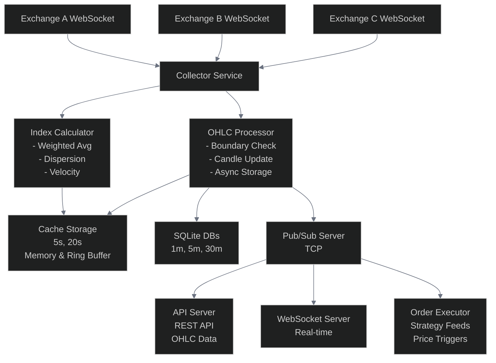

# Collector Service Documentation

> **Protocol Data Engine**: The Collector Service is the core of 1edge's real-time price data aggregation and historical data management.

## Overview

The Collector Service is the core data aggregation and processing component of the 1edge system. It handles real-time price data collection, index price computation, OHLC candle generation, and historical data management with failover capabilities.

| Component | Status | Description |
|-----------|--------|-------------|
| Multi-Exchange Aggregation | Active | Real-time price feeds from multiple sources |
| Index Price Computation | Active | Weighted average calculations with metrics |
| OHLC Candle System | Active | Multiple timeframes with dual storage |
| Historical Data Management | Active | Automatic gap filling and batch retrieval |
| Pub/Sub Architecture | Active | TCP based broadcasting |

## Key Features

### Real-Time Index Price Computation

| Feature | Implementation | Status |
|---------|----------------|--------|
| Multi-Exchange Aggregation | Simultaneous data collection |  |
| Weighted Average Calculation | Configurable source weights |  |
| Advanced Metrics | Velocity, dispersion, volume |  |
| Performance Optimization | Non-blocking queues |  |

### OHLC Candle System

| Timeframe | Storage Type | Performance | Status |
|-----------|--------------|-------------|--------|
| 5s, 20s | Memory Cache | Ultra-fast access |  |
| 1m, 5m, 30m | SQLite Database | Persistent storage |  |
| Async Processing | Non-blocking | Real-time maintained |  |
| Boundary Detection | Automatic | Precise timing |  |

### Historical Data Management

| Feature | Specification | Status |
|---------|---------------|--------|
| Automatic Gap Filling | CCXT + Binance API |  |
| Batch Retrieval | 1,000-candle chunks |  |
| Rate Limiting | 250ms between requests |  |
| Data Retention | 14 days minimum |  |
| Startup Validation | Sanity checks on boot |  |
| Timeframe Construction | 1m → 5m, 30m |  |
| Error Recovery | Graceful retry logic |  |

### High-Performance Pub/Sub Architecture

| Component | Technology | Capability | Status |
|-----------|------------|------------|--------|
| Message Bus | TCP | Dedicated pub/sub server |  |
| Broadcasting | Multi-subscriber | Index prices + OHLC data |  |
| Rate Control | Configurable intervals | Prevents overflow |  |

## Architecture



## Data Flow

### 1. Price Data Ingestion
```text
Exchange WebSocket → onTickerUpdate → calculateWeightedAverages → OHLC Processing → Pub/Sub Broadcast
```

### 2. OHLC Candle Processing
```text
Price Update → Timeframe Check → Boundary Detection → Candle Close/Open → Async Storage → Cache/DB
```

### 3. Historical Data Flow
```text
Startup → Data Sanity Check → Batch CCXT Fetch → Timeframe Construction → SQLite Storage
```

### 4. Batch Historical Data Retrieval
The collector implements a sophisticated batch retrieval system for historical data:

```text
Batch Loop:
1. Calculate time range (14 days from current timestamp)
2. Fetch 1,000 candles from start time
3. Process and store candles in database
4. Update start time to last candle + 1 timeframe
5. Wait 250ms (rate limiting)
6. Repeat until all data fetched or API limit reached
```

**Key Features:**
- **Pagination**: Handles Binance's 1,000-candle API limit by automatically requesting successive batches
- **Rate Limiting**: 250ms delays between requests to avoid API rate limits
- **Error Handling**: Continues with partial data if individual batches fail
- **Progress Tracking**: Logs batch progress and total candles fetched
- **Timeframe Awareness**: Automatically calculates correct timestamp increments for different timeframes

**Performance Metrics:**
- 14 days of 1-minute data: ~20,160 candles in 21 batches (~5.5 minutes)
- 14 days of 5-minute data: ~4,032 candles in 5 batches (~1.5 minutes)
- 14 days of 30-minute data: ~672 candles in 1 batch (~0.5 minutes)

## Storage Architecture

### Per-Pair Database Structure
Each trading pair (e.g., BTCUSDT) has its own SQLite database with the following tables:

```sql
-- 1-minute candles
CREATE TABLE candles_1m (
  timestamp INTEGER PRIMARY KEY,
  open REAL NOT NULL,
  high REAL NOT NULL,
  low REAL NOT NULL,
  close REAL NOT NULL,
  volume REAL NOT NULL,
  created_at INTEGER DEFAULT (strftime('%s', 'now') * 1000)
);

-- 5-minute candles
CREATE TABLE candles_5m (
  timestamp INTEGER PRIMARY KEY,
  open REAL NOT NULL,
  high REAL NOT NULL,
  low REAL NOT NULL,
  close REAL NOT NULL,
  volume REAL NOT NULL,
  created_at INTEGER DEFAULT (strftime('%s', 'now') * 1000)
);

-- 30-minute candles  
CREATE TABLE candles_30m (
  timestamp INTEGER PRIMARY KEY,
  open REAL NOT NULL,
  high REAL NOT NULL,
  low REAL NOT NULL,
  close REAL NOT NULL,
  volume REAL NOT NULL,
  created_at INTEGER DEFAULT (strftime('%s', 'now') * 1000)
);
```

### Cache Structure
Short-timeframe candles are kept in memory:
```typescript
interface CacheEntry {
  candles: OHLCCandle[];
  maxSize: number; // Ring buffer size
}

// Cache limits
{
  5: 720,   // 1 hour of 5s candles
  20: 180,  // 1 hour of 20s candles
}
```

##  API Endpoints

### OHLC Data Retrieval
```http
GET /ohlc/{symbol}?timeframe={seconds}&startTime={timestamp}&endTime={timestamp}&limit={number}
```

**Parameters:**
- `symbol`: Trading pair (e.g., `binance:spot:BTCUSDT`)
- `timeframe`: Timeframe in seconds (5, 20, 60, 300, 1800)
- `startTime`: Start timestamp (optional)
- `endTime`: End timestamp (optional)
- `limit`: Maximum number of candles (optional)

**Response:**
```json
{
  "success": true,
  "data": {
    "symbol": "binance:spot:BTCUSDT",
    "timeframe": 60,
    "candles": [
      {
        "timestamp": 1640995200000,
        "open": 47000.5,
        "high": 47100.0,
        "low": 46900.0,
        "close": 47050.0,
        "volume": 1250.75
      }
    ],
    "count": 1
  }
}
```

### Data Statistics
```http
GET /ohlc-stats/{symbol}
```

**Response:**
```json
{
  "success": true,
  "data": {
    "symbol": "binance:spot:BTCUSDT",
    "statistics": {
      "60": {
        "count": 20160,
        "oldest": "2024-01-01T00:00:00.000Z",
        "newest": "2024-01-15T00:00:00.000Z"
      },
      "300": {
        "count": 4032,
        "oldest": "2024-01-01T00:00:00.000Z",
        "newest": "2024-01-15T00:00:00.000Z"
      },
      "5_cache": {
        "count": 720,
        "maxSize": 720
      }
    }
  }
}
```

## Configuration

### Collector Configuration
```typescript
interface CollectorConfig {
  pollIntervalMs: number;
  tickers: Record<Symbol, AggregatedTickerConfig>;
}

interface AggregatedTickerConfig {
  id: Symbol;
  name: string;
  tf: TimeFrame;
  lookback: number;
  sources: Record<Symbol, { weight: number }>;
}
```

### Example Configuration
```json
{
  "collector": {
    "pollIntervalMs": 1000,
    "tickers": {
      "binance:spot:BTCUSDT": {
        "id": "binance:spot:BTCUSDT",
        "name": "Bitcoin/USDT",
        "tf": 60,
        "lookback": 3600,
        "sources": {
          "binance:spot:BTCUSDT": { "weight": 1.0 },
          "coinbase:spot:BTC-USD": { "weight": 0.8 }
        }
      }
    }
  }
}
```

## Performance Characteristics

### Metrics Tracked

| Metric | Description | Target |
|--------|-------------|--------|
| Average Calculation Time | Index price computation | < 1ms |
| Max Calculation Time | Peak calculation latency | < 5ms |
| Average Publish Time | Broadcast update time | < 2ms |
| Max Publish Time | Peak publish latency | < 10ms |
| Total Processed | Price updates handled | Unlimited |
| Dropped Updates | Backpressure protection | < 1% |

### Performance Optimizations

| Optimization | Implementation | Benefit |
|--------------|----------------|----------|
| Non-blocking Processing | `setImmediate` async ops | Real-time responsiveness |
| Queue Management | Max 3 pending per symbol | Backpressure protection |
| Batch Operations | Grouped DB writes | I/O efficiency |
| Ring Buffers | Cache memory management | Optimal memory usage |
| Concurrent Processing | Parallel pair processing | Horizontal scalability |

## Monitoring & Logging

### Health Checks

| Check Type | Frequency | Status |
|------------|-----------|--------|
| Database Connectivity | Continuous |  |
| Data Completeness | Startup + Hourly |  |
| WebSocket Status | Real-time |  |
| Pub/Sub Availability | Continuous |  |

### Log Levels

| Level | Content | Use Case |
|-------|---------|----------|
| INFO | Service lifecycle, sanity results |  Operations |
| DEBUG | Candle saves, cache ops |  Development |
| ERROR | WebSocket, DB, CCXT failures |  Critical issues |
| WARN | Missing data, config issues |  Attention needed |

### Metrics Export
Statistics are logged every 60 seconds:
```text
Collector stats: 5 indexes | Clients: 3 | Performance: {"avgCalc":"0.45ms","maxCalc":"2.10ms","avgPub":"1.20ms","maxPub":"5.30ms","processed":15420,"dropped":0}
```

## Error Handling & Recovery

### WebSocket Failures

| Scenario | Recovery Strategy | Status |
|----------|-------------------|--------|
| Connection Loss | Auto-reconnect (5s interval) |  |
| Source Unavailable | Graceful degradation |  |
| Weight Rebalancing | Redistribute across active |  |

### Database Failures

| Issue Type | Response | Status |
|------------|----------|--------|
| Write Failures | Transaction rollback |  |
| Temporary Outages | Queue persistence |  |
| Transient Errors | Automatic retry |  |

### Historical Data Failures

| Failure Mode | Mitigation | Status |
|--------------|------------|--------|
| API Unavailable | Alternative sources |  |
| Partial Data | Reconstruction from timeframes |  |
| Incomplete History | Graceful startup |  |

## Scalability Considerations

### Horizontal Scaling

| Aspect | Approach | Scalability |
|--------|----------|-------------|
| Trading Pairs | Independent processing | Linear |
| Database Access | Per-pair isolation | Unlimited |
| Collector Instances | Pub/Sub architecture | Multi-instance |

### Vertical Scaling

| Resource | Scaling Pattern | Notes |
|----------|-----------------|-------|
| Memory | Linear with cached timeframes | Predictable |
| Storage | Linear with retention period | Configurable |
| CPU | Linear with frequency × pairs | Optimized |

### Resource Requirements

| Resource | Per Trading Pair | Notes |
|----------|------------------|-------|
| Memory | ~10MB | Cache storage |
| Disk | ~50MB/year | Historical data |
| CPU | ~5% @ 1Hz | Update processing |
| Network | ~1KB/s | WebSocket data |

## Development & Testing

### Local Development
```bash
# Start collector service
bun run start:collector

# Test WebSocket connections
bun run test:websocket

# Check service status
curl http://localhost:40005/services/status
```

### API Testing
```bash
# Get OHLC data
curl "http://localhost:40005/ohlc/binance:spot:BTCUSDT?timeframe=60&limit=100"

# Get data statistics
curl "http://localhost:40005/ohlc-stats/binance:spot:BTCUSDT"
```

### Historical Data Testing
```bash
# Test historical data retrieval and storage
bun test tests/historical-data.test.ts

# Test WebSocket and market data integration
bun test tests/test-websocket.test.ts
```

### Historical Data Test Coverage

| Test Category | Scope | Status |
|---------------|-------|--------|
| Batch Retrieval | 14 days × 1m OHLC from Binance |  |
| Timeframe Construction | Auto 5m, 30m from 1m base |  |
| Schema Validation | DB structure + statistics |  |
| Rate Limiting | 250ms compliance |  |
| Data Integrity | OHLC + timestamp checks |  |
| Error Recovery | Partial data handling |  |

### Database Inspection
```bash
# Connect to pair database
sqlite3 ./data/ohlc/BTCUSDT.db

# Check candle counts
SELECT COUNT(*) FROM candles_1m;
SELECT MIN(timestamp), MAX(timestamp) FROM candles_1m;
```

## Future Enhancements

### Planned Features

| Feature | Priority | Timeline | Status |
|---------|----------|----------|---------|
| Data Compression | High | Q1 2025 |  |
| Distributed Storage | Medium | Q2 2025 |  |
| Advanced Analytics | High | Q1 2025 |  |
| Data Export | Low | Q3 2025 |  |
| Backup System | High | Q1 2025 |  |

### Performance Improvements

| Improvement | Impact | Priority | Status |
|-------------|--------|----------|--------|
| Batch Processing | +50% DB throughput | High |  |
| Connection Pooling | +30% query speed | Medium |  |
| Memory Optimization | -20% RAM usage | Medium |  |
| Parallel Processing | +100% computation | High |  |

## Troubleshooting

### Common Issues

#### High Memory Usage
```bash
# Check cache sizes
curl "http://localhost:40005/ohlc-stats/binance:spot:BTCUSDT"

# Reduce cache limits in configuration
# Restart collector service
```

#### Missing Historical Data
```bash
# Check data gaps
sqlite3 ./data/ohlc/BTCUSDT.db "SELECT MIN(timestamp), MAX(timestamp) FROM candles_1m"

# Check data completeness (should have ~20,160 1m candles for 14 days)
sqlite3 ./data/ohlc/BTCUSDT.db "SELECT COUNT(*) FROM candles_1m"

# Force re-fetch (delete database and restart)
rm ./data/ohlc/BTCUSDT.db
bun run start:collector
```

#### Batch Retrieval Issues
```bash
# Check for rate limiting errors in logs
grep "rate limit\|429\|too many requests" logs/collector.log

# Monitor batch progress during historical fetch
tail -f logs/collector.log | grep "batch\|Completed batch fetch"

# Verify CCXT Binance connection
bun -e "import ccxt from 'ccxt'; const b = new ccxt.binance(); console.log(await b.fetchMarkets());"
```

#### WebSocket Connection Issues
```bash
# Check network connectivity
curl -I https://api.binance.com/api/v3/ping

# Review collector logs
tail -f logs/collector.log
```

#### Database Lock Errors
```bash
# Check for concurrent access
lsof ./data/ohlc/BTCUSDT.db

# Stop all services and restart
bun run kill:all
bun run start:services
```

This collector service provides a robust foundation for real-time price data processing and historical data management, ensuring high availability and performance for trading strategy execution.
