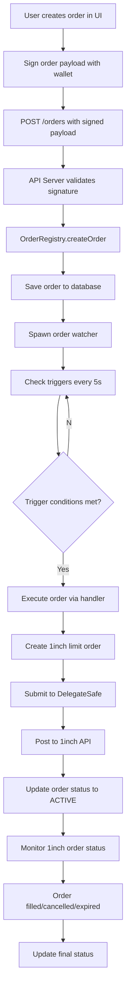

# Order Lifecycle

This document describes the complete lifecycle of an order in the 1edge system, from creation by the user to execution on the 1inch network.

## Overview

The order lifecycle is managed by the `OrderRegistry` service, which receives, stores, monitors, and executes all orders. Each order is processed by a dedicated "watcher" that monitors trigger conditions and executes when conditions are met. All order types (including strategies, which are recurring orders) follow the same unified flow.

## Architecture Diagram



## Complete Flow

### 1. Order Creation (Frontend)
- User configures order parameters in the UI
- Frontend validates inputs and estimates gas/fees
- User signs order payload with their wallet (EVM signature)
- Signed order is submitted to `POST /orders` endpoint

### 2. Order Validation (API Server)
- `apiServer.ts` receives the order request at `/orders` endpoint
- Validates the EVM signature using `ethers.utils.recoverAddress`
- Ensures the recovered address matches the order maker
- Forwards valid order to `OrderRegistry.createOrder()`

### 3. Order Registration (OrderRegistry)
- Validates order signature using `validateOrderSignature()`
- Initializes order fields: `status=PENDING`, `triggerCount=0`, `remainingSize=size`
- Saves order to database via `saveOrder()`
- Creates order event with `PENDING` status
- Spawns a new watcher for the order via `startWatcher()`

### 4. Order Monitoring (Watcher System)
- Each order has a dedicated watcher running in `watchOrder()` loop
- Watcher checks trigger conditions every 5 seconds using modular handlers
- Handlers implement `OrderHandler` interface with `shouldTrigger()` method
- Supports all order types: stop-limit, chase-limit, TWAP, DCA, etc.

### 5. Trigger Evaluation (Order Handlers)
- **Stop-Limit**: Monitors price feeds for trigger price breach
- **Chase-Limit**: Tracks price movement and adjusts orders dynamically  
- **TWAP**: Executes based on time intervals and volume distribution
- **DCA**: Triggers on scheduled intervals for recurring purchases
- Handler returns `true` when conditions are met

### 6. Order Execution (Handler Execute)
- Watcher calls `handler.execute(order)` when triggered
- Handler creates appropriate 1inch limit order parameters
- Increments `triggerCount` and updates `nextTriggerValue` for recurring orders
- Calls `DelegateSafe` contract to transfer user funds and sign order
- Submits signed order to 1inch Orderbook API

### 7. 1inch Integration
- Order posted to 1inch API with signed payload
- 1inch returns order hash for tracking
- Order hash stored in `order.oneInchOrderHashes[]` array
- Order status updated to `ACTIVE`
- Creates `SUBMITTED` order event

### 8. Order Tracking
- System monitors 1inch order status via API polling
- Tracks fills, cancellations, and expirations
- Updates order status accordingly: `FILLED`, `CANCELLED`, `EXPIRED`
- For recurring orders, watcher continues monitoring for next trigger

## API Endpoints

### `POST /orders`
Creates a new order with EVM signature verification.

**Request Body:**
```json
{
  "id": "generated-uuid",
  "type": "STOP_LIMIT",
  "pair": "WETH/USDC",
  "size": 1.0,
  "maker": "0x742d35cc6734C0532925a3b8D0d5D0a8d1238a60",
  "makerAsset": "0xA0b86a33E6409c26C5E1d7D35644C7a9A6BdF4fE",
  "takerAsset": "0x2791Bca1f2de4661ED88A30C99A7a9449Aa84174",
  "params": {
    "triggerPrice": 2500.00,
    "limitPrice": 2490.00
  },
  "signature": "0x...",
  "userSignedPayload": "..."
}
```

### `GET /orders`
Returns all active orders for monitoring.

### `GET /orders?maker=0x123...`
Returns all orders for a specific user address (transparent, no authentication required).

### `GET /orders/{orderId}`
Returns specific order details and status.

### `PUT /orders/{orderId}`
Modifies an order (cancels original, creates new).

### `DELETE /orders/{orderId}`
Cancels an order and stops its watcher.

## Database Schema

Orders are stored with the following key columns:
- `id`: Unique order identifier
- `pair`: Trading pair (e.g., WETH/USDC)
- `type`: Order type (STOP_LIMIT, CHASE_LIMIT, TWAP, DCA, etc.)
- `status`: Current status (PENDING, ACTIVE, FILLED, CANCELLED, FAILED)
- `size`: Original order size
- `remainingSize`: Remaining unfilled size
- `createdAt`: Order creation timestamp
- `triggerType`: Type of trigger condition
- `triggerCount`: Number of times order has been triggered
- `nextTriggerValue`: Next trigger value for recurring orders
- `oneInchOrderHashes`: Array of 1inch order hashes

## Order Statuses

- **PENDING**: Order created, watcher monitoring triggers
- **ACTIVE**: Order submitted to 1inch, awaiting fill
- **PARTIALLY_FILLED**: Order partially executed
- **FILLED**: Order completely executed
- **CANCELLED**: Order cancelled by user or system
- **EXPIRED**: Order expired without execution
- **FAILED**: Order execution failed due to error

## Performance & Reliability

### Database Optimizations
- **WAL Mode**: Write-Ahead Logging for non-blocking concurrent access
- **Memory Optimization**: 256MB memory-mapped I/O + 10MB cache
- **Prepared Statements**: Pre-compiled SQL eliminates parsing overhead
- **Strategic Indexes**: Optimized for order hash, maker address, and status queries
- **Composite Indexes**: Multi-column queries for user order history and filtering

### Watcher Recovery System
- **Automatic Restoration**: Pending orders automatically restored from database on service restart
- **Zero Downtime**: Watchers resume monitoring exactly where they left off
- **State Persistence**: All order state maintained in SQLite with ACID guarantees
- **Reliability Logging**: Clear visibility into restoration process and active watcher count

### Order Transparency
- **Public Access**: All order data accessible without authentication for full transparency
- **User Filtering**: Query orders by maker address using `?maker=0x123...` parameter
- **Open Intent**: Users cannot hide their trading intentions, promoting market transparency

## Security Model

- All orders require valid EVM signatures from the maker address
- OrderRegistry validates signatures using `ethers.utils.recoverAddress`
- DelegateSafe contract holds user funds with proper allowances
- No direct user private key access in the system
- All interactions signed by keeper with user authorization

## Involved Components

- **`front/`**: User interface for order creation and management
- **`back/services/apiServer.ts`**: REST API endpoints for order operations
- **`back/services/orderRegistry.ts`**: Core order lifecycle management service
- **`back/orders/`**: Modular order handler implementations
- **`back/services/storage.ts`**: Database access layer for order persistence
- **`common/types.ts`**: Shared TypeScript interfaces and types
- **`contracts/DelegateSafe.sol`**: Smart contract for fund management and order signing
