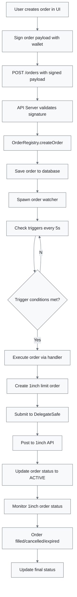

# Order Lifecycle

> **Complete Order Journey**: From user creation to on-chain execution through the 1inch network, this document tracks every step of an order's lifecycle in the 1edge system.

This document describes the complete lifecycle of an order in the 1edge system, from creation by the user to execution on the 1inch network.

| Phase | Component | Status |
|-------|-----------|--------|
| Creation | Frontend UI |  Active |
| Validation | API Server |  Active |
| Registration | OrderRegistry |  Active |
| Monitoring | Watcher System |  Active |
| Execution | Order Handlers |  Active |
| Integration | 1inch Protocol |  Active |

##  Overview

The order lifecycle is managed by the `OrderRegistry` service, which receives, stores, monitors, and executes all orders. Each order is processed by a dedicated "watcher" that monitors trigger conditions and executes when conditions are met. All order types (including strategies, which are recurring orders) follow the same unified flow.

##  Architecture Diagram



##  Complete Flow

###  Order Creation (Frontend)
- User configures order parameters in the UI
- Frontend validates inputs and estimates gas/fees
- User signs order payload with their wallet (EVM signature)
- Signed order is submitted to `POST /orders` endpoint

###  Order Validation (API Server)
- `apiServer.ts` receives the order request at `/orders` endpoint
- Validates the EVM signature using `ethers.utils.recoverAddress`
- Ensures the recovered address matches the order maker
- Forwards valid order to `OrderRegistry.createOrder()`

###  Order Registration (OrderRegistry)
- Validates order signature using `validateOrderSignature()`
- Initializes order fields: `status=PENDING`, `triggerCount=0`, `remainingSize=size`
- Saves order to database via `saveOrder()`
- Creates order event with `PENDING` status
- Spawns a new watcher for the order via `startWatcher()`

###  Order Monitoring (Watcher System)
- Each order has a dedicated watcher running in `watchOrder()` loop
- Watcher checks trigger conditions every 5 seconds using modular handlers
- Handlers implement `OrderWatcher` interface with `shouldTrigger()` method
- Supports all order types: stop-limit, chase-limit, TWAP, DCA, etc.

###  Trigger Evaluation (Order Handlers)
| Order Type | Trigger Mechanism | Status |
|------------|-------------------|--------|
| Stop-Limit | Price breach monitoring |  |
| Chase-Limit | Dynamic price tracking |  |
| TWAP | Time intervals + volume |  |
| DCA | Scheduled recurring |  |
| Handler Response | Boolean condition check |  |

###  Order Execution (Handler Execute)
- Watcher calls `handler.execute(order)` when triggered
- Handler creates appropriate 1inch limit order parameters
- Increments `triggerCount` and updates `nextTriggerValue` for recurring orders
- Calls `DelegateSafe` contract to transfer user funds and sign order
- Submits signed order to 1inch Orderbook API

###  1inch Integration
- Order posted to 1inch API with signed payload
- 1inch returns order hash for tracking
- Order hash stored in `order.oneInchOrderHashes[]` array
- Order status updated to `ACTIVE`
- Creates `SUBMITTED` order event

###  Order Tracking
- System monitors 1inch order status via API polling
- Tracks fills, cancellations, and expirations
- Updates order status accordingly: `FILLED`, `CANCELLED`, `EXPIRED`
- For recurring orders, watcher continues monitoring for next trigger

##  API Endpoints

### `POST /orders`
Creates a new order with EVM signature verification.

**Request Body:**
```json
{
  "id": "generated-uuid",
  "type": "STOP_LIMIT",
  "pair": "WETH/USDC",
  "size": 1.0,
  "maker": "0x742d35cc6734C0532925a3b8D0d5D0a8d1238a60",
  "makerAsset": "0xA0b86a33E6409c26C5E1d7D35644C7a9A6BdF4fE",
  "takerAsset": "0x2791Bca1f2de4661ED88A30C99A7a9449Aa84174",
  "params": {
    "triggerPrice": 2500.00,
    "limitPrice": 2490.00
  },
  "signature": "0x...",
  "userSignedPayload": "..."
}
```

### `GET /orders`
Returns all active orders for monitoring.

### `GET /orders?maker=0x123...`
Returns all orders for a specific user address (transparent, no authentication required).

### `GET /orders/{orderId}`
Returns specific order details and status.

### `PUT /orders/{orderId}`
Modifies an order (cancels original, creates new).

### `DELETE /orders/{orderId}`
Cancels an order and stops its watcher.

##  Database Schema

| Column | Type | Description | Status |
|--------|------|-------------|---------|
| `id` | TEXT | Unique order identifier |  |
| `pair` | TEXT | Trading pair (e.g., WETH/USDC) |  |
| `type` | TEXT | Order type (STOP_LIMIT, etc.) |  |
| `status` | TEXT | Current status |  |
| `size` | TEXT | Original order size |  |
| `remainingSize` | TEXT | Remaining unfilled size |  |
| `createdAt` | INTEGER | Order creation timestamp |  |
| `triggerType` | TEXT | Type of trigger condition |  |
| `triggerCount` | INTEGER | Times triggered |  |
| `nextTriggerValue` | TEXT | Next trigger for recurring |  |
| `oneInchOrderHashes` | TEXT | Array of 1inch hashes |  |

##  Order Statuses

| Status | Description | Icon |
|--------|-------------|------|
| PENDING | Order created, watcher monitoring |  |
| ACTIVE | Submitted to 1inch, awaiting fill |  |
| PARTIALLY_FILLED | Partially executed |  |
| FILLED | Completely executed |  |
| CANCELLED | Cancelled by user/system | ❌ |
| EXPIRED | Expired without execution |  |
| FAILED | Execution failed |  |

##  Performance & Reliability

###  Database Optimizations

| Optimization | Implementation | Benefit |
|--------------|----------------|----------|
| WAL Mode | Write-Ahead Logging | Non-blocking concurrent access |
| Memory Optimization | 256MB mmap + 10MB cache | Ultra-fast queries |
| Prepared Statements | Pre-compiled SQL | Zero parsing overhead |
| Strategic Indexes | Hash, maker, status | Optimized lookups |
| Composite Indexes | Multi-column queries | Complex filtering |

###  Watcher Recovery System

| Feature | Implementation | Status |
|---------|----------------|---------|
| Automatic Restoration | DB-driven recovery on restart |  |
| Zero Downtime | Seamless watcher resumption |  |
| State Persistence | SQLite ACID guarantees |  |
| Reliability Logging | Recovery visibility |  |

###  Order Transparency

| Aspect | Implementation | Purpose |
|--------|----------------|---------|
| Public Access | No authentication required | Full transparency |
| User Filtering | `?maker=0x123...` queries | Address-based filtering |
| Open Intent | Visible trading intentions | Market transparency |

##  Security Model

| Security Layer | Implementation | Status |
|----------------|----------------|---------|
| EVM Signatures | Required from maker address |  |
| Signature Validation | `ethers.utils.recoverAddress` |  |
| Fund Management | DelegateSafe contract |  |
| Private Keys | No direct access |  |
| Keeper Authorization | User-authorized signatures |  |

##  Involved Components

| Component | Path | Responsibility | Status |
|-----------|------|----------------|---------|
| Frontend | `front/` | Order creation UI |  |
| API Server | `back/services/apiServer.ts` | REST endpoints |  |
| Order Registry | `back/services/orderRegistry.ts` | Lifecycle management |  |
| Order Watchers | `back/orders/` | Modular implementations |  |
| Storage Layer | `back/services/storage.ts` | Database persistence |  |
| Type Definitions | `common/types.ts` | Shared interfaces |  |
| Smart Contract | `contracts/DelegateSafe.sol` | Fund management |  |
