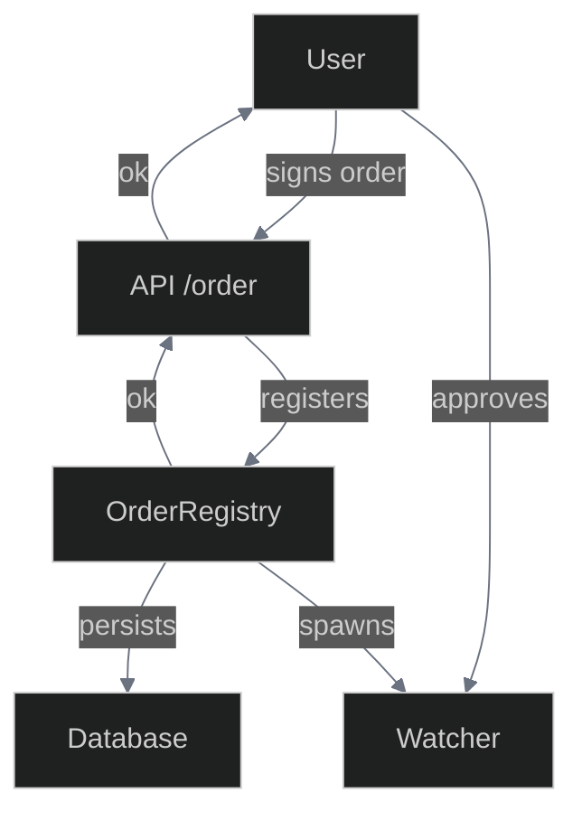
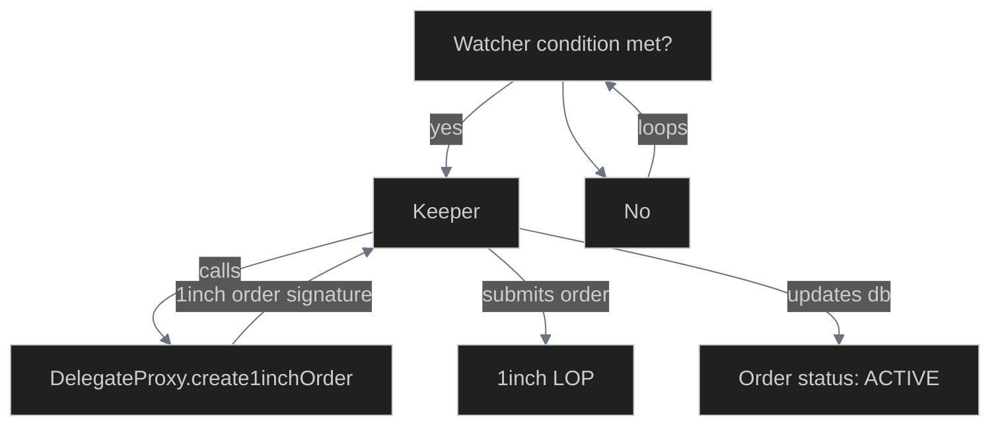
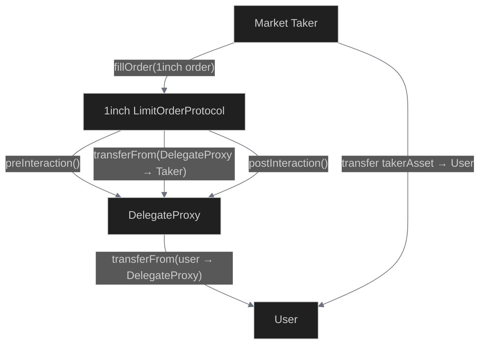
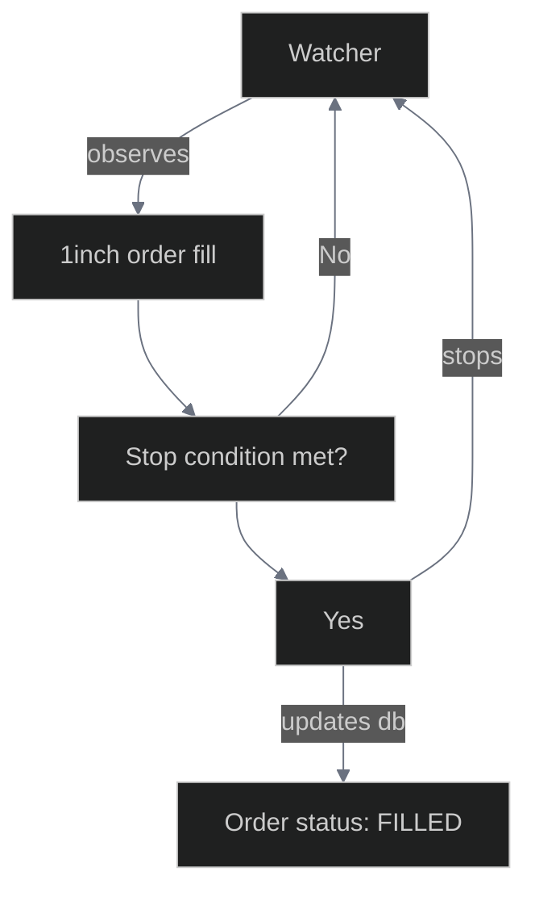

# Order Lifecycle

> **Complete Order Journey**: From user creation to on-chain execution through the 1inch network, this document tracks every step of an order's lifecycle in the 1edge system.

This document describes the complete lifecycle of an order in the 1edge system, from creation by the user to execution on the 1inch network.

| Phase        | Component      | Status |
| ------------ | -------------- | ------ |
| Creation     | Frontend UI    | Active |
| Validation   | API Server     | Active |
| Registration | OrderRegistry  | Active |
| Monitoring   | Watcher System | Active |
| Execution    | Order Handlers | Active |
| Integration  | 1inch Protocol | Active |

## Overview

The order lifecycle is managed by the `OrderRegistry` service, which receives, stores, monitors, and executes all orders. Each order is processed by a dedicated "watcher" that monitors trigger conditions and executes when conditions are met. All order types (including strategies, which are recurring orders) follow the same unified flow.

## Architecture & Flow

The order lifecycle is divided into three main phases:

### Phase 1: 1edge Order Creation



### Phase 2: Recurring 1inch Order Submission



### Phase 2bis: 1inch Order Fulfillment (JIT Order Funding)



### Phase 3: 1edge Order Fulfillment



## Complete Flow

### Order Creation (Frontend)

- User configures order parameters in the UI
- Frontend validates inputs and estimates gas/fees
- User signs order payload with their wallet (EVM signature)
- Signed order is submitted to `POST /orders` endpoint

### Order Validation (API Server)

- `apiServer.ts` receives the order request at `/orders` endpoint
- Validates the EVM signature using `ethers.utils.recoverAddress`
- Ensures the recovered address matches the order maker
- Forwards valid order to `OrderRegistry.createOrder()`

### Order Registration (OrderRegistry)

- Validates order signature using `validateOrderSignature()`
- Initializes order fields: `status=PENDING`, `triggerCount=0`, `remainingSize=size`
- Saves order to database via `saveOrder()`
- Creates order event with `PENDING` status
- Spawns a new watcher for the order via `startWatcher()`

### Order Monitoring (Watcher System)

- **Watcher Architecture**: Each order has a dedicated watcher running `watchOrder()` loop in `back/services/orderRegistry.ts:190`
- **Polling Frequency**: Watchers check trigger conditions every 5 seconds via `checkTriggers()`
- **Handler Resolution**: OrderRegistry uses `getOrderWatcher(order.type)` to get appropriate handler from `back/orders/`
- **Interface Contract**: All handlers implement `OrderWatcher` interface with `shouldTrigger()` and `execute()` methods
- **Reliability**: Pending orders automatically restored from database on service restart

### Trigger Evaluation (Order Handlers)

The OrderRegistry spawns dedicated watchers that check trigger conditions every 5 seconds using modular handlers. Each order type implements the `OrderWatcher` interface with specialized trigger logic:

**Price-Based Orders**: [Stop](../order-types.md#stop-limit), [Chase](../order-types.md#chase-limit), [Momentum](../order-types.md#momentum), [Breakout](../order-types.md#breakout)
**Time-Based Orders**: [TWAP](../order-types.md#twap), [DCA](../order-types.md#dca)  
**Progressive Orders**: [Iceberg](../order-types.md#iceberg), [Range](../order-types.md#range), [Grid](../order-types.md#grid)

> **See [Order Types Documentation](../order-types.md) for detailed trigger mechanisms and implementation specifics.**

### Order Execution (Handler Execute)

- **Trigger Detection**: Watcher calls `handler.shouldTrigger(order)` every 5 seconds
- **Execution Flow**: When triggered, OrderRegistry calls `executeOrder()` in `back/services/orderRegistry.ts:255`
- **Amount Calculation**: Computes `triggerAmount` based on order type (fixed for DCA, calculated for TWAP/Range)
- **1inch Order Creation**: Builds `LimitOrder` object with calculated `makingAmount`/`takingAmount`
- **State Updates**: Increments `triggerCount`, updates `nextTriggerValue` for recurring orders
- **Contract Integration**: Calls `DelegateProxy.create1inchOrder()` with DelegateProxy as the order.maker address
- **Order Submission**: Submits signed 1inch order with pre/post interaction hooks enabled

### 1inch Integration & Fund Management

- **Order Creation**: 1inch limit orders use DelegateProxy as maker address
- **Pre-Interaction Hook**: When order is filled, `DelegateProxy.preInteraction()` is called:
  - Transfers `makingAmount` from original user to DelegateProxy contract using `info.maker` address
  - Updates `orders[orderHash].remainingAmount` by subtracting filled amount
- **Post-Interaction Hook**: After order fill, `DelegateProxy.postInteraction()` is called:
  - Updates `orders[orderHash].remainingAmount` with actual remaining amount from 1inch
  - If order fully filled (`remainingMakingAmount == 0`), cleans up storage to save gas by deleting `orders[orderHash]`
- **1edge ↔ 1inch Relationship**: One 1edge order can create multiple 1inch limit orders over time

### Order Status Tracking & Multi-Call Batching

- **Database Tracking**: Order hashes stored in `order.oneInchOrderHashes[]` array
- **On-Chain Status**: Real-time order status retrieved via multi-call batching:
  - Frontend calls `DelegateProxy.getOrderData(bytes32[] orderIds)`
  - Returns `OrderData[]` with `orderMaker` and `remainingMakerAmount` for each order hash
  - Batched calls efficient for checking multiple order statuses simultaneously
- **User Dashboard**: When users connect, system performs multi-call to get current fill status
- **Watcher Monitoring**: Watchers continue until stop condition met (order fully executed)
- Order status updated accordingly: `FILLED`, `CANCELLED`, `EXPIRED`

## API Endpoints

### `POST /orders`

Creates a new order with EVM signature verification.

**Request Body:**

```json
{
  "id": "generated-uuid",
  "type": "STOP_LIMIT",
  "pair": "WETH/USDC",
  "size": 1.0,
  "maker": "0x742d35cc6734C0532925a3b8D0d5D0a8d1238a60",
  "makerAsset": "0xA0b86a33E6409c26C5E1d7D35644C7a9A6BdF4fE",
  "takerAsset": "0x2791Bca1f2de4661ED88A30C99A7a9449Aa84174",
  "params": {
    "triggerPrice": 2500.0,
    "limitPrice": 2490.0
  },
  "signature": "0x...",
  "userSignedPayload": "..."
}
```

### `GET /orders`

Returns all active orders for monitoring.

### `GET /orders?maker=0x123...`

Returns all orders for a specific user address (transparent, no authentication required).

### `GET /orders/{orderId}`

Returns specific order details and status.

### `PUT /orders/{orderId}`

Modifies an order (cancels original, creates new).

### `DELETE /orders/{orderId}`

Cancels an order and stops its watcher.

## Database Schema

| Column                  | Type    | Description                             |
| ----------------------- | ------- | --------------------------------------- |
| `id`                    | TEXT    | Unique order identifier                 |
| `order_hash`            | TEXT    | 1inch-computed order hash (unique)      |
| `strategy_id`           | TEXT    | Associated strategy identifier          |
| `type`                  | TEXT    | Order type (e.g., STOP_LIMIT, LIMIT)    |
| `status`                | TEXT    | Current order status                    |
| `maker_asset`           | TEXT    | Maker asset address                     |
| `taker_asset`           | TEXT    | Taker asset address                     |
| `making_amount`         | TEXT    | Amount of maker asset to sell           |
| `taking_amount`         | TEXT    | Amount of taker asset to buy            |
| `maker`                 | TEXT    | Maker address (order creator)           |
| `receiver`              | TEXT    | Receiver address (optional)             |
| `salt`                  | TEXT    | Unique salt for order hash              |
| `signature`             | TEXT    | EVM signature for order                 |
| `size`                  | TEXT    | Original order size                     |
| `remaining_size`        | TEXT    | Remaining unfilled size                 |
| `trigger_count`         | INTEGER | Number of times triggered               |
| `next_trigger_value`    | TEXT    | Next trigger value for recurring orders |
| `trigger_price`         | REAL    | Trigger price (if applicable)           |
| `filled_amount`         | TEXT    | Total filled amount                     |
| `created_at`            | INTEGER | Order creation timestamp                |
| `executed_at`           | INTEGER | Execution timestamp (if filled)         |
| `cancelled_at`          | INTEGER | Cancellation timestamp (if cancelled)   |
| `tx_hash`               | TEXT    | Transaction hash (if on-chain)          |
| `network`               | INTEGER | Chain/network ID                        |
| `expiry`                | INTEGER | Expiry timestamp (if set)               |
| `user_signed_payload`   | TEXT    | User-signed payload (JSON or string)    |
| `one_inch_order_hashes` | TEXT    | JSON array of 1inch order hashes        |
| `raw_data`              | TEXT    | Complete JSON-serialized Order object   |

## Order Statuses

| Status           | Description                       |
| ---------------- | --------------------------------- |
| PENDING          | Order created, watcher monitoring |
| ACTIVE           | Submitted to 1inch, awaiting fill |
| PARTIALLY_FILLED | Partially executed                |
| FILLED           | Completely executed               |
| CANCELLED        | Cancelled by user/system          |
| EXPIRED          | Expired without execution         |
| FAILED           | Execution failed                  |

## Multi-Call Order Status Batching

### Real-Time Order Status Checking

The 1edge system implements efficient batch checking of order status using the DelegateProxy contract's `getOrderData()` view function:

#### Implementation Details

**Contract Function:**

```solidity
function getOrderData(bytes32[] calldata orderIds)
    public view returns (OrderInfo[] memory)

struct OrderInfo {
    address maker;           // Original user who created the order
    uint256 remainingAmount; // Remaining amount to be filled
    bool signed;            // Whether the order is signed
}
```

**Usage Flow:**

1. **User Connection**: When user connects wallet, frontend queries database for their active orders
2. **Order Hash Collection**: Collect all 1inch order hashes from `order.oneInchOrderHashes[]` arrays
3. **Batch Status Call**: Single multi-call to `DelegateProxy.getOrderData(orderHashes[])`
4. **Status Interpretation**:
   - `remainingAmount = 0` → Order fully filled
   - `remainingAmount > 0` → Order partially filled
   - `maker = address(0)` → Order cancelled or non-existent

#### Efficiency Benefits

- **Gas Efficiency**: Single transaction instead of multiple calls
- **Network Efficiency**: Reduced RPC calls and latency
- **Real-Time Updates**: Always reflects current on-chain state
- **Scalability**: Handles hundreds of orders in single batch

#### Frontend Integration

```typescript
// Example implementation
async function getOrderStatuses(orderHashes: string[]): Promise<OrderStatus[]> {
  const delegateProxy = getDelegateProxyContract();
  const orderData = await delegateProxy.getOrderData(orderHashes);

  return orderData.map((data, index) => ({
    orderHash: orderHashes[index],
    maker: data.maker,
    remainingAmount: data.remainingAmount,
    signed: data.signed,
    status: data.remainingAmount === 0n ? "FILLED" : 
            data.maker === "0x0000000000000000000000000000000000000000" ? "CANCELLED" : "ACTIVE",
  }));
}
```

## DelegateProxy Contract Functions

The DelegateProxy contract provides the following key functions for order management:

### Order Creation Functions

#### `create1inchOrder(order, maker)`
Creates a single 1inch limit order with the following flow:
- Validates that `order.maker` equals the DelegateProxy contract address
- Stores order information in `orders[orderHash]` mapping with the original user as `maker`
- Approves tokens for the 1inch protocol if needed
- Emits `OrderCreated` event

#### `create1inchOrderBatch(orders, makers)`
Creates multiple 1inch limit orders in a single transaction:
- Validates array lengths match
- Processes each order with the same logic as single order creation
- More gas-efficient for creating multiple orders simultaneously

### Order Management Functions

#### `cancel1inchOrder(order)`
Cancels a single existing order:
- Only callable by approved keepers
- Deletes order from storage
- Calls 1inch protocol's `cancelOrder` function
- Emits `OrderCancelled` event

#### `cancel1inchOrderBatch(orders[])`
Cancels multiple orders in a single transaction:
- Only callable by approved keepers
- Processes each order with the same logic as single order cancellation
- More gas-efficient for cancelling multiple orders simultaneously
- Emits one `OrderCancelled` event per order

#### `getOrderData(orderIds[])`
Batch query function for order status:
- Returns `OrderInfo[]` array with current order state
- Used for efficient multi-call status checking
- View function (no gas cost)

### Interaction Hooks (1inch Protocol Integration)

#### `preInteraction(order, orderHash, makingAmount, ...)`
Called by 1inch protocol before order execution:
- Transfers `makingAmount` from original user (`info.maker`) to DelegateProxy using `safeTransferFrom()`
- Updates `info.remainingAmount` by subtracting the `makingAmount`
- Only callable by 1inch protocol (protected by `only1inch` modifier)
- Protected by `nonReentrant` modifier

#### `postInteraction(order, orderHash, remainingMakingAmount, ...)`
Called by 1inch protocol after order execution:
- If `remainingMakingAmount == 0`: Deletes order from storage (`delete orders[orderHash]`) for gas optimization
- If `remainingMakingAmount > 0`: Updates `orders[orderHash].remainingAmount` with the actual remaining amount
- Only callable by 1inch protocol (protected by `only1inch` modifier)

### Administrative Functions

#### `setKeeper(keeper, approved)`
Manages keeper permissions:
- Only callable by contract owner
- Controls who can create/cancel orders

#### `rescue(token)`
Emergency function to recover stuck funds:
- Only callable by contract owner
- Supports both native ETH (`0xEeeeeEeeeEeEeeEeEeEeeEEEeeeeEeeeeeeeEEeE`) and ERC20 tokens
- For ETH: Uses `payable(owner()).transfer(balance)` to send entire contract balance
- For ERC20: Uses `SafeERC20.safeTransfer()` to send entire token balance
- Reverts with `InsufficientBalance()` if balance is zero
- Protected by `nonReentrant` modifier

#### `isValidSignature(hash, signature)`
EIP-1271 signature validation:
- Returns magic value `0x1626ba7e` for valid orders
- Returns `0xffffffff` for invalid orders
- Used by 1inch protocol to validate contract signatures

---

## Involved Components

| Component                  | Path                              | Responsibility                                    | Status |
| -------------------------- | --------------------------------- | ------------------------------------------------- | ------ |
| Frontend                   | `front/`                          | Order creation UI, multi-call batching for status |        |
| API Server                 | `back/services/apiServer.ts`      | REST endpoints                                    |        |
| Order Registry             | `back/services/orderRegistry.ts`  | Lifecycle management, watcher spawning            |        |
| Order Watchers             | `back/orders/`                    | Modular trigger implementations                   |        |
| Storage Layer              | `back/services/storage.ts`        | Database persistence                              |        |
| Type Definitions           | `common/types.ts`                 | Shared interfaces                                 |        |
| DelegateProxy Contract     | `contracts/src/DelegateProxy.sol` | JIT order funding, pre/post interaction hooks, rescue function     |        |
| 1inch Limit Order Protocol | External                          | Order execution and filling                       |        |
