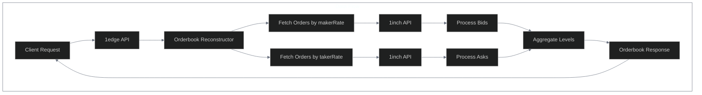

#  Orderbook Reconstruction API

> **Traditional Orderbook Views**: Transform 1inch Limit Order Protocol data into familiar bid/ask orderbook displays for any trading pair.

The 1edge platform provides a powerful orderbook reconstruction service that aggregates limit orders from the 1inch Limit Order Protocol to create traditional orderbook views for any trading pair.

| Feature | Status | Description |
|---------|--------|-------------|
| Multi-Chain Support |  | Ethereum, Polygon, BSC, Arbitrum |
| Dual-Sort Approach |  | Enhanced depth via 4K order fetch |
| Spot Price Filtering |  | Clean bid/ask separation |
| Symbol Resolution |  | Automatic token mapping |
| Real-time Data |  | Live orderbook snapshots |

##  Overview

The orderbook reconstruction service fetches active limit orders from the 1inch API and transforms them into bid/ask levels suitable for display in trading interfaces. It uses a dual-sort approach to efficiently fetch the most relevant orders for both sides of the orderbook.

| Component | Technology | Purpose |
|-----------|------------|----------|
| Data Source | 1inch Limit Order Protocol | Active order aggregation |
| Processing | Dual-sort algorithm | Efficient order fetching |
| Output Format | Traditional orderbook | Familiar trading interface |
| Real-time Updates | Snapshot-based | Live market data |



##  API Endpoints

###  Market Overview

Fetches orders across all trading pairs on a specific blockchain.

```
GET /orderbook/{chain}?limit={limit}
```

**Parameters:**

| Parameter | Type | Default | Description | Status |
|-----------|------|---------|-------------|---------|
| `chain` | number | required | Chain ID (1=Ethereum, 137=Polygon, 56=BSC) |  |
| `limit` | number | 1000 | Max orders per side (max: 1000) |  |

**Example:**

```bash
curl "http://localhost:40005/orderbook/1?limit=500"
```

###  Specific Trading Pair by Contract Address

Reconstructs the orderbook for a specific asset pair using contract addresses.

```
GET /orderbook/{chain}/{makerAsset}/{takerAsset}?limit={limit}
```

**Parameters:**

| Parameter | Type | Default | Description | Status |
|-----------|------|---------|-------------|---------|
| `chain` | number | required | Chain ID |  |
| `makerAsset` | string | required | Maker asset contract address |  |
| `takerAsset` | string | required | Taker asset contract address |  |
| `limit` | number | 1000 | Max orders per side (max: 1000) |  |

**Example:**

```bash
# USDT/WETH orderbook on Ethereum
curl "http://localhost:40005/orderbook/1/0xdAC17F958D2ee523a2206206994597C13D831ec7/0xC02aaA39b223FE8D0A0e5C4F27eAD9083C756Cc2?limit=1000"
```

### 🏷 Trading Pair by Symbol

Reconstructs the orderbook for a trading pair using symbolic names (e.g., "BTCUSDT"). This endpoint automatically resolves token symbols to their contract addresses based on the configured token mapping.

```
GET /orderbook-symbol/{chain}/{symbol}?limit={limit}
```

**Parameters:**

| Parameter | Type | Default | Description | Status |
|-----------|------|---------|-------------|---------|
| `chain` | number | required | Chain ID (1=Ethereum, 56=BSC, 42161=Arbitrum) |  |
| `symbol` | string | required | Trading pair (BTCUSDT, ETHUSDC, AAVEUSDT) |  |
| `limit` | number | 500 | Max orders per side (max: 1000) |  |

**Examples:**

```bash
# BTC/USDT orderbook on Ethereum
curl "http://localhost:40005/orderbook-symbol/1/BTCUSDT?limit=500"

# ETH/USDC orderbook on Arbitrum
curl "http://localhost:40005/orderbook-symbol/42161/ETHUSDC?limit=300"

# AAVE/USDT orderbook on BSC
curl "http://localhost:40005/orderbook-symbol/56/AAVEUSDT"
```

**Supported Symbols:**

| Category | Tokens | Status |
|----------|--------|---------|
| Base Tokens | WBTC, WETH, 1INCH, AAVE |  |
| Alias Tokens | BTC → WBTC, ETH → WETH |  |
| Quote Tokens | USDT, USDC |  |

##  Response Structure

```typescript
{
  "success": true,
  "data": {
    "chain": number,              // Chain ID
    "makerAsset": string,         // Maker asset address or "ALL"
    "takerAsset": string,         // Taker asset address or "ALL"
    "bids": OrderbookLevel[],     // Buy orders (sorted by price descending)
    "asks": OrderbookLevel[],     // Sell orders (sorted by price ascending)
    "timestamp": number,          // Orderbook snapshot timestamp
    "summary": {
      "totalBidOrders": number,   // Total number of bid orders
      "totalAskOrders": number,   // Total number of ask orders
      "bestBid": string | null,   // Highest bid price
      "bestAsk": string | null,   // Lowest ask price
      "spread": string | null     // Bid-ask spread with percentage
    }
  }
}
```

### OrderbookLevel Structure

Each price level contains aggregated information about orders at that price:

```typescript
{
  "price": string,              // Price level (rate)
  "amount": string,             // Total amount at this level
  "total": string,              // Cumulative total from best price
  "count": number,              // Number of orders at this level
  "orders": OneInchOrder[]      // Individual orders (see below)
}
```

### OneInchOrder Structure

Individual order details from the 1inch API:

```typescript
{
  "orderHash": string,
  "createDateTime": string,
  "remainingMakerAmount": string,
  "makerBalance": string,
  "makerAllowance": string,
  "data": {
    "makerAsset": string,
    "takerAsset": string,
    "salt": string,
    "receiver": string | undefined,
    "makingAmount": string,
    "takingAmount": string,
    "maker": string,
    "extension": string | undefined,
    "makerTraits": string | undefined
  },
  "makerRate": string,          // Price from maker's perspective
  "takerRate": string,          // Price from taker's perspective
  "isMakerContract": boolean,
  "orderInvalidReason": string | null,
  "signature": string
}
```

##  Implementation Details

###  Enhanced Dual-Sort Approach

The service uses four separate API calls to efficiently reconstruct the orderbook with maximum depth:

| Step | Method | Purpose | Orders |
|------|--------|---------|--------|
| 1 | Sort by `makerRate` (descending) | Best potential bids | 2000 |
| 2 | Sort by `takerRate` (ascending) | Best potential asks | 2000 |
| 3 | Spot Price Center | Theoretical book center | Reference |
| 4 | Smart Filtering | Remove wrong territories | Clean data |

###  Benefits

| Benefit | Improvement | Status |
|---------|-------------|--------|
| Order Depth | 4000 vs 1000 orders |  |
| Bid/Ask Separation | Market-based reference |  |
| Noise Reduction | Clean orderbook display |  |

###  Order Filtering

The service automatically filters out:

| Filter Type | Condition | Status |
|-------------|-----------|--------|
| Invalid Orders | `orderInvalidReason !== null` |  |
| Filled Orders | `remainingMakerAmount === "0"` |  |
| Invalid Rates | `makerRate <= 0` or `takerRate <= 0` |  |
| Invalid Status | Only status `1` (Valid) included |  |

**Order Status Meanings:**

| Status | Description | Action |
|--------|-------------|--------|
| 1 | Valid orders - Active and executable |  Include |
| 2 | Temporarily invalid - May become valid |  Exclude |
| 3 | Invalid orders - Permanently invalid |  Exclude |

###  Spot Price Filtering

To ensure clean bid and ask separation, the service:

| Step | Process | Benefit |
|------|---------|----------|
| 1 | Fetch current spot price | Market reference |
| 2 | Establish book center | Theoretical midpoint |
| 3 | Filter wrong territories | Clean separation |
| 4 | Reduce noise | Better display |

 **Note**: Uses [1inch Spot Price API](/docs/1inch/Spot%20Price%20API/) for reference pricing.

###  Price Level Aggregation

Orders with the same price are aggregated into levels:

| Step | Process | Purpose |
|------|---------|----------|
| 1 | Group by rate (price) | Price level creation |
| 2 | Sum remaining amounts | Level depth calculation |
| 3 | Calculate cumulative totals | Market depth analysis |
| 4 | Sort levels | Bids descending, asks ascending |

##  Configuration

###  Environment Variables

| Variable | Required | Purpose | Status |
|----------|----------|---------|--------|
| `ONE_INCH_API_KEY` | Optional | Higher rate limits |  |

```bash
# 1inch API Key (optional but recommended for higher rate limits)
ONE_INCH_API_KEY=your_1inch_api_key_here
```

###  Service Configuration

| Component | Integration | Port | Status |
|-----------|-------------|------|---------|
| API Server | Built-in service | 40005 |  |
| Configuration | No separate config needed | Default |  |

##  Error Handling

The API returns appropriate HTTP status codes and error messages:

| Status | Error | Description | Resolution |
|--------|-------|-------------|------------|
| 400 | Chain ID required | Missing chain parameter | Add chain ID |
| 400 | Invalid chain ID | Non-numeric chain parameter | Use valid chain ID |
| 400 | Invalid orderbook request format | Malformed request path | Check URL format |
| 401 | 1inch API authentication failed | Invalid or missing API key | Verify API key |
| 429 | Rate limit exceeded | Too many requests to 1inch API | Implement backoff |
| 500 | Failed to reconstruct orderbook | General server error | Check logs |

##  Usage Examples

### 1. Get Ethereum Market Overview

```javascript
const response = await fetch("http://localhost:40005/orderbook/1?limit=100");
const orderbook = await response.json();

console.log(`Total bid orders: ${orderbook.data.summary.totalBidOrders}`);
console.log(`Total ask orders: ${orderbook.data.summary.totalAskOrders}`);
console.log(`Best bid: ${orderbook.data.summary.bestBid}`);
console.log(`Best ask: ${orderbook.data.summary.bestAsk}`);
```

### 2. Get USDT/WETH Orderbook

```javascript
const USDT = "0xdAC17F958D2ee523a2206206994597C13D831ec7";
const WETH = "0xC02aaA39b223FE8D0A0e5C4F27eAD9083C756Cc2";

const response = await fetch(
  `http://localhost:40005/orderbook/1/${USDT}/${WETH}?limit=500`,
);
const orderbook = await response.json();

// Display top 5 bid levels
orderbook.data.bids.slice(0, 5).forEach((level) => {
  console.log(
    `Price: ${level.price}, Amount: ${level.amount}, Orders: ${level.count}`,
  );
});
```

### 3. Calculate Market Depth

```javascript
function calculateDepth(orderbook, percentage = 0.01) {
  const midPrice =
    (parseFloat(orderbook.summary.bestBid) +
      parseFloat(orderbook.summary.bestAsk)) /
    2;
  const threshold = midPrice * percentage;

  let bidDepth = 0n;
  let askDepth = 0n;

  // Calculate bid depth within percentage
  for (const level of orderbook.bids) {
    if (parseFloat(level.price) < midPrice - threshold) break;
    bidDepth += BigInt(level.amount);
  }

  // Calculate ask depth within percentage
  for (const level of orderbook.asks) {
    if (parseFloat(level.price) > midPrice + threshold) break;
    askDepth += BigInt(level.amount);
  }

  return { bidDepth: bidDepth.toString(), askDepth: askDepth.toString() };
}
```

##  Performance Considerations

| Consideration | Recommendation | Priority |
|---------------|----------------|-----------|
| Rate Limits | Use API key for higher limits | High |
| Caching | Implement client-side caching | Medium |
| Pagination | 1000 orders usually sufficient | Low |
| Real-time Updates | 5-10 second polling intervals | High |
| WebSocket Support | Consider for push updates | Medium |
| 1inch WebSocket | Use for order events | Medium |

##  Integration with Trading Interface

The orderbook data can be directly used in trading interfaces:

```javascript
// Transform for TradingView or similar charting libraries
function transformForTradingView(orderbook) {
  return {
    bids: orderbook.bids.map((level) => ({
      price: parseFloat(level.price),
      volume: parseFloat(level.amount) / 1e18, // Adjust decimals as needed
    })),
    asks: orderbook.asks.map((level) => ({
      price: parseFloat(level.price),
      volume: parseFloat(level.amount) / 1e18,
    })),
  };
}
```

##  Troubleshooting

###  Common Issues

| Issue | Causes | Solutions | Status |
|-------|--------|-----------|--------|
| Empty Orderbook | Wrong addresses, no orders, wrong chain | Verify parameters |  |
| Authentication Errors | Missing/invalid API key | Check environment |  |
| Rate Limiting | Too many requests | Implement backoff, use API key |  |

###  Debug Mode

| Debug Level | Command | Output |
|-------------|---------|--------|
| Debug | `LOG_LEVEL=debug bun run start:api` | Detailed logging |

```bash
# Set log level in your environment
LOG_LEVEL=debug bun run start:api
```

##  Future Enhancements

Potential improvements to the orderbook service:

| Enhancement | Description | Priority | Timeline |
|-------------|-------------|----------|-----------|
| WebSocket Support | Real-time orderbook updates | High | Q1 2025 |
| Historical Data | Orderbook snapshots storage | Medium | Q2 2025 |
| Advanced Analytics | VWAP, market depth charts | Medium | Q2 2025 |
| Multi-chain Aggregation | Cross-chain orderbook combining | Low | Q3 2025 |
| Order Matching | Arbitrage opportunity detection | Low | Q3 2025 |

##  Related Documentation

| Document | Description | Status |
|----------|-------------|---------|
| [1inch Orderbook API Reference](/docs/1inch/Orderbook%20API/api-reference/get-all-orders.md) | External API documentation |  |
| [1edge Architecture](/docs/1edge/architecture.md) | System architecture overview |  |
| [API Server Configuration](/docs/1edge/README.md#configuration) | Server configuration guide |  |
