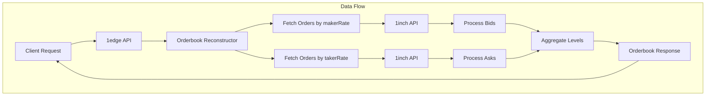

# Orderbook Reconstruction API

The 1edge platform provides a powerful orderbook reconstruction service that aggregates limit orders from the 1inch Limit Order Protocol to create traditional orderbook views for any trading pair.

## Overview

The orderbook reconstruction service fetches active limit orders from the 1inch API and transforms them into bid/ask levels suitable for display in trading interfaces. It uses a dual-sort approach to efficiently fetch the most relevant orders for both sides of the orderbook.



## API Endpoints

### 1. Market Overview

Fetches orders across all trading pairs on a specific blockchain.

```
GET /orderbook/{chain}?limit={limit}
```

**Parameters:**

- `chain` (required): Chain ID (1 = Ethereum, 137 = Polygon, 56 = BSC, etc.)
- `limit` (optional): Maximum orders per side (default: 1000, max: 1000)

**Example:**

```bash
curl "http://localhost:40005/orderbook/1?limit=500"
```

### 2. Specific Trading Pair by Contract Address

Reconstructs the orderbook for a specific asset pair using contract addresses.

```
GET /orderbook/{chain}/{makerAsset}/{takerAsset}?limit={limit}
```

**Parameters:**

- `chain` (required): Chain ID
- `makerAsset` (required): Maker asset contract address
- `takerAsset` (required): Taker asset contract address
- `limit` (optional): Maximum orders per side (default: 1000, max: 1000)

**Example:**

```bash
# USDT/WETH orderbook on Ethereum
curl "http://localhost:40005/orderbook/1/0xdAC17F958D2ee523a2206206994597C13D831ec7/0xC02aaA39b223FE8D0A0e5C4F27eAD9083C756Cc2?limit=1000"
```

### 3. Trading Pair by Symbol

Reconstructs the orderbook for a trading pair using symbolic names (e.g., "BTCUSDT"). This endpoint automatically resolves token symbols to their contract addresses based on the configured token mapping.

```
GET /orderbook-symbol/{chain}/{symbol}?limit={limit}
```

**Parameters:**

- `chain` (required): Chain ID (1 = Ethereum, 56 = BSC, 42161 = Arbitrum, etc.)
- `symbol` (required): Trading pair symbol (e.g., "BTCUSDT", "ETHUSDC", "AAVEUSDT")
- `limit` (optional): Maximum orders per side (default: 500, max: 1000)

**Examples:**

```bash
# BTC/USDT orderbook on Ethereum
curl "http://localhost:40005/orderbook-symbol/1/BTCUSDT?limit=500"

# ETH/USDC orderbook on Arbitrum
curl "http://localhost:40005/orderbook-symbol/42161/ETHUSDC?limit=300"

# AAVE/USDT orderbook on BSC
curl "http://localhost:40005/orderbook-symbol/56/AAVEUSDT"
```

**Supported Symbols:**
- WBTC, WETH, USDT, USDC, 1INCH, AAVE
- Base tokens: BTC (resolves to WBTC), ETH (resolves to WETH)
- Quote tokens: USDT, USDC

## Response Structure

```typescript
{
  "success": true,
  "data": {
    "chain": number,              // Chain ID
    "makerAsset": string,         // Maker asset address or "ALL"
    "takerAsset": string,         // Taker asset address or "ALL"
    "bids": OrderbookLevel[],     // Buy orders (sorted by price descending)
    "asks": OrderbookLevel[],     // Sell orders (sorted by price ascending)
    "timestamp": number,          // Orderbook snapshot timestamp
    "summary": {
      "totalBidOrders": number,   // Total number of bid orders
      "totalAskOrders": number,   // Total number of ask orders
      "bestBid": string | null,   // Highest bid price
      "bestAsk": string | null,   // Lowest ask price
      "spread": string | null     // Bid-ask spread with percentage
    }
  }
}
```

### OrderbookLevel Structure

Each price level contains aggregated information about orders at that price:

```typescript
{
  "price": string,              // Price level (rate)
  "amount": string,             // Total amount at this level
  "total": string,              // Cumulative total from best price
  "count": number,              // Number of orders at this level
  "orders": OneInchOrder[]      // Individual orders (see below)
}
```

### OneInchOrder Structure

Individual order details from the 1inch API:

```typescript
{
  "orderHash": string,
  "createDateTime": string,
  "remainingMakerAmount": string,
  "makerBalance": string,
  "makerAllowance": string,
  "data": {
    "makerAsset": string,
    "takerAsset": string,
    "salt": string,
    "receiver": string | undefined,
    "makingAmount": string,
    "takingAmount": string,
    "maker": string,
    "extension": string | undefined,
    "makerTraits": string | undefined
  },
  "makerRate": string,          // Price from maker's perspective
  "takerRate": string,          // Price from taker's perspective
  "isMakerContract": boolean,
  "orderInvalidReason": string | null,
  "signature": string
}
```

## Implementation Details

### Enhanced Dual-Sort Approach

The service uses four separate API calls to efficiently reconstruct the orderbook with maximum depth:

1. **First 2000 orders sorted by `makerRate`** (descending) - Gets the best potential bids
2. **Next 2000 orders sorted by `takerRate`** (ascending) - Gets the best potential asks  
3. **Spot Price Center**: Fetches current spot price from 1inch Price API to establish theoretical book center
4. **Smart Filtering**: Removes orders in wrong territories using spot price as reference

This approach ensures:
- Maximum order depth (4000 total orders vs previous 1000)
- Clean bid/ask separation using market-based reference price
- Elimination of noisy orders that could distort the orderbook

### Order Filtering

The service automatically filters out:

- Invalid orders (`orderInvalidReason !== null`)
- Fully filled orders (`remainingMakerAmount === "0"`)
- Orders with invalid rates (`makerRate <= 0` or `takerRate <= 0`)
- Non-valid order statuses (only status `1` - Valid orders are included)

**Order Status Meanings:**
- Status `1`: Valid orders - Active and executable orders
- Status `2`: Temporarily invalid orders - Orders that may become valid later
- Status `3`: Invalid orders - Permanently invalid orders

### Spot Price Filtering

To ensure clean bid and ask separation, the service:

1. Fetches the current spot price using the [1inch Spot Price API](/docs/1inch/Spot%20Price%20API/)
2. Uses this spot price as the theoretical book center
3. Filters out orders that appear in wrong territories (e.g., asks below spot price, bids above spot price)
4. Results in cleaner bid/ask separation with reduced noise

### Price Level Aggregation

Orders with the same price are aggregated into levels:

1. Groups orders by their rate (price)
2. Sums the remaining amounts at each level
3. Calculates cumulative totals for market depth
4. Sorts levels appropriately (descending for bids, ascending for asks)

## Configuration

### Environment Variables

Add the following to your `.env` file:

```bash
# 1inch API Key (optional but recommended for higher rate limits)
ONE_INCH_API_KEY=your_1inch_api_key_here
```

### Service Configuration

The orderbook reconstruction service is integrated into the main API server and doesn't require separate configuration. It uses the standard API server port (default: 40005).

## Error Handling

The API returns appropriate HTTP status codes and error messages:

| Status | Error                            | Description                    |
| ------ | -------------------------------- | ------------------------------ |
| 400    | Chain ID required                | Missing chain parameter        |
| 400    | Invalid chain ID                 | Non-numeric chain parameter    |
| 400    | Invalid orderbook request format | Malformed request path         |
| 401    | 1inch API authentication failed  | Invalid or missing API key     |
| 429    | Rate limit exceeded              | Too many requests to 1inch API |
| 500    | Failed to reconstruct orderbook  | General server error           |

## Usage Examples

### 1. Get Ethereum Market Overview

```javascript
const response = await fetch("http://localhost:40005/orderbook/1?limit=100");
const orderbook = await response.json();

console.log(`Total bid orders: ${orderbook.data.summary.totalBidOrders}`);
console.log(`Total ask orders: ${orderbook.data.summary.totalAskOrders}`);
console.log(`Best bid: ${orderbook.data.summary.bestBid}`);
console.log(`Best ask: ${orderbook.data.summary.bestAsk}`);
```

### 2. Get USDT/WETH Orderbook

```javascript
const USDT = "0xdAC17F958D2ee523a2206206994597C13D831ec7";
const WETH = "0xC02aaA39b223FE8D0A0e5C4F27eAD9083C756Cc2";

const response = await fetch(
  `http://localhost:40005/orderbook/1/${USDT}/${WETH}?limit=500`,
);
const orderbook = await response.json();

// Display top 5 bid levels
orderbook.data.bids.slice(0, 5).forEach((level) => {
  console.log(
    `Price: ${level.price}, Amount: ${level.amount}, Orders: ${level.count}`,
  );
});
```

### 3. Calculate Market Depth

```javascript
function calculateDepth(orderbook, percentage = 0.01) {
  const midPrice =
    (parseFloat(orderbook.summary.bestBid) +
      parseFloat(orderbook.summary.bestAsk)) /
    2;
  const threshold = midPrice * percentage;

  let bidDepth = 0n;
  let askDepth = 0n;

  // Calculate bid depth within percentage
  for (const level of orderbook.bids) {
    if (parseFloat(level.price) < midPrice - threshold) break;
    bidDepth += BigInt(level.amount);
  }

  // Calculate ask depth within percentage
  for (const level of orderbook.asks) {
    if (parseFloat(level.price) > midPrice + threshold) break;
    askDepth += BigInt(level.amount);
  }

  return { bidDepth: bidDepth.toString(), askDepth: askDepth.toString() };
}
```

## Performance Considerations

1. **Rate Limits**: The 1inch API has rate limits. Using an API key increases these limits.

2. **Caching**: Consider implementing client-side caching as orderbook data can be bandwidth-intensive.

3. **Pagination**: The maximum limit of 1000 orders per side is usually sufficient for display purposes. For deeper analysis, implement pagination on the client side.

4. **Real-time Updates**: The current implementation provides snapshots. For real-time updates, consider:
   - Polling at appropriate intervals (e.g., every 5-10 seconds)
   - Implementing WebSocket support for push updates
   - Using the 1inch WebSocket API for order events

## Integration with Trading Interface

The orderbook data can be directly used in trading interfaces:

```javascript
// Transform for TradingView or similar charting libraries
function transformForTradingView(orderbook) {
  return {
    bids: orderbook.bids.map((level) => ({
      price: parseFloat(level.price),
      volume: parseFloat(level.amount) / 1e18, // Adjust decimals as needed
    })),
    asks: orderbook.asks.map((level) => ({
      price: parseFloat(level.price),
      volume: parseFloat(level.amount) / 1e18,
    })),
  };
}
```

## Troubleshooting

### Common Issues

1. **Empty Orderbook**
   - Verify the asset addresses are correct
   - Check if there are active orders for the pair on 1inch
   - Ensure the chain ID is correct

2. **Authentication Errors**
   - Verify your 1inch API key is set in the environment
   - Check if the API key has the necessary permissions

3. **Rate Limiting**
   - Implement exponential backoff for retries
   - Consider caching responses
   - Use an API key for higher limits

### Debug Mode

Enable debug logging to troubleshoot issues:

```bash
# Set log level in your environment
LOG_LEVEL=debug bun run start:api
```

## Future Enhancements

Potential improvements to the orderbook service:

1. **WebSocket Support**: Real-time orderbook updates via WebSocket
2. **Historical Data**: Store and serve historical orderbook snapshots
3. **Advanced Analytics**: Volume-weighted average price (VWAP), market depth charts
4. **Multi-chain Aggregation**: Combine orderbooks across multiple chains
5. **Order Matching**: Identify arbitrage opportunities across DEXs

## Related Documentation

- [1inch Orderbook API Reference](/docs/1inch/Orderbook%20API/api-reference/get-all-orders.md)
- [1edge Architecture](/docs/1edge/architecture.md)
- [API Server Configuration](/docs/1edge/README.md#configuration)
