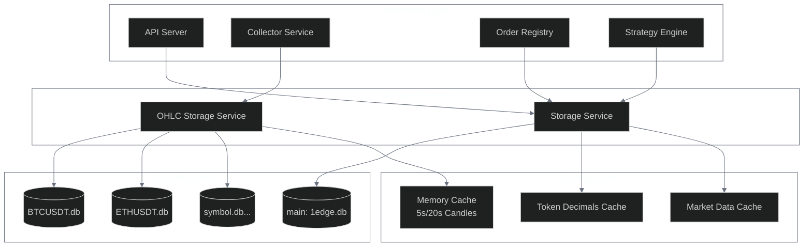
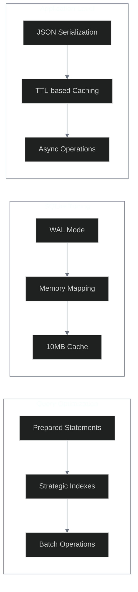
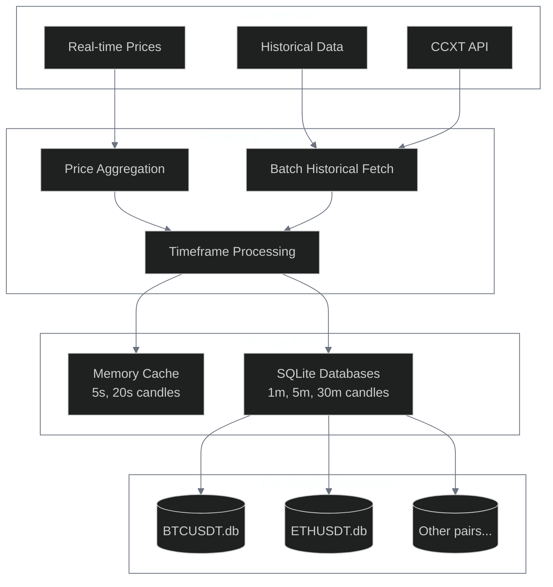
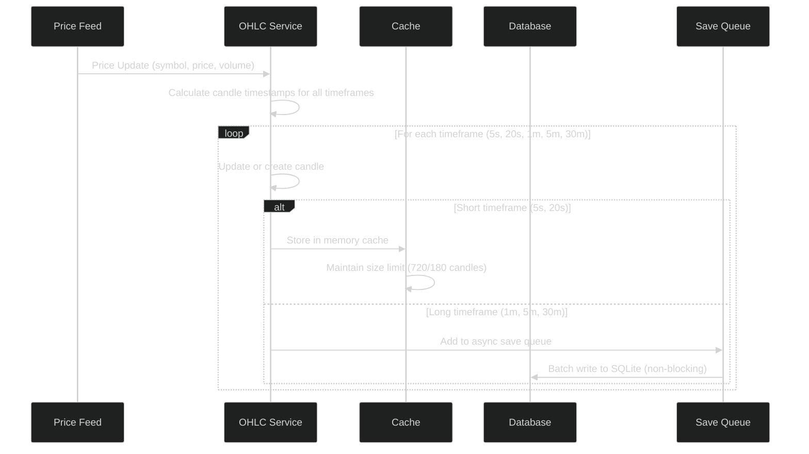
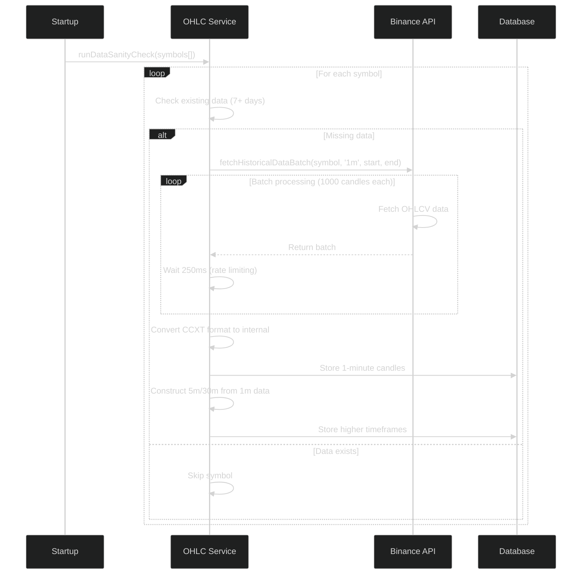
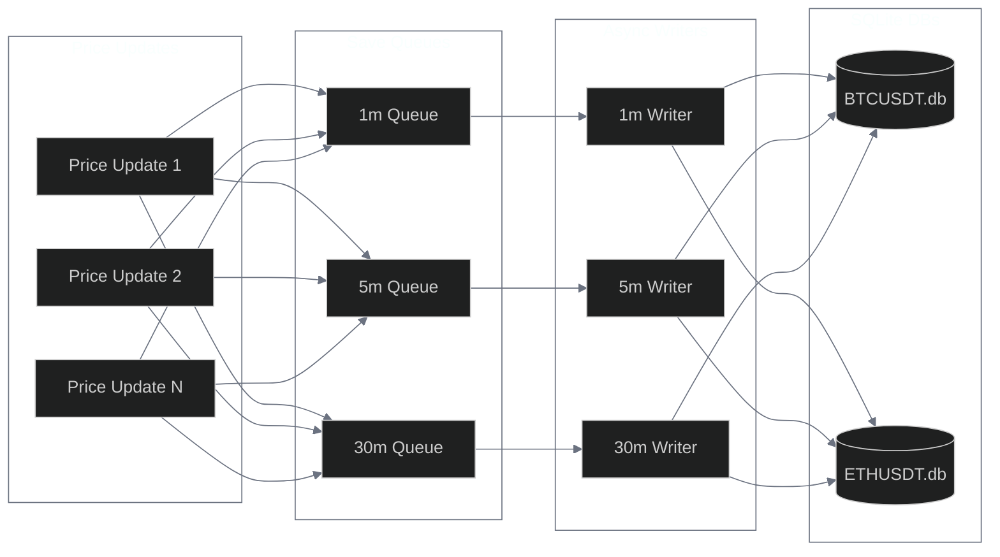

# Storage Services Documentation

> **Dual-Storage Architecture**: High-performance data persistence using specialized SQLite services for trading data and market data with ACID compliance.

1edge employs a dual-storage architecture with specialized services for different data types: the main Storage Service for trading data and the OHLC Storage Service for market data. Both services use SQLite for high-performance, ACID-compliant data persistence.

| Service                  | Purpose                                      | Database Type       | Status |
| ------------------------ | -------------------------------------------- | ------------------- | ------ |
| Storage Service          | Trading data (orders, positions, strategies) | SQLite (main)       |        |
| OHLC Storage Service     | Market data (candles, price feeds)           | SQLite (per-symbol) |        |
| Caching Layer            | In-memory acceleration                       | Memory + TTL        |        |
| Performance Optimization | WAL mode, prepared statements                | Built-in            |        |

## Architecture Overview



## Storage Service (`back/services/storage.ts`)

The main Storage Service handles all trading-related data including orders, positions, strategies, and market data caching.

| Data Type         | Storage Method                     | Performance            | Status |
| ----------------- | ---------------------------------- | ---------------------- | ------ |
| Orders            | SQLite tables + JSON serialization | Ultra-fast queries     |        |
| Positions         | Structured tables                  | Optimized lookups      |        |
| Strategies        | JSON configuration storage         | Flexible schema        |        |
| Market Data Cache | TTL-based memory cache             | Sub-millisecond access |        |

### Core Features

| Feature                  | Implementation                        | Benefit                | Status |
| ------------------------ | ------------------------------------- | ---------------------- | ------ |
| Unified Trading Data     | Orders, positions, strategies, events | Single source of truth |        |
| Performance Optimization | Pre-compiled statements, indexes      | Ultra-fast queries     |        |
| Object Serialization     | Raw JSON storage                      | Data integrity         |        |
| Market Data Caching      | TTL-based ticker/token cache          | Sub-ms access          |        |
| SQLite Optimizations     | WAL mode, memory mapping              | Concurrent access      |        |

### Database Schema

#### Orders Table

```sql
CREATE TABLE orders (
    id TEXT PRIMARY KEY,
    order_hash TEXT UNIQUE,
    strategy_id TEXT,
    type TEXT NOT NULL,
    status TEXT NOT NULL,
    maker_asset TEXT NOT NULL,
    taker_asset TEXT NOT NULL,
    making_amount TEXT NOT NULL,
    taking_amount TEXT NOT NULL,
    maker TEXT NOT NULL,
    receiver TEXT,
    salt TEXT,
    signature TEXT,
    size TEXT NOT NULL,
    remaining_size TEXT NOT NULL,
    trigger_count INTEGER DEFAULT 0,
    next_trigger_value TEXT,
    trigger_price REAL,
    filled_amount TEXT DEFAULT '0',
    created_at INTEGER NOT NULL,
    executed_at INTEGER,
    cancelled_at INTEGER,
    tx_hash TEXT,
    network INTEGER NOT NULL,
    expiry INTEGER,
    user_signed_payload TEXT,
    one_inch_order_hashes TEXT,
    raw_data TEXT NOT NULL -- Complete Order object as JSON
);
```

#### Positions Table

```sql
CREATE TABLE positions (
    id TEXT PRIMARY KEY,
    strategy_id TEXT NOT NULL,
    symbol TEXT NOT NULL,
    side TEXT NOT NULL,
    entry_price REAL NOT NULL,
    current_price REAL,
    size TEXT NOT NULL,
    size_usd REAL NOT NULL,
    pnl REAL,
    pnl_percent REAL,
    opened_at INTEGER NOT NULL,
    closed_at INTEGER
);
```

#### Strategies Table

```sql
CREATE TABLE strategies (
    id TEXT PRIMARY KEY,
    name TEXT NOT NULL,
    type TEXT NOT NULL,
    status TEXT NOT NULL,
    network INTEGER NOT NULL,
    enabled INTEGER NOT NULL,
    config TEXT NOT NULL, -- Complete Strategy object as JSON
    started_at INTEGER,
    paused_at INTEGER,
    stopped_at INTEGER,
    order_count INTEGER DEFAULT 0,
    filled_count INTEGER DEFAULT 0,
    total_volume TEXT DEFAULT '0',
    pnl REAL DEFAULT 0,
    pnl_percent REAL DEFAULT 0
);
```

### Performance Optimizations



### Key Operations

#### Order Management

```typescript
// Save complete order with full serialization
await saveOrder(order: Order): Promise<void>

// Retrieve orders with various filters
await getActiveOrders(): Promise<Order[]>
await getOrdersByMaker(address: string): Promise<Order[]>
await getOrdersByStrategy(strategyId: string): Promise<Order[]>
await getPendingOrders(): Promise<Order[]>
```

#### Position Tracking

```typescript
// Position lifecycle management
await savePosition(position: Position): Promise<void>
await getOpenPositions(strategyId?: string): Promise<Position[]>
await getPosition(id: string): Promise<Position | null>
```

#### Strategy Management

```typescript
// Strategy CRUD operations
await saveStrategy(strategy: Strategy): Promise<void>
await getActiveStrategies(): Promise<Strategy[]>
await getAllStrategies(): Promise<Strategy[]>
```

#### Caching System

```typescript
// Market data caching with TTL
await cacheTicker(symbol: string, data: TickerFeed, ttl?: number): Promise<void>
await getCachedTicker(symbol: string): Promise<TickerFeed | null>

// Token metadata caching
await cacheTokenDecimals(chainId: number, address: string, decimals: number): Promise<void>
await getCachedTokenDecimals(chainId: number, address: string): Promise<number | null>
```

## OHLC Storage Service (`back/services/ohlcStorage.ts`)

Specialized service for high-performance OHLC (candlestick) data storage and real-time market data processing.

| Capability              | Implementation                     | Performance               | Status |
| ----------------------- | ---------------------------------- | ------------------------- | ------ |
| Multi-Timeframe Storage | 5s, 20s (cache) + 1m, 5m, 30m (DB) | Optimized access patterns |        |
| Real-time Processing    | Live price feed integration        | <1ms per update           |        |
| Historical Data         | 14-day automatic backfill          | Batch API optimization    |        |
| Per-Symbol Databases    | Isolated SQLite files              | Parallel access           |        |

### Architecture



### Key Features

#### 🕐 Multi-Timeframe Support

| Timeframe          | Storage Type     | Size Limit      | Purpose            | Status |
| ------------------ | ---------------- | --------------- | ------------------ | ------ |
| 5s, 20s            | Memory cache     | 720/180 candles | Ultra-fast access  |        |
| 1m, 5m, 30m        | SQLite database  | Unlimited       | Persistent storage |        |
| Smart Construction | 1m → higher TFs  | Efficient       | Space optimization |        |
| Real-time Updates  | Live price feeds | Continuous      | Current candles    |        |

#### Historical Data Management

| Feature            | Specification        | Implementation         | Status |
| ------------------ | -------------------- | ---------------------- | ------ |
| Automatic Backfill | 14 days on startup   | CCXT + Binance API     |        |
| Batch API Calls    | 1000-candle chunks   | Rate-limited requests  |        |
| Efficient Storage  | 1m base data only    | Local TF construction  |        |
| Data Validation    | OHLC + sanity checks | Integrity verification |        |

#### Per-Symbol Databases

Each trading pair gets its own SQLite database for optimal performance:

| Database   | Tables                              | Purpose            | Status |
| ---------- | ----------------------------------- | ------------------ | ------ |
| BTCUSDT.db | candles_1m, candles_5m, candles_30m | BTC/USDT data      |        |
| ETHUSDT.db | candles_1m, candles_5m, candles_30m | ETH/USDT data      |        |
| Symbol.db  | Standardized schema                 | Per-pair isolation |        |

```sql
-- Example: BTCUSDT.db
CREATE TABLE candles_1m (
    timestamp INTEGER PRIMARY KEY,
    open REAL NOT NULL,
    high REAL NOT NULL,
    low REAL NOT NULL,
    close REAL NOT NULL,
    volume REAL NOT NULL,
    created_at INTEGER DEFAULT (strftime('%s', 'now') * 1000)
);

CREATE TABLE candles_5m (
    timestamp INTEGER PRIMARY KEY,
    open REAL NOT NULL,
    high REAL NOT NULL,
    low REAL NOT NULL,
    close REAL NOT NULL,
    volume REAL NOT NULL,
    created_at INTEGER DEFAULT (strftime('%s', 'now') * 1000)
);

CREATE TABLE candles_30m (
    timestamp INTEGER PRIMARY KEY,
    open REAL NOT NULL,
    high REAL NOT NULL,
    low REAL NOT NULL,
    close REAL NOT NULL,
    volume REAL NOT NULL,
    created_at INTEGER DEFAULT (strftime('%s', 'now') * 1000)
);
```

### Data Flow

#### Real-time Price Processing



#### Historical Data Retrieval



### Symbol Format Conversion

The service handles conversion between internal symbol formats and CCXT exchange formats:

| Format Type     | Example                | Usage                | Status |
| --------------- | ---------------------- | -------------------- | ------ |
| Internal Format | `binance:spot:BTCUSDT` | 1edge system         |        |
| CCXT Format     | `BTC/USDT`             | Exchange APIs        |        |
| Pair Mapping    | BTCUSDT → BTC/USDT     | Automatic conversion |        |

```typescript
// Internal format: "binance:spot:BTCUSDT"
// CCXT format: "BTC/USDT"

private getCCXTSymbol(symbol: Symbol): string {
    const pair = this.getPairFromSymbol(symbol);

    const pairMappings: Record<string, string> = {
        'BTCUSDT': 'BTC/USDT',
        'ETHUSDT': 'ETH/USDT',
        'USDCUSDT': 'USDC/USDT',
        '1INCHUSDT': '1INCH/USDT',
        'AAVEUSDT': 'AAVE/USDT'
    };

    return pairMappings[pair] || pair;
}
```

### Cache Management

Memory-based caching for ultra-fast access to short timeframes:

| Timeframe       | Cache Size  | Duration    | Purpose            | Status |
| --------------- | ----------- | ----------- | ------------------ | ------ |
| 5s              | 720 candles | 1 hour      | Ultra-fast queries |        |
| 20s             | 180 candles | 1 hour      | Real-time display  |        |
| Size Management | Automatic   | Ring buffer | Memory efficiency  |        |

```typescript
// Cache configuration
private readonly CACHE_LIMITS = {
    [OHLCTimeframe.S5]: 720,   // 1 hour of 5s candles
    [OHLCTimeframe.S20]: 180,  // 1 hour of 20s candles
};

// Automatic size management
if (cache.candles.length > cache.maxSize) {
    cache.candles.shift(); // Remove oldest candle
}
```

### Async Save Queue System

Non-blocking database writes with queue management:

| Component     | Purpose                     | Performance         | Status |
| ------------- | --------------------------- | ------------------- | ------ |
| Price Updates | Trigger queue population    | Real-time           |        |
| Save Queues   | Buffer writes per timeframe | Non-blocking        |        |
| Async Writers | Background database writes  | Parallel processing |        |
| SQLite DBs    | Persistent storage          | ACID compliance     |        |



### API Integration

#### Data Retrieval

```typescript
// Get candles with flexible filtering
async getCandles(
    symbol: Symbol,
    timeframe: OHLCTimeframe,
    startTime?: number,
    endTime?: number,
    limit?: number
): Promise<OHLCCandle[]>

// Get storage statistics
async getDataStats(symbol: Symbol): Promise<Record<string, any>>
```

#### Real-time Processing

```typescript
// Process live price updates
async processPriceUpdate(
    symbol: Symbol,
    price: number,
    volume: number = 0
): Promise<void>

// Historical data sanity check (startup)
async runDataSanityCheck(symbols: Symbol[]): Promise<void>
```

## Data Integrity and Validation

### OHLC Relationship Validation

```typescript
// Verify candle logic
expect(candle.high).toBeGreaterThanOrEqual(Math.max(candle.open, candle.close));
expect(candle.low).toBeLessThanOrEqual(Math.min(candle.open, candle.close));
expect(candle.volume).toBeGreaterThanOrEqual(0);
```

### Historical Data Completeness

| Requirement        | Specification                  | Status |
| ------------------ | ------------------------------ | ------ |
| Minimum Data       | 7 days                         |        |
| Automatic Backfill | 14 days when missing           |        |
| Data Volume        | ~20,160 1m candles per symbol  |        |
| Validation         | Price ranges, OHLC, timestamps |        |

### Error Handling

| Error Type          | Recovery Strategy            | Status |
| ------------------- | ---------------------------- | ------ |
| Partial Failures    | Continue with available data |        |
| Rate Limit Recovery | Exponential backoff          |        |
| Database Locks      | Queue-based resolution       |        |
| Data Corruption     | Auto-reconstruction          |        |

## Performance Characteristics

### Storage Service

| Metric           | Performance          | Target              | Status |
| ---------------- | -------------------- | ------------------- | ------ |
| Order Queries    | <1ms                 | Prepared statements |        |
| Batch Operations | 1000+ records/tx     | High throughput     |        |
| Cache Hit Rate   | >95%                 | Frequently accessed |        |
| Database Size    | ~100MB per 1M orders | Efficient storage   |        |

### OHLC Storage Service

| Metric            | Performance           | Specification         | Status |
| ----------------- | --------------------- | --------------------- | ------ |
| Real-time Updates | <1ms per update       | Ultra-fast processing |        |
| Historical Fetch  | ~10s per symbol       | 14 days backfill      |        |
| Memory Usage      | ~50MB per symbol      | Cached timeframes     |        |
| Database Size     | ~10MB per symbol/year | Efficient storage     |        |

### System-wide Performance

| Metric                | Capability            | Notes                     | Status |
| --------------------- | --------------------- | ------------------------- | ------ |
| Concurrent Operations | 100+ simultaneous r/w | WAL mode enables          |        |
| Data Retention        | Unlimited             | Disk space dependent      |        |
| Startup Time          | 30-60 seconds         | Historical data dependent |        |
| Recovery Time         | <5 seconds            | Crash recovery            |        |

## Monitoring and Maintenance

### Health Checks

| Check Type        | Frequency  | Purpose                    | Status |
| ----------------- | ---------- | -------------------------- | ------ |
| Data Completeness | Regular    | Expected vs actual records |        |
| Storage Usage     | Continuous | Disk space monitoring      |        |
| Query Performance | Real-time  | Slow query detection       |        |
| Cache Efficiency  | Continuous | Hit/miss ratio tracking    |        |

### Maintenance Tasks

| Task               | Schedule  | Purpose                 | Status |
| ------------------ | --------- | ----------------------- | ------ |
| Index Optimization | Regular   | ANALYZE and VACUUM      |        |
| Data Archival      | Scheduled | Cleanup and compression |        |
| Cache Warming      | Startup   | Preload frequent data   |        |
| Backup Procedures  | Automated | SQLite backups          |        |

### Troubleshooting

| Issue              | Diagnosis                 | Solution              | Status |
| ------------------ | ------------------------- | --------------------- | ------ |
| Database Locks     | Long-running transactions | Kill/optimize queries |        |
| Memory Growth      | Cache size monitoring     | Cleanup procedures    |        |
| Slow Queries       | Query plan analysis       | Add indexes           |        |
| Data Inconsistency | Integrity checks          | Rebuild if needed     |        |
