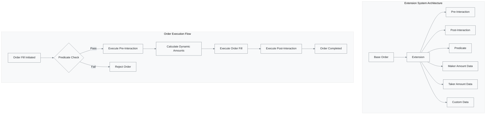

# Extensions

> ** Supercharge Your Orders**  
> Extensions unlock advanced functionality for 1inch Limit Order Protocol, enabling custom behaviors, interactions, and sophisticated trading strategies.



---

## Overview

Extensions provide a powerful plugin system that allows developers to customize order behavior beyond standard parameters. Think of extensions as smart contract "middleware" that executes during order processing.

### Extension Capabilities

| Feature               | Description                                 | Use Case                   |
| --------------------- | ------------------------------------------- | -------------------------- |
| Pre/Post Interactions | Execute custom logic before/after fills     | Complex trading strategies |
| Dynamic Pricing       | Calculate amounts based on external data    | Oracle-based pricing       |
| Conditional Execution | Orders execute only when conditions are met | Automated trading triggers |
| Custom Permissions    | Advanced authorization mechanisms           | Enterprise integrations    |

---

## Extension Class

> ** Core Extension Engine**  
> The Extension class provides comprehensive functionality for encoding, decoding, and managing order extensions.

| Method    | Purpose                     | Signature                      | Usage                     |
| --------- | --------------------------- | ------------------------------ | ------------------------- |
| decode    | Parse extension from bytes  | `(bytes: string) => Extension` | Load existing extensions  |
| default   | Create empty extension      | `() => Extension`              | Start building extensions |
| keccak256 | Calculate extension hash    | `() => bigint`                 | Verification and indexing |
| isEmpty   | Check if extension is empty | `() => boolean`                | Validation logic          |
| encode    | Convert to hex string       | `() => string`                 | Blockchain submission     |

### Method Details

#### decode

> **📥 Parse Extension Data**  
> Reconstructs an Extension instance from raw blockchain bytes.

```typescript
const extension = Extension.decode("0x1234567890abcdef...");
```

#### default

> ** Create Empty Extension**  
> Generates a new Extension instance with no active components.

```typescript
const emptyExtension = Extension.default();
```

#### keccak256

> **🔒 Generate Hash**  
> Computes cryptographic hash for verification and indexing purposes.

```typescript
const hash = extension.keccak256();
console.log(`Extension Hash: ${hash}`);
```

#### isEmpty

> ** Validation Check**  
> Determines if the extension contains any active components.

```typescript
if (extension.isEmpty()) {
  console.log("No extension functionality active");
}
```

#### encode

> ** Blockchain Ready**  
> Converts extension to hex string format for blockchain submission.

```typescript
const encodedData = extension.encode();
// Result: "0x1234567890abcdef..."
```

---

## Extension Properties

> **🧩 Modular Components**  
> Extensions are composed of multiple specialized components, each serving a specific purpose in order execution.

### Core Extension Components

| Property                |  Purpose                        |  Type           |  Use Case                 |
| ----------------------- | --------------------------------- | ----------------- | --------------------------- |
| **🆔 EMPTY**            | Default empty state               | `ExtensionStruct` | Template for new extensions |
| ** makerAssetSuffix** | Additional maker asset data       | `string`          | Custom token handling       |
| ** takerAssetSuffix** | Additional taker asset data       | `string`          | Custom token handling       |
| ** makingAmountData** | Dynamic making amount calculation | `string`          | Oracle-based pricing        |
| ** takingAmountData** | Dynamic taking amount calculation | `string`          | Oracle-based pricing        |
| ** predicate**        | Conditional execution logic       | `string`          | Automated triggers          |
| ** makerPermit**      | Maker authorization data          | `string`          | Gasless approvals           |
| **🔄 preInteraction**   | Pre-execution hooks               | `string`          | Setup operations            |
| **🏁 postInteraction**  | Post-execution hooks              | `string`          | Cleanup operations          |
| **🎨 customData**       | Application-specific data         | `string`          | Custom functionality        |

### Property Details

#### EMPTY

> ** Template Foundation**  
> Provides the basic structure for building new extensions.

```typescript
const template = Extension.EMPTY;
// Contains all properties initialized to empty strings
```

#### makerAssetSuffix & takerAssetSuffix

> ** Token Enhancement**  
> Additional data appended to token transfers for custom handling.

```typescript
// Example: Add fee calculation data
extension.makerAssetSuffix = "0x1234..."; // Fee calculation bytes
extension.takerAssetSuffix = "0x5678..."; // Slippage protection data
```

#### makingAmountData & takingAmountData

> ** Dynamic Pricing**  
> Enable real-time amount calculations based on external data sources.

```typescript
// Oracle-based pricing
extension.makingAmountData = "0xabcd..."; // Price oracle contract call
extension.takingAmountData = "0xefgh..."; // Slippage adjustment logic
```

#### predicate

> **🔒 Conditional Logic**  
> Orders execute only when specified conditions are met.

```typescript
// Time-based execution
extension.predicate = "0x1111..."; // "Execute only after timestamp X"

// Price-based execution
extension.predicate = "0x2222..."; // "Execute only if ETH > $2000"
```

#### makerPermit

> ** Gasless Approvals**  
> Include EIP-2612 permit data for seamless token authorization.

```typescript
// Gasless USDC approval
extension.makerPermit = "0x3333..."; // Encoded permit signature
```

#### preInteraction & postInteraction

> **🎭 Execution Hooks**  
> Custom logic that runs before and after order fills.

```typescript
// DeFi strategy integration
extension.preInteraction = "0x4444..."; // Withdraw from yield farm
extension.postInteraction = "0x5555..."; // Deposit to new strategy
```

#### customData

> ** Unlimited Possibilities**  
> Application-specific data for custom functionality.

```typescript
// Trading bot metadata
extension.customData = "0x6666..."; // Strategy parameters, user preferences, etc.
```

---

## ExtensionBuilder Class

> ** Fluent Extension Creation**  
> The ExtensionBuilder provides an intuitive, chainable interface for constructing sophisticated order extensions with ease.

### Builder Pattern Benefits

- ** Chainable Methods**: Fluent API for readable code
- ** Type Safety**: Full TypeScript support and validation
- **🛠 Incremental Building**: Add components step by step
- ** Easy Testing**: Clear separation of concerns

### Builder Methods Overview

| Method                      |  Purpose                |  Parameters                            |  Chainable |
| --------------------------- | ------------------------- | ---------------------------------------- | ------------ |
| ** withMakerAssetSuffix** | Add maker asset data      | `suffix: string`                         |            |
| ** withTakerAssetSuffix** | Add taker asset data      | `suffix: string`                         |            |
| ** withMakingAmountData** | Set dynamic making amount | `address: Address, data: string`         |            |
| ** withTakingAmountData** | Set dynamic taking amount | `address: Address, data: string`         |            |
| ** withPredicate**        | Add conditional logic     | `predicate: string`                      |            |
| ** withMakerPermit**      | Include permit data       | `tokenFrom: Address, permitData: string` |            |
| **🔄 withPreInteraction**   | Set pre-execution hook    | `interaction: Interaction`               |            |
| **🏁 withPostInteraction**  | Set post-execution hook   | `interaction: Interaction`               |            |
| **🎨 withCustomData**       | Add custom functionality  | `data: string`                           |            |
| **✨ build**                | Create final Extension    | -                                        |  Final     |

### Detailed Method Documentation

#### withMakerAssetSuffix

> ** Enhance Maker Asset**  
> Appends custom data to maker asset transfers for specialized handling.

```typescript
const builder = new ExtensionBuilder().withMakerAssetSuffix(
  "0x1234567890abcdef",
); // Custom fee calculation data
```

#### withTakerAssetSuffix

> ** Enhance Taker Asset**  
> Appends custom data to taker asset transfers for specialized handling.

```typescript
const builder = new ExtensionBuilder().withTakerAssetSuffix(
  "0xabcdef1234567890",
); // Slippage protection data
```

#### withMakingAmountData

> ** Dynamic Making Amount**  
> Enables real-time calculation of making amounts via external contracts.

```typescript
import { Address } from "@1inch/limit-order-sdk";

const oracleAddress = new Address("0x1234..."); // Price oracle contract
const callData = "0xabcd..."; // Function call data

const builder = new ExtensionBuilder().withMakingAmountData(
  oracleAddress,
  callData,
);
```

**Parameters:**

- `address`: Contract address that will calculate the making amount
- `data`: Encoded function call data for the calculation

#### withTakingAmountData

> ** Dynamic Taking Amount**  
> Enables real-time calculation of taking amounts via external contracts.

```typescript
const slippageProtection = new Address("0x5678...");
const protectionData = "0xefgh...";

const builder = new ExtensionBuilder().withTakingAmountData(
  slippageProtection,
  protectionData,
);
```

**Parameters:**

- `address`: Contract address that will calculate the taking amount
- `data`: Encoded function call data for the calculation

#### withPredicate

> **🔒 Conditional Execution**  
> Adds logic that must evaluate to true for order execution.

```typescript
// Time-based predicate: execute only after specific timestamp
const timeBasedPredicate = "0x111...";

const builder = new ExtensionBuilder().withPredicate(timeBasedPredicate);
```

#### withMakerPermit

> ** Gasless Authorization**  
> Includes EIP-2612 permit for seamless token approvals.

```typescript
const usdcAddress = new Address("0xA0b86a33E6433c68844f6e3A93366Ea38e2a3F98");
const permitSignature = "0x2222..."; // EIP-2612 permit data

const builder = new ExtensionBuilder().withMakerPermit(
  usdcAddress,
  permitSignature,
);
```

#### withPreInteraction & withPostInteraction

> **🎭 Execution Hooks**  
> Custom logic executed before and after order fills.

```typescript
import { Interaction } from "@1inch/limit-order-sdk";

// Withdraw from yield farm before trade
const preHook = new Interaction({
  target: new Address("0x3333..."), // Yield farm contract
  data: "0x4444...", // Withdraw function call
});

// Deposit proceeds to new strategy after trade
const postHook = new Interaction({
  target: new Address("0x5555..."), // Strategy contract
  data: "0x6666...", // Deposit function call
});

const builder = new ExtensionBuilder()
  .withPreInteraction(preHook)
  .withPostInteraction(postHook);
```

#### withCustomData

> ** Unlimited Customization**  
> Application-specific data for any custom functionality.

```typescript
// Trading bot strategy parameters
const strategyParams = "0x7777..."; // Encoded strategy configuration

const builder = new ExtensionBuilder().withCustomData(strategyParams);
```

#### build

> **🏁 Finalize Extension**  
> Constructs the final Extension instance from all configured components.

```typescript
const extension = new ExtensionBuilder()
  .withMakerAssetSuffix("0x1111...")
  .withPredicate("0x2222...")
  .withPreInteraction(preHook)
  .build(); // Creates Extension instance
```

### Complete Example

```typescript
import { ExtensionBuilder, Address, Interaction } from "@1inch/limit-order-sdk";

// Build a sophisticated extension with multiple components
const advancedExtension = new ExtensionBuilder()
  //  Add fee calculation for maker asset
  .withMakerAssetSuffix("0x1234567890abcdef")

  //  Dynamic pricing via oracle
  .withMakingAmountData(
    new Address("0x5f4eC3Df9cbd43714FE2740f5E3616155c5b8419"), // Chainlink ETH/USD
    "0x50d25bcd", // latestRoundData()
  )

  //  Time-based execution
  .withPredicate("0x1111222233334444") // Execute after 2024-12-01

  // 🔄 Withdraw from Aave before trade
  .withPreInteraction(
    new Interaction({
      target: new Address("0x7d2768dE32b0b80b7a3454c06BdAc94A69DDc7A9"),
      data: "0x69328dec...", // withdraw(asset, amount, to)
    }),
  )

  // 🏁 Deposit to Compound after trade
  .withPostInteraction(
    new Interaction({
      target: new Address("0x5d3a536E4D6DbD6114cc1Ead35777bAB948E3643"),
      data: "0xa0712d68...", // mint(mintAmount)
    }),
  )

  // 🎨 Custom trading bot metadata
  .withCustomData("0x99887766554433221100")

  .build(); // ✨ Create the extension

console.log("Extension hash:", advancedExtension.keccak256());
console.log("Encoded extension:", advancedExtension.encode());
```

---

## Extension Mastery Complete!

 You now understand how to leverage the full power of 1inch Limit Order Extensions.

### Next Steps

1. **🧪 Experiment**: Try building simple extensions first
2. ** Integrate**: Add extensions to your limit orders
3. ** Monitor**: Track extension performance and gas usage
4. ** Optimize**: Refine your extension logic for efficiency
