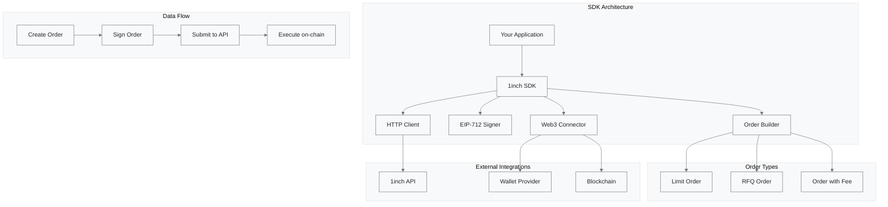

# 1inch Limit Order SDK Overview

> ** Comprehensive DeFi Trading Toolkit**  
> The 1inch Limit Order SDK is a powerful JavaScript/TypeScript library designed for seamless interaction with the 1inch Limit Order Protocol v4. Build sophisticated trading applications with enterprise-grade tools and precision control.



---

## Key Features

### Core Capabilities

| Feature               | Description                                     | Benefit                       |
| --------------------- | ----------------------------------------------- | ----------------------------- |
| Order Creation        | Build limit orders with customizable parameters | Precise trade control         |
| EIP-712 Signing       | Cryptographic signing using Ethereum standards  | Maximum security              |
| Orderbook Integration | Submit and query orders via 1inch API           | Global liquidity access       |
| TypeScript Support    | Full type definitions and IntelliSense          | Enhanced developer experience |
| HTTP Flexibility      | Multiple connector options (Fetch, Axios)       | Adaptable architecture        |

### Advanced Features

- **Gas Optimization**: Efficient smart contract interactions
- **Extensible Architecture**: Plugin system for custom functionality
- **Multi-Network Support**: Deploy across multiple blockchains
- **Security First**: Battle-tested cryptographic implementations
- **Real-time Monitoring**: Order status tracking and updates

---

## Core Components

> ** Modular Architecture**  
> The SDK is built with a modular design, allowing you to use only the components you need while maintaining full functionality.

### Order Types

| Order Type        | Purpose                   | Performance      | Features                   |
| ----------------- | ------------------------- | ---------------- | -------------------------- |
| LimitOrder        | Standard trading orders   | Moderate         | Full feature set           |
| RfqOrder          | Market maker optimization | High performance | Lightweight, gas-efficient |
| LimitOrderWithFee | Fee-integrated orders     | Moderate         | Built-in fee mechanisms    |

#### Order Type Details

- **🏛 LimitOrder**: Complete feature support including partial fills, extensions, and multiple executions
- ** RfqOrder**: Streamlined for professional market makers with minimal gas overhead
- **💸 LimitOrderWithFee**: Sophisticated fee handling for integrators and protocols

### Configuration Traits

| Trait Type       | Scope         | Purpose                         | Usage              |
| ---------------- | ------------- | ------------------------------- | ------------------ |
| ** MakerTraits** | Order creator | Define order behavior and rules | All order types    |
| ** TakerTraits** | Order filler  | Set execution preferences       | Filling operations |

#### Trait Capabilities

- ** MakerTraits**: Expiration, nonces, partial fills, private orders, interactions
- ** TakerTraits**: Amount modes, unwrapping, permit handling, custom receivers

### API Integration Layer

| Component                  | Level      | Description                     | 💼 Use Case                |
| -------------------------- | ---------- | ------------------------------- | -------------------------- |
| ** Sdk**                   | High-level | Complete order management suite | Application integration    |
| ** Api**                   | Mid-level  | Direct orderbook API access     | Custom implementations     |
| ** HttpProviderConnector** | Low-level  | Pluggable HTTP client system    | Infrastructure flexibility |

---

## Use Cases & Applications

> ** Versatile Trading Solutions**  
> The SDK enables a wide range of DeFi applications, from simple trading interfaces to sophisticated market-making operations.

### Primary Use Cases

| Use Case                  | Description                                                    | Target Users            | ⭐ Complexity |
| ------------------------- | -------------------------------------------------------------- | ----------------------- | ------------- |
| **🏛 DEX Integration**    | Build decentralized exchanges with limit order functionality   | 👨‍ DApp developers     | Medium        |
| **🤖 Trading Bots**       | Create automated trading strategies with precise price control | Quantitative traders    | Low           |
| **🏪 Market Making**      | Deploy efficient market-making strategies using RFQ orders     | 💼 Professional traders | 🔴 High       |
| ** Portfolio Management** | Execute trades at specific price targets                       | Asset managers          | Medium        |

### Advanced Applications

- ** Cross-chain Trading**: Leverage multiple networks for arbitrage opportunities
- ** Yield Optimization**: Automated rebalancing based on price triggers
- ** Dollar-Cost Averaging**: Systematic investment strategies
- **🛡 Risk Management**: Stop-loss and take-profit order automation

---

## Getting Started

> ** Quick Launch Sequence**  
> Get up and running with the 1inch Limit Order SDK in minutes.

### Step 1: Installation

```bash
# Install the SDK package
bun add '@1inch/limit-order-sdk'
```

### Step 2: Learning Path

| Step  | Resource                                                   | Focus                  | ⏱ Time |
| ----- | ---------------------------------------------------------- | ---------------------- | ------- |
| **1** | [Installation Guide](./install.md)                         | Setup and dependencies | 5 min   |
| **2** | [Integration Guide](./integration.md)                      | Create first order     | 15 min  |
| **3** | [Contract Documentation](../limit-order-maker-contract.md) | Protocol deep dive     | 30 min  |
| **4** | [Extensions Guide](../extensions.md)                       | Advanced features      | 20 min  |

---

## Network Support

> ** Multi-Chain Compatibility**  
> Deploy your applications across the entire 1inch ecosystem with seamless cross-chain support.

### Supported Networks

| Network       | Chain ID | Type      | Status |
| ------------- | -------- | --------- | ------ |
| **Ethereum**  | 1        | L1        | Active |
| **Polygon**   | 137      | L2        | Active |
| **BSC**       | 56       | Sidechain | Active |
| **Arbitrum**  | 42161    | L2        | Active |
| **Optimism**  | 10       | L2        | Active |
| **Avalanche** | 43114    | L1        | Active |
| **Fantom**    | 250      | L1        | Active |

> ** Growing Ecosystem**  
> New networks are continuously added based on community demand and protocol deployment.

---

## Authentication & API Access

> **🛡 Secure API Integration**  
> Professional-grade authentication system ensures secure and reliable access to the 1inch ecosystem.

### Getting Your API Key

1. ** Visit**: [1inch Developer Portal](https://portal.1inch.dev/)
2. ** Register**: Create your developer account
3. ** Generate**: Obtain authentication credentials
4. ** Configure**: Integrate into your application

### Security Best Practices

- **🔐 Environment Variables**: Store API keys securely
- **🔄 Key Rotation**: Regularly update credentials
- ** Rate Limiting**: Respect API usage limits
- **🛡 Error Handling**: Implement robust error management

---

## Next Steps & Resources

> ** Launch Your Journey**  
> Everything you need to become a 1inch Limit Order Protocol expert.

### Essential Reading

| Priority    | Resource                                           | Purpose                |
| ----------- | -------------------------------------------------- | ---------------------- |
| **🔥 High** | [Installation Guide](./install.md)                 | Get started quickly    |
| **🔥 High** | [Integration Guide](./integration.md)              | Master order creation  |
| ** Medium** | [Maker Contract](../limit-order-maker-contract.md) | Understand internals   |
| ** Medium** | [Taker Contract](../limit-order-taker-contract.md) | Learn execution        |
| ** Low**    | [Extensions](../extensions.md)                     | Advanced customization |

### Development Tools

- **📘 TypeScript Definitions**: Full IntelliSense support
- **🧪 Test Framework**: Comprehensive testing utilities
- ** Monitoring Tools**: Order tracking and analytics
- ** Debug Utilities**: Development and troubleshooting helpers

### Support & Community

- ** Documentation**: Comprehensive guides and references
- ** Discord**: Join the developer community
- **🐛 GitHub**: Report issues and contribute
- **📧 Support**: Professional developer assistance
