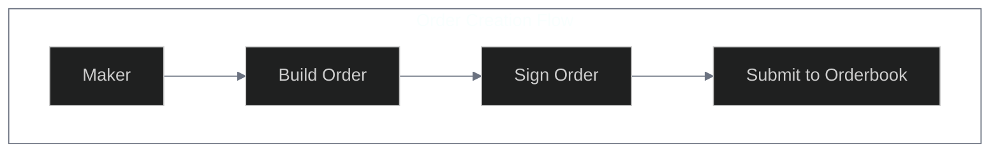
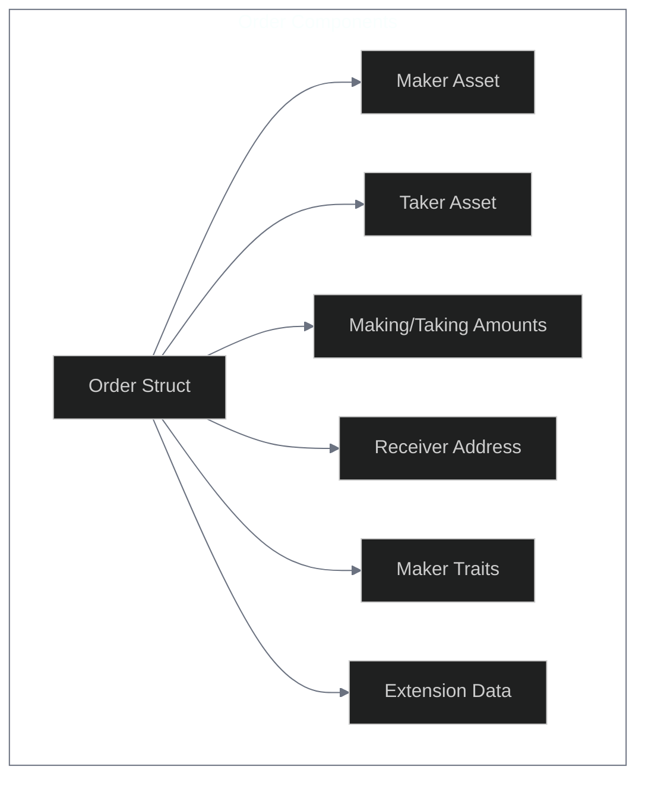
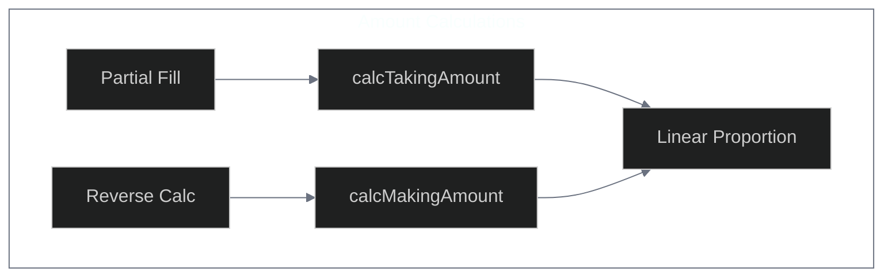
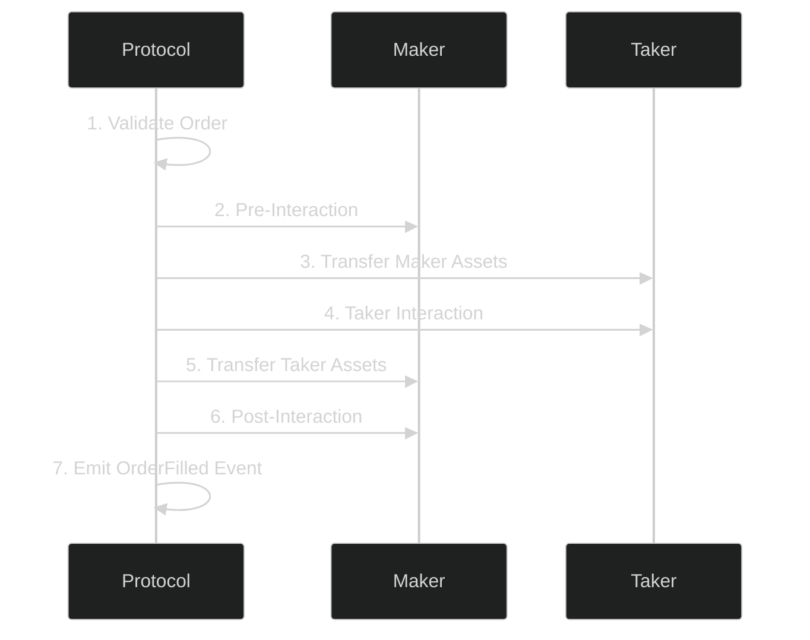

# Creating Limit Orders

> **Order Creation Engine**  
> Complete guide to creating and configuring limit orders in the 1inch Limit Order Protocol v4. From basic orders to advanced strategies with extensions.







## Overview

> **Flexible Trading Engine**  
> The 1inch Limit Order Protocol enables creation of highly customizable orders that go far beyond traditional limit orders.

Limit orders are a fundamental part of financial trading, allowing traders to buy or sell assets at specific prices or better. The 1inch limit order protocol implements smart contract logic to fill on-chain orders created off-chain, offering extreme flexibility for:

- **Classic limit orders** with precise price execution
- **Advanced order types** like Dutch auctions and range orders
- **Non-ERC20 token trading** (NFTs, custom tokens)
- **Dynamic exchange rates** calculated on-chain
- **Conditional execution** with custom predicates
- **Gas-efficient operations** with optimized storage

---

## Basic Order Features

> **Standard Functionality**  
> Essential features available for all order types.

| Feature                   | Description                                        | Use Case                |
| ------------------------- | -------------------------------------------------- | ----------------------- |
| **Custom Receiver**       | Specify receiving wallet different from maker      | Multi-sig management    |
| **Partial Fills**         | Allow orders to be filled in multiple transactions | Large order execution   |
| **Multiple Fills**        | Enable repeated partial fills of same order        | Market making           |
| **Expiration**            | Set automatic order invalidation date              | Time-based strategies   |
| **Private Orders**        | Restrict filling to specific taker address         | OTC trading             |
| **Conditional Execution** | Define validation predicates                       | Stop-loss, take-profit  |
| **Nonce Management**      | Easy order cancellation system                     | Order lifecycle control |

---

## Advanced Order Features

> **Cutting-Edge Capabilities**  
> Advanced features for sophisticated trading strategies.

### Non-ERC20 Token Support

**Trade any asset type** using proxy contracts:

- **ERC721 NFTs** with custom transfer logic
- **ERC1155 multi-tokens** with batch operations
- **Custom tokens** with non-standard interfaces

### Dynamic Pricing

**On-chain rate calculations** for advanced strategies:

- **Dutch Auctions** - Price decreases over time
- **Range Orders** - Price changes based on fill volume
- **Oracle-based pricing** - Dynamic rates from external data

### Smart Interactions

**Execute custom code** during order processing:

- **Pre-interactions** - Execute before asset transfer
- **Post-interactions** - Execute after asset transfer
- **Arbitrary logic** - Custom validation and processing

---

## Order Structure

> **Order DNA**  
> The fundamental building blocks of every limit order.

```solidity
struct Order {
    uint256 salt;           // Order salt + extension hash
    address maker;          // Order creator address
    address receiver;       // Asset receiver address
    address makerAsset;     // Token being sold
    address takerAsset;     // Token being bought
    uint256 makingAmount;   // Amount being sold
    uint256 takingAmount;   // Amount being bought
    MakerTraits makerTraits; // Order configuration
}
```

### Parameter Details

| Parameter        | Type          | Description                                               |
| ---------------- | ------------- | --------------------------------------------------------- |
| **salt**         | `uint256`     | Combined order salt (96 bits) + extension hash (160 bits) |
| **maker**        | `address`     | The order creator's address                               |
| **receiver**     | `address`     | Destination for taker assets (can differ from maker)      |
| **makerAsset**   | `address`     | Contract address of token being sold                      |
| **takerAsset**   | `address`     | Contract address of token being bought                    |
| **makingAmount** | `uint256`     | Quantity of maker tokens to sell                          |
| **takingAmount** | `uint256`     | Quantity of taker tokens to receive                       |
| **makerTraits**  | `MakerTraits` | Bit-packed order configuration and metadata               |

> **Unique Orders**  
> Each order requires a unique salt to prevent hash collisions. Orders with identical parameters must use different salts to remain distinct.

---

## MakerTraits Configuration

> **Order DNA System**  
> MakerTraits is a sophisticated bit-packed uint256 that encodes order behavior, permissions, and metadata for gas-efficient storage.

### Bit Structure Overview

```
 Bit Position │ Purpose                 │ Type     │ Description
──────────────┼────────────────────────┼──────────┼─────────────────────────
 255          │ NO_PARTIAL_FILLS_FLAG  │ Flag     │ Disable partial fills
 254          │ ALLOW_MULTIPLE_FILLS   │ Flag     │ Enable multiple fills
 253          │ (unused)               │ Reserved │ Future expansion
 252          │ PRE_INTERACTION_CALL   │ Flag     │ Execute pre-hooks
 251          │ POST_INTERACTION_CALL  │ Flag     │ Execute post-hooks
 250          │ NEED_CHECK_EPOCH       │ Flag     │ Validate epoch manager
 249          │ HAS_EXTENSION_FLAG     │ Flag     │ Order has extensions
 248          │ USE_PERMIT2_FLAG       │ Flag     │ Use Permit2 authorization
 247          │ UNWRAP_WETH_FLAG       │ Flag     │ Unwrap WETH to ETH
 200-246      │ (reserved)             │ Reserved │ Future flags
 120-199      │ Allowed Sender         │ uint80   │ Last 10 bytes of address
 80-119       │ Expiration             │ uint40   │ Timestamp deadline
 40-79        │ Nonce/Epoch            │ uint40   │ Unique identifier
 0-39         │ Series                 │ uint40   │ Epoch series grouping
```

### Control Flags (High Bits)

| Bit     | Flag Name                       | When Set                  | When Clear            | Use Case              |
| ------- | ------------------------------- | ------------------------- | --------------------- | --------------------- |
| **255** | `NO_PARTIAL_FILLS_FLAG`         | Partial fills disabled    | Partial fills allowed | All-or-nothing orders |
| **254** | `ALLOW_MULTIPLE_FILLS_FLAG`     | Multiple fills enabled    | Single fill only      | Market maker orders   |
| **252** | `PRE_INTERACTION_CALL_FLAG`     | Pre-hooks executed        | No pre-execution      | DeFi integrations     |
| **251** | `POST_INTERACTION_CALL_FLAG`    | Post-hooks executed       | No post-execution     | Automated workflows   |
| **250** | `NEED_CHECK_EPOCH_MANAGER_FLAG` | Epoch validation required | No epoch checking     | Advanced invalidation |
| **249** | `HAS_EXTENSION_FLAG`            | Extensions included       | No extensions         | Custom functionality  |
| **248** | `USE_PERMIT2_FLAG`              | Permit2 authorization     | Standard approvals    | Gasless interactions  |
| **247** | `UNWRAP_WETH_FLAG`              | WETH → ETH conversion     | Keep as WETH          | Native ETH delivery   |

### Data Fields (Low Bits)

| Bits        | Field              | Purpose                                  | Details                                  |
| ----------- | ------------------ | ---------------------------------------- | ---------------------------------------- |
| **120-199** | **Allowed Sender** | Restrict order fills to specific address | Last 10 bytes of address (80 bits)       |
| **80-119**  | **Expiration**     | Order deadline timestamp                 | Unix timestamp (40 bits, max ~35k years) |
| **40-79**   | **Nonce/Epoch**    | Unique order identifier                  | For cancellation and tracking            |
| **0-39**    | **Series**         | Epoch series grouping                    | Used with epoch manager                  |

---

## SDK Usage

> **Developer Tools**  
> Comprehensive TypeScript SDK for creating and managing orders.

### Core Calculation Functions

| Function           | Purpose                             | Signature                                                         | Use Case             |
| ------------------ | ----------------------------------- | ----------------------------------------------------------------- | -------------------- |
| `calcTakingAmount` | Calculate proportional taker amount | `(swapMakerAmount, orderMakerAmount, orderTakerAmount) => bigint` | Partial fills        |
| `calcMakingAmount` | Calculate proportional maker amount | `(swapTakerAmount, orderMakerAmount, orderTakerAmount) => bigint` | Reverse calculations |

#### Amount Calculation Examples

```typescript
import { calcTakingAmount, calcMakingAmount } from "@1inch/limit-order-sdk";

// Partial fill calculation
const orderMakerAmount = 100_000000n; // 100 USDT (6 decimals)
const orderTakerAmount = 10_000000000000000000n; // 10 1INCH (18 decimals)
const swapMakerAmount = 50_000000n; // Fill 50 USDT

const requiredTakerAmount = calcTakingAmount(
  swapMakerAmount, // 50 USDT - amount being filled
  orderMakerAmount, // 100 USDT - total order size
  orderTakerAmount, // 10 1INCH - total taker amount
);
// Result: 5_000000000000000000n (5 1INCH)

// Reverse calculation
const swapTakerAmount = 3_000000000000000000n; // Taker provides 3 1INCH
const receivedMakerAmount = calcMakingAmount(
  swapTakerAmount, // 3 1INCH - taker input
  orderMakerAmount, // 100 USDT - total order size
  orderTakerAmount, // 10 1INCH - total taker amount
);
// Result: 30_000000n (30 USDT)
```

### MakerTraits Methods

#### Creation & Configuration

```typescript
import { MakerTraits, Address } from "@1inch/limit-order-sdk";

// Create default traits
const traits = MakerTraits.default();

// Configure order behavior
const configuredTraits = MakerTraits.default()
  .withAllowedSender(new Address("0x1234...")) // Private order
  .withExpiration(BigInt(Math.floor(Date.now() / 1000)) + 3600n) // 1 hour
  .withNonce(42n) // Unique identifier
  .disablePartialFills() // All-or-nothing
  .allowMultipleFills() // Market maker mode
  .withExtension(); // Mark as having extensions
```

#### Query Methods

```typescript
// Check order configuration
if (traits.isPrivate()) {
  console.log("Order restricted to:", traits.allowedSender());
}

const deadline = traits.expiration();
if (deadline !== null) {
  console.log(`Expires: ${new Date(Number(deadline) * 1000)}`);
}

console.log("Partial fills allowed:", traits.isPartialFillAllowed());
console.log("Multiple fills allowed:", traits.isMultipleFillsAllowed());
```

---

## Order Extensions

> **Advanced Functionality**  
> Extensions enable gas-efficient advanced features without changing the core order structure.

Extensions are modular components that add sophisticated functionality:

- **Separated storage** - Extensions stored separately from orders
- **Hash validation** - Extension hash embedded in order salt
- **Conditional execution** - Only processed when needed
- **Gas optimization** - Pay only for features you use

### Available Extensions

#### Asset Transfer Extensions

- **MakerAssetSuffix** - Custom transfer logic for non-ERC20 tokens
- **TakerAssetSuffix** - Custom receive logic for non-standard assets

#### Dynamic Pricing Extensions

- **MakingAmountGetter** - Calculate maker amount dynamically
- **TakingAmountGetter** - Calculate taker amount dynamically
- **DutchAuctionCalculator** - Time-based price decay
- **RangeAmountCalculator** - Volume-based price changes

#### Execution Control Extensions

- **Predicate** - Conditional order validation
- **PreInteractionData** - Execute code before transfers
- **PostInteractionData** - Execute code after transfers

#### Authorization Extensions

- **MakerPermit** - Gasless token approvals

### Extension Structure

Extensions use dynamic length encoding:

```
| Offsets (32 bytes) | Extension Data (variable) | Custom Data (variable) |
```

**Offset Encoding** (bytes 0-31):

- Each 4-byte section contains end offset for corresponding extension
- Extensions packed sequentially after offset table

| Parameter           | Location (bytes) |
| ------------------- | ---------------- |
| MakerAssetSuffix    | [0..3]           |
| TakerAssetSuffix    | [4..7]           |
| MakingAmountGetter  | [8..11]          |
| TakingAmountGetter  | [12..15]         |
| Predicate           | [16..19]         |
| MakerPermit         | [20..23]         |
| PreInteractionData  | [24..27]         |
| PostInteractionData | [28..31]         |

---

## Non-ERC20 Token Trading

> **Universal Asset Support**  
> Trade any token type using proxy contracts that adapt transfer signatures.

### Implementation Steps

1. **Deploy Proxy Contract** - Implement transfer adapter
2. **Set Asset Address** - Use proxy address in order
3. **Configure Extension** - Add asset suffix with extra parameters
4. **Ensure Compatibility** - Cannot use with Permit2

### ERC721 Example

```solidity
contract ERC721Proxy is ImmutableOwner {
    error ERC721ProxyBadSelector();

    constructor(address _immutableOwner) ImmutableOwner(_immutableOwner) {
        if (ERC721Proxy.func_60iHVgK.selector != IERC20.transferFrom.selector)
            revert ERC721ProxyBadSelector();
    }

    /// @notice Proxy transfer method matching IERC20.transferFrom selector
    function func_60iHVgK(
        address from,
        address to,
        uint256 /* amount */,
        uint256 tokenId,
        IERC721 token
    ) external onlyImmutableOwner {
        token.transferFrom(from, to, tokenId);
    }
}
```

**Order Configuration:**

- Set `makerAsset`/`takerAsset` to proxy address
- Enable `HAS_EXTENSION` flag
- Include `makerAssetSuffix`/`takerAssetSuffix` with `tokenId` and `token` address

---

## Dynamic Pricing

> **Smart Price Discovery**  
> Implement sophisticated pricing strategies with on-chain calculations.

### Getter Functions

Dynamic pricing uses getter functions called during order execution:

```solidity
// Function signature for amount getters
address.selector(
    <packed arguments>,
    requestedAmount,
    remainingMakingAmount,
    orderHash
)
```

**Parameters:**

- `requestedAmount` - Amount being calculated for
- `remainingMakingAmount` - Unfilled order amount
- `orderHash` - Unique order identifier

### Dutch Auction Example

```typescript
// Time-based price decay
const rangeAmountCalculator = await ethers.getContractFactory(
  "RangeAmountCalculator",
);

const makingAmountGetter =
  rangeAmountCalculator.address +
  trim0x(
    cutLastArg(
      cutLastArg(
        rangeAmountCalculator.interface.encodeFunctionData(
          "getRangeMakerAmount",
          [startPrice, endPrice, makingAmount, 0, 0],
        ),
      ),
    ),
  );
```

---

## Conditional Orders

> **Smart Validation**  
> Execute orders only when specific conditions are met using predicate logic.

### Predicate Functions

| Function                            | Purpose        | Usage                  |
| ----------------------------------- | -------------- | ---------------------- |
| `eq(value, data)`                   | Equality check | Exact value matching   |
| `lt(value, data)`                   | Less than      | Minimum thresholds     |
| `gt(value, data)`                   | Greater than   | Maximum thresholds     |
| `and(offsets, data)`                | Logical AND    | Multiple conditions    |
| `or(offsets, data)`                 | Logical OR     | Alternative conditions |
| `not(data)`                         | Logical NOT    | Inverse conditions     |
| `arbitraryStaticCall(target, data)` | Custom logic   | External validation    |

### Stop-Loss Example

```typescript
// Build condition: (daiPrice < 1000) OR (daiPrice > 2000)
const priceCall = swap.interface.encodeFunctionData("arbitraryStaticCall", [
  daiOracle.address,
  daiOracle.interface.encodeFunctionData("latestAnswer"),
]);

const compareLt = swap.interface.encodeFunctionData("lt", [
  ether("1000"),
  priceCall,
]);
const compareGt = swap.interface.encodeFunctionData("gt", [
  ether("2000"),
  priceCall,
]);

const { offsets, data } = joinStaticCalls([compareLt, compareGt]);
const predicate = swap.interface.encodeFunctionData("or", [offsets, data]);
```

---

## Interactions

> **Execution Hooks**  
> Execute custom logic before, during, and after order fills.

### Interaction Types

| Type                  | Timing                | Interface           | Purpose                |
| --------------------- | --------------------- | ------------------- | ---------------------- |
| **Pre-Interaction**   | Before asset transfer | `IPreInteraction`   | Setup, validation      |
| **Taker Interaction** | During fill execution | `ITakerInteraction` | Custom taker logic     |
| **Post-Interaction**  | After asset transfer  | `IPostInteraction`  | Cleanup, notifications |

### Execution Flow



### Interface Definitions

```solidity
// Maker's pre-interaction
function preInteraction(
    IOrderMixin.Order calldata order,
    bytes32 orderHash,
    address taker,
    uint256 makingAmount,
    uint256 takingAmount,
    uint256 remainingMakingAmount,
    bytes calldata extraData
) external;

// Taker's interaction (can improve rate)
function takerInteraction(
    IOrderMixin.Order calldata order,
    bytes32 orderHash,
    address taker,
    uint256 makingAmount,
    uint256 takingAmount,
    uint256 remainingMakingAmount,
    bytes calldata extraData
) external returns(uint256 offeredTakingAmount);
```

---

## Order Examples

> **Practical Implementation**  
> Real-world examples for common order types.

### Simple Limit Order

```typescript
import { LimitOrder, MakerTraits, Address } from "@1inch/limit-order-sdk";

const simpleOrder = new LimitOrder({
  salt: 42n,
  maker: new Address("0xmaker..."),
  receiver: new Address("0xmaker..."), // Same as maker
  makerAsset: new Address("0xUSDT..."),
  takerAsset: new Address("0xWETH..."),
  makingAmount: 1000_000000n, // 1000 USDT
  takingAmount: 500_000000000000000000n, // 0.5 ETH
  makerTraits: MakerTraits.default().withExpiration(
    BigInt(Math.floor(Date.now() / 1000)) + 86400n,
  ), // 24 hours
});
```

### Private Market Maker Order

```typescript
const marketMakerOrder = new LimitOrder({
  salt: 123n,
  maker: new Address("0xmarket_maker..."),
  receiver: new Address("0xmarket_maker..."),
  makerAsset: new Address("0xUSDC..."),
  takerAsset: new Address("0xDAI..."),
  makingAmount: 10000_000000n, // 10,000 USDC
  takingAmount: 10000_000000000000000000n, // 10,000 DAI
  makerTraits: MakerTraits.default()
    .withAllowedSender(new Address("0xtrusted_taker..."))
    .allowPartialFills()
    .allowMultipleFills(),
});
```

### Advanced Order with Extensions

```typescript
const advancedOrder = new LimitOrder({
  salt: LimitOrder.buildSalt(extension, 456n),
  maker: new Address("0xadvanced_trader..."),
  receiver: new Address("0xreceiver..."),
  makerAsset: new Address("0xtoken1..."),
  takerAsset: new Address("0xtoken2..."),
  makingAmount: 5000_000000000000000000n,
  takingAmount: 2500_000000n,
  makerTraits: MakerTraits.default()
    .withExtension()
    .enablePreInteraction()
    .enablePostInteraction()
    .withNonce(789n),
});
```

---

## Best Practices

> **Production Guidelines**  
> Essential practices for secure and efficient order creation.

### Security

- **Validate addresses** - Ensure all addresses are valid contracts/EOAs
- **Check decimals** - Verify token decimal places for amount calculations
- **Set expiration** - Always include reasonable expiration times
- **Unique salts** - Use different salts for orders with same parameters
- **Test thoroughly** - Validate orders on testnets before mainnet

### Gas Optimization

- **Minimal extensions** - Only use extensions when necessary
- **Efficient traits** - Configure only required MakerTraits flags
- **Batch operations** - Group multiple orders when possible
- **Monitor costs** - Track gas usage across different order types

### Error Handling

- **Order validation** - Check order structure before signing
- **Extension verification** - Validate extension hashes match salt
- **Signature verification** - Confirm signatures before submission
- **Network conditions** - Account for congestion and gas prices

---

## Next Steps

> **Ready to Build**  
> You now have comprehensive knowledge of order creation in the 1inch Limit Order Protocol.

### Continue Learning

1. **[Fill Orders](./fill-order.md)** - Learn how to execute orders
2. **[Extensions Guide](./extensions.md)** - Deep dive into advanced features
3. **[SDK Reference](./Limit%20Order%20SDK/overview.md)** - Complete API documentation
4. **[Examples](./Examples/)** - Code samples for common patterns

### Start Building

1. **Set up environment** - Install SDK and configure your project
2. **Create test orders** - Practice on testnets first
3. **Implement strategies** - Build your trading logic
4. **Monitor performance** - Track success rates and costs
