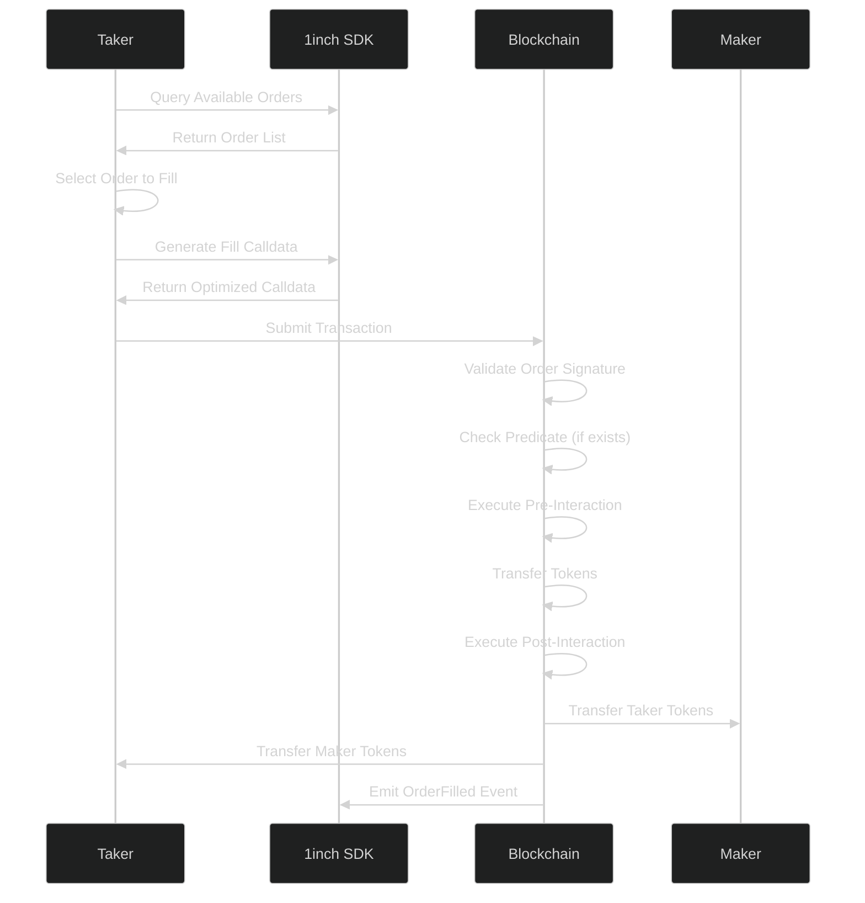

# Filling Limit Orders

> **Order Execution Engine**  
> Master the art of filling limit orders in the 1inch Limit Order Protocol v4. From simple fills to complex contract interactions with advanced features.



---

## Overview

> **Execution Mastery**  
> Learn to efficiently execute limit orders with various filling strategies optimized for different scenarios.

Order filling in the 1inch Limit Order Protocol is designed for maximum flexibility and gas efficiency. The protocol provides multiple execution methods tailored for different use cases:

- **Simple fills** for basic EOA orders
- **Contract fills** for smart contract makers
- **Extended fills** with advanced features
- **Optimized gas consumption** for each scenario

---

## Fill Function Overview

> **Method Selection Guide**  
> Choose the optimal filling method based on order type and required features.

### Available Fill Methods

| Scenario                   | Order Type     | Extensions                  | Method                  | Best For                |
| -------------------------- | -------------- | --------------------------- | ----------------------- | ----------------------- |
| **Simple Fill**            | EOA Order      | None                        | `fillOrder`             | Basic trading           |
| **Contract Fill**          | Contract Order | None                        | `fillContractOrder`     | Smart contract makers   |
| **Extended Fill**          | EOA Order      | Has Extensions/Interactions | `fillOrderArgs`         | Complex strategies      |
| **Extended Contract Fill** | Contract Order | Has Extensions/Interactions | `fillContractOrderArgs` | Enterprise integrations |

### Decision Tree

```
Is the order maker a contract?
├─ No (EOA) ────────────┬─ Has extensions/interactions?
│                       ├─ No  → fillOrder ( Most efficient)
│                       └─ Yes → fillOrderArgs (🎭 Full features)
└─ Yes (Contract) ──────┬─ Has extensions/interactions?
                        ├─ No  → fillContractOrder (🏢 Contract optimized)
                        └─ Yes → fillContractOrderArgs ( Enterprise)
```

---

## Core Fill Methods

> **Optimized Execution**  
> Each method is optimized for specific use cases, ensuring minimal gas consumption and maximum reliability.

### fillOrder

> **Lightning Fast Fills**  
> Optimized for simple EOA orders without extensions or taker interactions.

```solidity
function fillOrder(
    IOrderMixin.Order calldata order,
    bytes32 r,
    bytes32 vs,
    uint256 amount,
    TakerTraits takerTraits
) public payable returns(uint256 makingAmount, uint256 takingAmount, bytes32 orderHash)
```

**Gas Optimization**: Most efficient method for standard order fills.

#### SDK Usage

```typescript
import { LimitOrderContract, TakerTraits } from "@1inch/limit-order-sdk";

const contract = new LimitOrderContract();

// Simple order fill - maximum gas efficiency
const calldata = contract.getFillOrderCalldata(
  order, // LimitOrderV4Struct
  signature, // "0x..." - EIP-712 signature
  takerTraits, // TakerTraits configuration
  fillAmount, // bigint - amount to fill
);

// Use calldata in transaction
await wallet.sendTransaction({
  to: LIMIT_ORDER_PROTOCOL_ADDRESS,
  data: calldata,
  value: 0,
});
```

### fillContractOrder

> **Smart Contract Integration**  
> Specialized for orders where the maker is a smart contract using EIP-1271 signatures.

```solidity
function fillContractOrder(
    IOrderMixin.Order calldata order,
    bytes calldata signature,
    uint256 amount,
    TakerTraits takerTraits
) public returns(uint256 makingAmount, uint256 takingAmount, bytes32 orderHash)
```

**Security**: Handles EIP-1271 signature validation for contract makers.

#### SDK Usage

```typescript
// Contract maker order (e.g., DAO treasury, automated strategy)
const calldata = contract.getFillContractOrderCalldata(
  contractOrder, // Order where maker is a contract
  signature, // Contract signature (EIP-1271)
  takerTraits, // Execution preferences
  fillAmount, // Fill amount
);
```

### fillOrderArgs

> **Advanced Functionality**  
> Full-featured filling with extensions and taker interactions.

```solidity
function fillOrderArgs(
    IOrderMixin.Order calldata order,
    bytes32 r,
    bytes32 vs,
    uint256 amount,
    TakerTraits takerTraits,
    bytes calldata args
) public payable returns(uint256 makingAmount, uint256 takingAmount, bytes32 orderHash)
```

**Power**: Supports all protocol features including:

- Extensions (predicates, interactions, custom logic)
- Dynamic amount calculations
- Pre/post execution hooks
- Custom taker behaviors

#### SDK Usage

```typescript
// Advanced order with extensions/interactions
const advancedTraits = TakerTraits.default()
  .setAmountMode(AmountMode.maker)
  .enableNativeUnwrap()
  .setExtension(orderExtension)
  .setInteraction(takerInteraction);

const calldata = contract.getFillOrderArgsCalldata(
  order,
  signature,
  advancedTraits, // Rich configuration
  fillAmount,
);
```

### fillContractOrderArgs

> **Enterprise Grade**  
> Maximum functionality for contract makers with full feature support.

```solidity
function fillContractOrderArgs(
    IOrderMixin.Order calldata order,
    bytes calldata signature,
    uint256 amount,
    TakerTraits takerTraits,
    bytes calldata args
) public returns(uint256 makingAmount, uint256 takingAmount, bytes32 orderHash)
```

**Use Cases**:

- Institutional trading systems
- Advanced trading bots
- DAO treasury management
- Cross-protocol integrations

---

## Function Parameters

> **Parameter Reference**  
> Detailed explanation of all function parameters and their usage.

### Core Parameters

| Parameter       | Type          | Description                                            |
| --------------- | ------------- | ------------------------------------------------------ |
| **order**       | `Order`       | The order structure to be filled                       |
| **r**           | `bytes32`     | R-component of EIP-712 signature (EOA orders)          |
| **vs**          | `bytes32`     | VS-component of EIP-712 signature (EOA orders)         |
| **signature**   | `bytes`       | EIP-1271 signature for contract orders                 |
| **amount**      | `uint256`     | Amount to fill (interpretation depends on TakerTraits) |
| **takerTraits** | `TakerTraits` | Taker's configuration for the fill                     |
| **args**        | `bytes`       | Extension data, taker interaction, and target address  |

### Return Values

| Return Value     | Type      | Description                      |
| ---------------- | --------- | -------------------------------- |
| **makingAmount** | `uint256` | Actual amount the maker provided |
| **takingAmount** | `uint256` | Actual amount the taker received |
| **orderHash**    | `bytes32` | Hash of the filled order         |

---

## TakerTraits Configuration

> **Taker DNA System**  
> TakerTraits encodes all taker preferences and execution parameters in a single uint256 for gas efficiency.

### Bit Structure Overview

```
 Bit Position │ Purpose                 │ Type     │ Description
──────────────┼────────────────────────┼──────────┼─────────────────────────
 255          │ MAKER_AMOUNT_FLAG      │ Flag     │ Amount type selection
 254          │ UNWRAP_WETH_FLAG       │ Flag     │ WETH unwrapping
 253          │ SKIP_ORDER_PERMIT_FLAG │ Flag     │ Skip maker permit
 252          │ USE_PERMIT2_FLAG       │ Flag     │ Use Permit2
 251          │ ARGS_HAS_TARGET        │ Flag     │ Custom receiver
 224-247      │ ARGS_EXTENSION_LENGTH  │ uint24   │ Extension data length
 200-223      │ ARGS_INTERACTION_LENGTH│ uint24   │ Interaction data length
 0-184        │ THRESHOLD              │ uint184  │ Amount threshold
```

### Control Flags

| Bit     | Flag Name                | When Set               | When Clear             | Use Case               |
| ------- | ------------------------ | ---------------------- | ---------------------- | ---------------------- |
| **255** | `MAKER_AMOUNT_FLAG`      | Amount = making amount | Amount = taking amount | Specify fill type      |
| **254** | `UNWRAP_WETH_FLAG`       | Unwrap WETH to ETH     | Keep as WETH           | Native ETH delivery    |
| **253** | `SKIP_ORDER_PERMIT_FLAG` | Skip maker permit      | Execute permit         | Gas optimization       |
| **252** | `USE_PERMIT2_FLAG`       | Use Permit2            | Standard approval      | Advanced authorization |
| **251** | `ARGS_HAS_TARGET`        | Custom receiver        | Use msg.sender         | Redirect assets        |

### Data Fields

| Bits        | Field                  | Purpose                          | Details             |
| ----------- | ---------------------- | -------------------------------- | ------------------- |
| **224-247** | **Extension Length**   | Size of extension data in args   | Up to 16MB of data  |
| **200-223** | **Interaction Length** | Size of interaction data in args | Up to 16MB of data  |
| **0-184**   | **Threshold**          | Price protection mechanism       | Slippage protection |

---

## TakerTraits SDK Methods

> **Developer Interface**  
> Comprehensive SDK for configuring taker behavior with a fluent API.

### Creation & Configuration

```typescript
import { TakerTraits, AmountMode, Address } from "@1inch/limit-order-sdk";

// Create default traits
const traits = TakerTraits.default();

// Configure fill behavior
const configuredTraits = TakerTraits.default()
  .setAmountMode(AmountMode.maker) // Treat amount as making amount
  .enableNativeUnwrap() // Convert WETH to ETH
  .setReceiver(new Address("0x1234...")) // Custom recipient
  .setAmountThreshold(1000000n) // Slippage protection
  .setExtension(orderExtension) // Order extensions
  .setInteraction(takerInteraction); // Taker interaction
```

### Core Methods

| Method                 | Purpose                      | Signature                            | Effect                |
| ---------------------- | ---------------------------- | ------------------------------------ | --------------------- |
| **setAmountMode**      | Define amount interpretation | `(mode: AmountMode) => this`         | Maker vs taker amount |
| **enableNativeUnwrap** | Enable WETH unwrapping       | `() => this`                         | Convert WETH to ETH   |
| **setReceiver**        | Set custom recipient         | `(receiver: Address) => this`        | Redirect maker assets |
| **setAmountThreshold** | Set price protection         | `(threshold: bigint) => this`        | Slippage protection   |
| **setExtension**       | Include extensions           | `(ext: Extension) => this`           | Advanced features     |
| **setInteraction**     | Add taker interaction        | `(interaction: Interaction) => this` | Custom logic          |

### Amount Modes

| Mode                 | Description       | Amount Interpretation                              |
| -------------------- | ----------------- | -------------------------------------------------- |
| **AmountMode.taker** | Taker amount mode | `amount` = taking amount, making amount calculated |
| **AmountMode.maker** | Maker amount mode | `amount` = making amount, taking amount calculated |

### Threshold Protection

The threshold mechanism provides slippage protection:

**For Taker Amount Mode (flag = 0):**

```
threshold ≤ amount × (makingAmount / takingAmount)
```

**For Maker Amount Mode (flag = 1):**

```
threshold ≥ amount × (takingAmount / makingAmount)
```

---

## Args Structure

> **Extended Parameters**  
> The args parameter contains optional data for advanced fills.

### Args Components

The `args` calldata is structured based on TakerTraits flags:

```
| Target (20 bytes) | Extension Data (variable) | Interaction Data (variable) |
```

**Component Inclusion:**

- **Target**: Included if `ARGS_HAS_TARGET` flag is set
- **Extension**: Length specified in `ARGS_EXTENSION_LENGTH`
- **Interaction**: Length specified in `ARGS_INTERACTION_LENGTH`

### Args Usage Example

```typescript
// Configure complex args structure
const traits = TakerTraits.default()
  .setReceiver(new Address("0xcustom_receiver...")) // Include target
  .setExtension(orderExtension) // Include extension
  .setInteraction(takerInteraction); // Include interaction

const { trait, args } = traits.encode();

// Use in fill call
const calldata = contract.getFillOrderArgsCalldata(
  order,
  signature,
  { asBigInt: () => trait }, // TakerTraits as bigint
  fillAmount,
);
```

---

## Fill Examples

> **Master Class Implementation**  
> Real-world examples showcasing different filling scenarios.

### Simple Order Fill

```typescript
import {
  LimitOrderContract,
  TakerTraits,
  AmountMode,
} from "@1inch/limit-order-sdk";

class OrderFiller {
  private contract = new LimitOrderContract();

  async fillSimpleOrder(order: LimitOrderV4Struct, signature: string) {
    // Simple, gas-efficient fill
    const traits = TakerTraits.default().setAmountMode(AmountMode.maker);

    const calldata = this.contract.getFillOrderCalldata(
      order,
      signature,
      traits,
      order.makingAmount / 2n, // Fill 50%
    );

    return calldata;
  }
}
```

### Fill with WETH Unwrapping

```typescript
async fillWithUnwrapping(order: LimitOrderV4Struct, signature: string) {
  // Fill with WETH unwrapping
  const traits = TakerTraits.default()
    .setAmountMode(AmountMode.taker)
    .enableNativeUnwrap(); // Convert WETH to ETH

  const calldata = this.contract.getFillOrderArgsCalldata(
    order,
    signature,
    traits,
    order.takingAmount,
  );

  return calldata;
}
```

### Contract Order Fill

```typescript
async fillContractOrder(order: LimitOrderV4Struct, signature: string) {
  // Contract maker with custom receiver
  const traits = TakerTraits.default()
    .setReceiver(new Address("0x1234...")); // Custom recipient

  const calldata = this.contract.getFillContractOrderCalldata(
    order,
    signature,
    traits,
    order.makingAmount,
  );

  return calldata;
}
```

### Advanced Fill with Slippage Protection

```typescript
async fillWithSlippageProtection(
  order: LimitOrderV4Struct,
  signature: string,
  maxSlippage: number
) {
  // Fill with price protection
  const expectedTakingAmount = order.takingAmount;
  const minReceived = expectedTakingAmount * BigInt(100 - maxSlippage) / 100n;

  const traits = TakerTraits.default()
    .setAmountMode(AmountMode.maker)
    .setAmountThreshold(minReceived); // Minimum acceptable amount

  const calldata = this.contract.getFillOrderArgsCalldata(
    order,
    signature,
    traits,
    order.makingAmount,
  );

  return calldata;
}
```

---

## Performance Comparison

> **Method Benchmarks**  
> Choose the optimal method for your performance requirements.

| Method                     | ⛽ Gas Cost | Speed      | Features | 🧩 Complexity |
| -------------------------- | ----------- | ---------- | -------- | ------------- |
| ** fillOrder**             | Lowest      | Fastest    | 🔴 Basic | Simple        |
| **🏢 fillContractOrder**   | Low         | Fast       | 🔴 Basic | Medium        |
| **🎭 fillOrderArgs**       | Medium      | Medium     | Full     | Medium        |
| ** fillContractOrderArgs** | 🔴 Highest  | 🔴 Slowest | Full     | 🔴 Complex    |

### Gas Usage Guidelines

- **fillOrder**: ~150,000 gas for simple fills
- **fillContractOrder**: ~180,000 gas (EIP-1271 overhead)
- **fillOrderArgs**: ~200,000+ gas (depends on extensions)
- **fillContractOrderArgs**: ~250,000+ gas (full feature set)

---

## Order Cancellation

> **Order Lifecycle Management**  
> Multiple strategies for invalidating orders based on different scenarios.

### Automatic Cancellation

#### Expiration-Based

Orders automatically become invalid after their expiration timestamp:

```typescript
// Order expires automatically
const traits = MakerTraits.default().withExpiration(
  BigInt(Math.floor(Date.now() / 1000)) + 3600n,
); // 1 hour
```

**Error**: `OrderExpired` when attempting to fill expired orders.

#### Predicate-Based

Orders become invalid when their predicate evaluates to false:

```typescript
// Order becomes invalid when condition fails
const predicate = buildStopLossPredicate(stopPrice);
```

**Error**: `PredicateIsNotTrue` when predicate validation fails.

### Manual Cancellation

#### Cancel by Order Hash

Direct cancellation using order hash and traits:

```solidity
function cancelOrder(
    bytes32 orderHash,
    MakerTraits makerTraits
) external
```

> **Important**: Use correct `makerTraits` that match the original order, or cancellation will have no effect.

**Invalidator Selection**:

- **BitInvalidator**: Used when partial OR multiple fills are disabled
- **RemainingInvalidator**: Used when both partial AND multiple fills are enabled

#### Mass Cancellation by Epoch

Cancel multiple orders simultaneously using epoch management:

```solidity
function increaseEpoch(uint256 series) external
function advanceEpoch(uint256 series, uint256 amount) external
```

**Requirements**:

- Orders must have `NEED_CHECK_EPOCH_MANAGER` flag set
- Partial and multiple fills must be allowed
- Orders must match the current epoch for the series

**Use Cases**:

- Emergency order cancellation
- Strategy rotation
- Risk management

---

## Error Handling

> **Troubleshooting Guide**  
> Common errors and their solutions.

### Common Fill Errors

| Error                   | Cause                      | Solution                |
| ----------------------- | -------------------------- | ----------------------- |
| `OrderExpired`          | Order past expiration      | Use unexpired orders    |
| `InvalidatedOrder`      | Order manually cancelled   | Check order status      |
| `BitInvalidatedOrder`   | Nonce-based cancellation   | Verify order validity   |
| `PredicateIsNotTrue`    | Predicate condition failed | Check predicate logic   |
| `WrongSeriesNonce`      | Epoch mismatch             | Update to current epoch |
| `InsufficientBalance`   | Insufficient maker balance | Check maker funds       |
| `InsufficientAllowance` | Insufficient approval      | Increase allowance      |

### Best Practices

#### Pre-Fill Validation

```typescript
// Validate order before attempting fill
async function validateOrder(order: LimitOrderV4Struct): Promise<boolean> {
  // Check expiration
  if (order.makerTraits.expiration() !== null) {
    const now = BigInt(Math.floor(Date.now() / 1000));
    if (order.makerTraits.expiration()! < now) {
      throw new Error("Order expired");
    }
  }

  // Check maker balance
  const balance = await tokenContract.balanceOf(order.maker);
  if (balance < order.makingAmount) {
    throw new Error("Insufficient maker balance");
  }

  // Check allowance
  const allowance = await tokenContract.allowance(
    order.maker,
    LIMIT_ORDER_PROTOCOL_ADDRESS,
  );
  if (allowance < order.makingAmount) {
    throw new Error("Insufficient allowance");
  }

  return true;
}
```

#### Gas Estimation

```typescript
// Estimate gas before execution
async function estimateFillGas(
  order: LimitOrderV4Struct,
  signature: string,
  traits: TakerTraits,
  amount: bigint,
): Promise<bigint> {
  const calldata = contract.getFillOrderCalldata(
    order,
    signature,
    traits,
    amount,
  );

  return await provider.estimateGas({
    to: LIMIT_ORDER_PROTOCOL_ADDRESS,
    data: calldata,
  });
}
```

---

## Advanced Features

> **Expert Techniques**  
> Leverage advanced protocol features for sophisticated trading strategies.

### Taker Interactions

Implement custom logic during order execution:

```solidity
interface ITakerInteraction {
    function takerInteraction(
        IOrderMixin.Order calldata order,
        bytes32 orderHash,
        address taker,
        uint256 makingAmount,
        uint256 takingAmount,
        uint256 remainingMakingAmount,
        bytes calldata extraData
    ) external returns(uint256 offeredTakingAmount);
}
```

**Benefits**:

- Rate improvement opportunities
- Custom validation logic
- Integration with external protocols
- Dynamic fee calculation

### Batch Filling

Fill multiple orders in a single transaction:

```typescript
// Pseudo-code for batch filling
async function batchFillOrders(orders: OrderFillData[]) {
  const calls = orders.map(({ order, signature, traits, amount }) =>
    contract.getFillOrderCalldata(order, signature, traits, amount),
  );

  // Use multicall or custom batch contract
  return await batchContract.multiCall(calls);
}
```

### MEV Protection

Implement MEV protection strategies:

```typescript
// Private mempool submission
async function fillOrderPrivately(order: LimitOrderV4Struct) {
  const calldata = contract.getFillOrderCalldata(/* ... */);

  // Submit via Flashbots or other private pools
  return await flashbotsProvider.sendBundle([
    {
      to: LIMIT_ORDER_PROTOCOL_ADDRESS,
      data: calldata,
    },
  ]);
}
```

---

## Integration Examples

> **Real-World Integrations**  
> Production-ready patterns for different platforms.

### Trading Bot Integration

```typescript
class LimitOrderBot {
  private contract = new LimitOrderContract();

  async monitorAndFill() {
    const profitableOrders = await this.findProfitableOrders();

    for (const order of profitableOrders) {
      try {
        await this.fillOrderSafely(order);
      } catch (error) {
        console.error(`Fill failed: ${error.message}`);
      }
    }
  }

  private async fillOrderSafely(order: OrderData) {
    // Implement safety checks, gas estimation, profit calculation
    const traits = TakerTraits.default()
      .setAmountMode(AmountMode.maker)
      .setAmountThreshold(this.calculateMinProfit(order));

    const calldata = this.contract.getFillOrderCalldata(
      order.order,
      order.signature,
      traits,
      order.fillAmount,
    );

    return await this.executeWithRetry(calldata);
  }
}
```

### DEX Aggregator Integration

```typescript
class DEXAggregator {
  async getBestPrice(tokenIn: Address, tokenOut: Address, amountIn: bigint) {
    const [limitOrderPrice, ammPrice] = await Promise.all([
      this.getLimitOrderPrice(tokenIn, tokenOut, amountIn),
      this.getAMMPrice(tokenIn, tokenOut, amountIn),
    ]);

    return limitOrderPrice > ammPrice
      ? this.buildLimitOrderFill(tokenIn, tokenOut, amountIn)
      : this.buildAMMSwap(tokenIn, tokenOut, amountIn);
  }
}
```

---

## Best Practices

> **Production Guidelines**  
> Essential practices for secure and efficient order filling.

### Security

- **Validate signatures** before submission
- **Check order expiration** and validity
- **Verify maker balances** and allowances
- **Implement slippage protection** with thresholds
- **Monitor for MEV attacks** and front-running

### Performance

- **Choose optimal fill method** for your use case
- **Batch multiple fills** when possible
- **Estimate gas costs** before execution
- **Monitor network congestion** for timing
- **Cache order data** to reduce RPC calls

### Error Recovery

- **Implement retry logic** for failed transactions
- **Handle network failures** gracefully
- **Log errors** for debugging
- **Monitor success rates** and optimize
- **Plan for edge cases** and exceptional conditions

---

## Next Steps

> **Ready to Execute**  
> You now have comprehensive mastery of order execution in the 1inch Limit Order Protocol.

### Continue Learning

1. **[Create Orders](./create-order.md)** - Learn order creation strategies
2. **[Extensions Guide](./extensions.md)** - Advanced protocol features
3. **[SDK Reference](./Limit%20Order%20SDK/overview.md)** - Complete API documentation
4. **[Examples](./Examples/)** - Production code samples

### Start Building

1. **Test Integration** - Try different fill scenarios on testnets
2. **Optimize Gas** - Benchmark different methods for your use case
3. **Build Tools** - Create utilities for your specific trading strategies
4. **Monitor Performance** - Track execution success rates and costs
