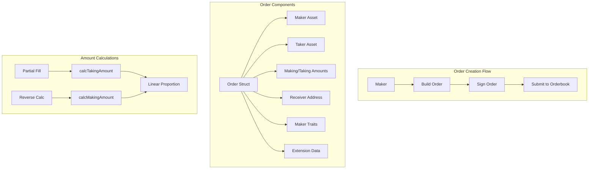

# Limit Order Maker Contract

> **⚙️ Core Protocol Engine**  
> Deep dive into the essential functions and classes that power limit order creation and management in the 1inch Limit Order Protocol v4.



---

## Core Calculation Functions

> **📊 Precision Mathematics**  
> These utility functions handle the precise calculations required for proportional order fills and amount conversions.

### Amount Calculation Methods

| Function         | Purpose                             | Signature                                                         | Use Case             |
| ---------------- | ----------------------------------- | ----------------------------------------------------------------- | -------------------- |
| calcTakingAmount | Calculate proportional taker amount | `(swapMakerAmount, orderMakerAmount, orderTakerAmount) => bigint` | Partial fills        |
| calcMakingAmount | Calculate proportional maker amount | `(swapTakerAmount, orderMakerAmount, orderTakerAmount) => bigint` | Reverse calculations |

### Function Details

#### calcTakingAmount

> **⚖️ Proportional Taker Calculation**  
> Determines the exact taker amount required for a given maker amount using linear proportion.

```typescript
import { calcTakingAmount } from "@1inch/limit-order-sdk";

// Example: Partial fill calculation
const orderMakerAmount = 100_000000n; // 100 USDT (6 decimals)
const orderTakerAmount = 10_000000000000000000n; // 10 1INCH (18 decimals)
const swapMakerAmount = 50_000000n; // Fill 50 USDT

const requiredTakerAmount = calcTakingAmount(
  swapMakerAmount, // 50 USDT - amount being filled
  orderMakerAmount, // 100 USDT - total order size
  orderTakerAmount, // 10 1INCH - total taker amount
);
// Result: 5_000000000000000000n (5 1INCH)
```

#### calcMakingAmount

> **🔄 Reverse Proportion Calculation**  
> Determines the maker amount that will be provided for a given taker amount.

```typescript
import { calcMakingAmount } from "@1inch/limit-order-sdk";

// Example: Calculate maker amount for specific taker input
const orderMakerAmount = 100_000000n; // 100 USDT (6 decimals)
const orderTakerAmount = 10_000000000000000000n; // 10 1INCH (18 decimals)
const swapTakerAmount = 3_000000000000000000n; // Taker provides 3 1INCH

const receivedMakerAmount = calcMakingAmount(
  swapTakerAmount, // 3 1INCH - taker input
  orderMakerAmount, // 100 USDT - total order size
  orderTakerAmount, // 10 1INCH - total taker amount
);
// Result: 30_000000n (30 USDT)
```

#### Mathematical Formula

Both functions use linear proportion:

```
calcTakingAmount = (swapMakerAmount × orderTakerAmount) ÷ orderMakerAmount
calcMakingAmount = (swapTakerAmount × orderMakerAmount) ÷ orderTakerAmount
```

---

## MakerTraits

> **🧬 Order DNA System**  
> MakerTraits is a sophisticated bit-packed uint256 that encodes order behavior, permissions, and metadata in a single value for gas-efficient storage and processing.

### Bit Structure Overview

```
 Bit Position │ Purpose                 │ Type     │ Description
──────────────┼────────────────────────┼──────────┼─────────────────────────
 255          │ NO_PARTIAL_FILLS_FLAG  │ Flag     │ Disable partial fills
 254          │ ALLOW_MULTIPLE_FILLS   │ Flag     │ Enable multiple fills
 253          │ (unused)               │ Reserved │ Future expansion
 252          │ PRE_INTERACTION_CALL   │ Flag     │ Execute pre-hooks
 251          │ POST_INTERACTION_CALL  │ Flag     │ Execute post-hooks
 250          │ NEED_CHECK_EPOCH       │ Flag     │ Validate epoch manager
 249          │ HAS_EXTENSION_FLAG     │ Flag     │ Order has extensions
 248          │ USE_PERMIT2_FLAG       │ Flag     │ Use Permit2 authorization
 247          │ UNWRAP_WETH_FLAG       │ Flag     │ Unwrap WETH to ETH
 200-246      │ (reserved)             │ Reserved │ Future flags
 120-199      │ Allowed Sender         │ uint80   │ Last 10 bytes of address
 80-119       │ Expiration             │ uint40   │ Timestamp deadline
 40-79        │ Nonce/Epoch            │ uint40   │ Unique identifier
 0-39         │ Series                 │ uint40   │ Epoch series grouping
```

### High Bits (Control Flags)

| Bit     | 🎯 Flag Name                    | ✅ When Set               | ❌ When Clear         | 💡 Use Case           |
| ------- | ------------------------------- | ------------------------- | --------------------- | --------------------- |
| **255** | `NO_PARTIAL_FILLS_FLAG`         | Partial fills disabled    | Partial fills allowed | All-or-nothing orders |
| **254** | `ALLOW_MULTIPLE_FILLS_FLAG`     | Multiple fills enabled    | Single fill only      | Market maker orders   |
| **252** | `PRE_INTERACTION_CALL_FLAG`     | Pre-hooks executed        | No pre-execution      | DeFi integrations     |
| **251** | `POST_INTERACTION_CALL_FLAG`    | Post-hooks executed       | No post-execution     | Automated workflows   |
| **250** | `NEED_CHECK_EPOCH_MANAGER_FLAG` | Epoch validation required | No epoch checking     | Advanced invalidation |
| **249** | `HAS_EXTENSION_FLAG`            | Extensions included       | No extensions         | Custom functionality  |
| **248** | `USE_PERMIT2_FLAG`              | Permit2 authorization     | Standard approvals    | Gasless interactions  |
| **247** | `UNWRAP_WETH_FLAG`              | WETH → ETH conversion     | Keep as WETH          | Native ETH delivery   |

### Low Bits (Data Fields)

| Bits        | 📝 Field           | 🎯 Purpose                               | 💡 Details                               |
| ----------- | ------------------ | ---------------------------------------- | ---------------------------------------- |
| **120-199** | **Allowed Sender** | Restrict order fills to specific address | Last 10 bytes of address (80 bits)       |
| **80-119**  | **Expiration**     | Order deadline timestamp                 | Unix timestamp (40 bits, max ~35k years) |
| **40-79**   | **Nonce/Epoch**    | Unique order identifier                  | For cancellation and tracking            |
| **0-39**    | **Series**         | Epoch series grouping                    | Used with epoch manager                  |

> **⚡ Gas Optimization**  
> By packing all configuration into a single uint256, MakerTraits minimizes storage costs and enables efficient bitwise operations.

---

## MakerTraits Methods

> **🔧 Fluent Configuration API**  
> Comprehensive methods for configuring and querying order behavior with a developer-friendly interface.

### Creation & Configuration

| Method                   | 🎯 Purpose                 | 📝 Signature                              | 🔗 Chainable |
| ------------------------ | -------------------------- | ----------------------------------------- | ------------ |
| **🆕 default**           | Create default instance    | `() => MakerTraits`                       | ❌ Static    |
| **👤 withAllowedSender** | Restrict to specific taker | `(sender: Address) => this`               | ✅           |
| **🌐 withAnySender**     | Allow any taker            | `() => this`                              | ✅           |
| **⏰ withExpiration**    | Set deadline               | `(expiration: bigint) => this`            | ✅           |
| **🎲 withNonce**         | Set unique identifier      | `(nonce: bigint) => this`                 | ✅           |
| **📅 withEpoch**         | Enable epoch management    | `(series: bigint, epoch: bigint) => this` | ✅           |

### Query Methods

| Method               | 🎯 Purpose             | 📝 Returns       | 💡 Description                 |
| -------------------- | ---------------------- | ---------------- | ------------------------------ |
| **👤 allowedSender** | Get restricted address | `string`         | Last 10 bytes of allowed taker |
| **🔒 isPrivate**     | Check if restricted    | `boolean`        | True if specific taker only    |
| **⏰ expiration**    | Get deadline           | `bigint \| null` | Unix timestamp or null         |
| **🎲 nonceOrEpoch**  | Get identifier         | `bigint`         | Current nonce or epoch value   |
| **📅 series**        | Get epoch series       | `bigint`         | Series grouping value          |

### Feature Toggles

| Method                      | 🎯 Purpose               | 📝 Signature | 💡 Effect               |
| --------------------------- | ------------------------ | ------------ | ----------------------- |
| **✂️ disablePartialFills**  | Require full execution   | `() => this` | All-or-nothing          |
| **🔄 allowPartialFills**    | Enable partial execution | `() => this` | Default behavior        |
| **🔁 allowMultipleFills**   | Enable reusable orders   | `() => this` | Market maker mode       |
| **1️⃣ disableMultipleFills** | Single use only          | `() => this` | Default behavior        |
| **🔧 withExtension**        | Mark extension usage     | `() => this` | Required for extensions |

### Detailed Method Documentation

#### default

> **🏗️ Foundation Builder**  
> Creates a new MakerTraits instance with sensible defaults.

```typescript
import { MakerTraits } from "@1inch/limit-order-sdk";

const traits = MakerTraits.default();
// Default: Partial fills enabled, single fill, no expiration, public order
```

#### Access Control Methods

##### withAllowedSender

> **🔒 Private Order Creation**  
> Restricts order fills to a specific address.

```typescript
import { Address } from "@1inch/limit-order-sdk";

const traits = MakerTraits.default().withAllowedSender(
  new Address("0x1234567890123456789012345678901234567890"),
);
// Only the specified address can fill this order
```

##### withAnySender

> **🌍 Public Order Creation**  
> Removes any sender restrictions (default behavior).

```typescript
const traits = MakerTraits.default().withAnySender(); // Anyone can fill this order
```

##### allowedSender

> **🔍 Get Restricted Address**  
> Returns the last 10 bytes of the allowed sender address.

```typescript
const address = traits.allowedSender();
// Returns: "1234567890123456789012345678901234567890" (last 10 bytes)
```

##### isPrivate

> **✅ Privacy Check**  
> Determines if the order is restricted to a specific taker.

```typescript
if (traits.isPrivate()) {
  console.log("Order is private - restricted taker");
} else {
  console.log("Order is public - any taker allowed");
}
```

#### Time Management

##### withExpiration

> **⏰ Deadline Setting**  
> Sets when the order becomes invalid.

```typescript
const futureTimestamp = BigInt(Math.floor(Date.now() / 1000)) + 3600n; // 1 hour

const traits = MakerTraits.default().withExpiration(futureTimestamp);
```

##### expiration

> **🔍 Get Deadline**  
> Retrieves the order expiration timestamp.

```typescript
const deadline = traits.expiration();
if (deadline === null) {
  console.log("Order never expires");
} else {
  console.log(`Order expires at: ${new Date(Number(deadline) * 1000)}`);
}
```

#### expiration

Returns expiration timestamp. If null is returned, the order has no expiration.

| Method       | Type                   |
| ------------ | ---------------------- |
| `expiration` | `() => bigint or null` |

#### withExpiration

Sets order expiration time.

| Method           | Type                           |
| ---------------- | ------------------------------ |
| `withExpiration` | `(expiration: bigint) => this` |

Parameters:

- `expiration`: expiration timestamp in seconds

#### nonceOrEpoch

Returns epoch if `isEpochManagerEnabled()` is true, otherwise returns nonce.

| Method         | Type           |
| -------------- | -------------- |
| `nonceOrEpoch` | `() => bigint` |

#### withNonce

Sets nonce. Note: nonce and epoch share the same field, so they can't be set together.

| Method      | Type                      |
| ----------- | ------------------------- |
| `withNonce` | `(nonce: bigint) => this` |

Parameters:

- `nonce`: must be less than or equal to uint40::max

#### withEpoch

Enables epoch manager check. If set, the contract will check that order epoch equals to epoch on SeriesEpochManager contract.

Note: epoch manager can be used only when partialFills AND multipleFills are allowed. Nonce and epoch share the same field, so they can't be set together.

| Method      | Type                                      |
| ----------- | ----------------------------------------- |
| `withEpoch` | `(series: bigint, epoch: bigint) => this` |

Parameters:

- `series`: subgroup for epoch
- `epoch`: unique order id inside series

#### series

Gets current series.

| Method   | Type           |
| -------- | -------------- |
| `series` | `() => bigint` |

#### hasExtension

Returns true if order has an extension, false otherwise.

| Method         | Type            |
| -------------- | --------------- |
| `hasExtension` | `() => boolean` |

#### withExtension

Marks that order has an extension.

| Method          | Type         |
| --------------- | ------------ |
| `withExtension` | `() => this` |

#### isPartialFillAllowed

Checks if partial fills are allowed for order.

| Method                 | Type            |
| ---------------------- | --------------- |
| `isPartialFillAllowed` | `() => boolean` |

#### disablePartialFills

Disables partial fills for order.

| Method                | Type         |
| --------------------- | ------------ |
| `disablePartialFills` | `() => this` |

#### allowPartialFills

Allows partial fills for order.

| Method              | Type         |
| ------------------- | ------------ |
| `allowPartialFills` | `() => this` |

#### setPartialFills

Sets partial fill flag to passed value.

| Method            | Type                     |
| ----------------- | ------------------------ |
| `setPartialFills` | `(val: boolean) => this` |

#### isMultipleFillsAllowed

Returns true if order allows more than one fill, false otherwise.

| Method                   | Type            |
| ------------------------ | --------------- |
| `isMultipleFillsAllowed` | `() => boolean` |

#### allowMultipleFills

Allows many fills for order.

| Method               | Type         |
| -------------------- | ------------ |
| `allowMultipleFills` | `() => this` |

#### disableMultipleFills

Allows at most 1 fill for order.

| Method                 | Type         |
| ---------------------- | ------------ |
| `disableMultipleFills` | `() => this` |

#### setMultipleFills

If val is true, then multiple fills are allowed, otherwise disallowed.

| Method             | Type                     |
| ------------------ | ------------------------ |
| `setMultipleFills` | `(val: boolean) => this` |

#### hasPreInteraction

Returns true if maker has pre-interaction, false otherwise.

| Method              | Type            |
| ------------------- | --------------- |
| `hasPreInteraction` | `() => boolean` |

#### enablePreInteraction

Enables maker pre-interaction.

| Method                 | Type         |
| ---------------------- | ------------ |
| `enablePreInteraction` | `() => this` |

#### disablePreInteraction

Disables maker pre-interaction.

| Method                  | Type         |
| ----------------------- | ------------ |
| `disablePreInteraction` | `() => this` |

#### hasPostInteraction

Returns true if maker has post-interaction, false otherwise.

| Method               | Type            |
| -------------------- | --------------- |
| `hasPostInteraction` | `() => boolean` |

#### enablePostInteraction

Enables maker post-interaction.

| Method                  | Type         |
| ----------------------- | ------------ |
| `enablePostInteraction` | `() => this` |

#### disablePostInteraction

Disables maker post-interaction.

| Method                   | Type         |
| ------------------------ | ------------ |
| `disablePostInteraction` | `() => this` |

#### isEpochManagerEnabled

Returns true if epoch manager is enabled.

| Method                  | Type            |
| ----------------------- | --------------- |
| `isEpochManagerEnabled` | `() => boolean` |

#### isPermit2

Returns true if permit2 is enabled for maker funds transfer.

| Method      | Type            |
| ----------- | --------------- |
| `isPermit2` | `() => boolean` |

#### enablePermit2

Uses permit2 to transfer maker funds to contract.

| Method          | Type         |
| --------------- | ------------ |
| `enablePermit2` | `() => this` |

#### disablePermit2

Does not use permit2 to transfer maker funds to contract.

| Method           | Type         |
| ---------------- | ------------ |
| `disablePermit2` | `() => this` |

#### isNativeUnwrapEnabled

Checks if WRAPPED token will be unwrapped to NATIVE before sending to maker.

| Method                  | Type            |
| ----------------------- | --------------- |
| `isNativeUnwrapEnabled` | `() => boolean` |

#### enableNativeUnwrap

Unwraps WRAPPED token to NATIVE before sending it to maker.

| Method               | Type         |
| -------------------- | ------------ |
| `enableNativeUnwrap` | `() => this` |

#### disableNativeUnwrap

Does not unwrap WRAPPED token to NATIVE before sending it to maker.

| Method                | Type         |
| --------------------- | ------------ |
| `disableNativeUnwrap` | `() => this` |

#### asBigInt

Converts MakerTraits to bigint.

| Method     | Type           |
| ---------- | -------------- |
| `asBigInt` | `() => bigint` |

#### isBitInvalidatorMode

Returns true if bit invalidator mode is used to invalidate order (cancel/mark as filled).

Bit invalidator is cheaper in terms of gas, but can be used only when partial fills OR multiple fills are disabled.

| Method                 | Type            |
| ---------------------- | --------------- |
| `isBitInvalidatorMode` | `() => boolean` |

## LimitOrder

The LimitOrder class represents a limit order in the protocol.

### Methods

#### buildSalt

Builds correct salt for order. If order has extension, it is crucial to build correct salt otherwise order won't be filled.

| Method      | Type                                                  |
| ----------- | ----------------------------------------------------- |
| `buildSalt` | `(extension: Extension, baseSalt?: bigint) => bigint` |

#### verifySalt

Verifies salt against extension.

| Method       | Type                                             |
| ------------ | ------------------------------------------------ |
| `verifySalt` | `(salt: bigint, extension: Extension) => bigint` |

#### fromCalldata

Creates LimitOrder from calldata.

| Method         | Type                            |
| -------------- | ------------------------------- |
| `fromCalldata` | `(bytes: string) => LimitOrder` |

#### fromDataAndExtension

Creates LimitOrder from data and extension.

| Method                 | Type                                                             |
| ---------------------- | ---------------------------------------------------------------- |
| `fromDataAndExtension` | `(data: LimitOrderV4Struct, extension: Extension) => LimitOrder` |

#### toCalldata

Converts LimitOrder to calldata.

| Method       | Type           |
| ------------ | -------------- |
| `toCalldata` | `() => string` |

#### build

Builds LimitOrderV4Struct.

| Method  | Type                       |
| ------- | -------------------------- |
| `build` | `() => LimitOrderV4Struct` |

#### getTypedData

Gets EIP-712 typed data for signing.

| Method         | Type                                   |
| -------------- | -------------------------------------- |
| `getTypedData` | `(chainId: number) => EIP712TypedData` |

#### getOrderHash

Gets order hash.

| Method         | Type                          |
| -------------- | ----------------------------- |
| `getOrderHash` | `(chainId: number) => string` |

#### isPrivate

Returns true if only a specific address can fill order.

| Method      | Type            |
| ----------- | --------------- |
| `isPrivate` | `() => boolean` |

### Properties

| Property       | Type          |
| -------------- | ------------- |
| `salt`         | `bigint`      |
| `maker`        | `Address`     |
| `receiver`     | `Address`     |
| `makerAsset`   | `Address`     |
| `takerAsset`   | `Address`     |
| `makingAmount` | `bigint`      |
| `takingAmount` | `bigint`      |
| `makerTraits`  | `MakerTraits` |

## Interaction

The Interaction class represents an interaction in the protocol.

### Methods

#### decode

Creates Interaction from bytes.

| Method   | Type                             |
| -------- | -------------------------------- |
| `decode` | `(bytes: string) => Interaction` |

Parameters:

- `bytes`: Hex string with 0x. First 20 bytes are target, then data

#### encode

Encodes interaction as hex string with 0x. First 20 bytes are target, then data.

| Method   | Type           |
| -------- | -------------- |
| `encode` | `() => string` |

## LimitOrderWithFee

The LimitOrderWithFee class extends LimitOrder with fee functionality.

### Methods

#### withRandomNonce

Sets random nonce to makerTraits and creates LimitOrderWithFee.

| Method            | Type                                                                                                                            |
| ----------------- | ------------------------------------------------------------------------------------------------------------------------------- |
| `withRandomNonce` | `(orderInfo: Omit<OrderInfoData, "receiver">, feeExtension: FeeTakerExtension, makerTraits?: MakerTraits) => LimitOrderWithFee` |

#### fromDataAndExtension

Creates LimitOrderWithFee from data and extension.

| Method                 | Type                                                                    |
| ---------------------- | ----------------------------------------------------------------------- |
| `fromDataAndExtension` | `(data: LimitOrderV4Struct, extension: Extension) => LimitOrderWithFee` |

#### getTakingAmount

Calculates the takingAmount required from the taker in exchange for the makingAmount.

| Method            | Type                                                |
| ----------------- | --------------------------------------------------- |
| `getTakingAmount` | `(taker: Address, makingAmount?: bigint) => bigint` |

Parameters:

- `makingAmount`: amount to be filled

#### getMakingAmount

Calculates the makingAmount that the taker receives in exchange for the takingAmount.

| Method            | Type                                                |
| ----------------- | --------------------------------------------------- |
| `getMakingAmount` | `(taker: Address, takingAmount?: bigint) => bigint` |

Parameters:

- `takingAmount`: amount to be filled

#### getResolverFee

Fee in takerAsset which resolver pays to resolver fee receiver.

| Method           | Type                                                |
| ---------------- | --------------------------------------------------- |
| `getResolverFee` | `(taker: Address, makingAmount?: bigint) => bigint` |

Parameters:

- `taker`: who will fill order
- `makingAmount`: amount wanted to fill

#### getIntegratorFee

Fee in takerAsset which integrator gets to integrator wallet.

| Method             | Type                                                |
| ------------------ | --------------------------------------------------- |
| `getIntegratorFee` | `(taker: Address, makingAmount?: bigint) => bigint` |

Parameters:

- `taker`: who will fill order
- `makingAmount`: amount wanted to fill

#### getProtocolFee

Fee in takerAsset which protocol gets. It equals to share from integrator fee plus resolver fee.

| Method           | Type                                                |
| ---------------- | --------------------------------------------------- |
| `getProtocolFee` | `(taker: Address, makingAmount?: bigint) => bigint` |

Parameters:

- `taker`: who will fill order
- `makingAmount`: amount wanted to fill

## TakerTraits

The TakerTraits class defines traits used to encode the taker's preferences for an order in a single uint256.

### Structure

The TakerTraits are structured as follows:

#### High bits (flags)

- **255 bit**: `_MAKER_AMOUNT_FLAG` - If set, the taking amount is calculated based on making amount, otherwise making amount is calculated based on taking amount
- **254 bit**: `_UNWRAP_WETH_FLAG` - If set, the WETH will be unwrapped into ETH before sending to taker
- **253 bit**: `_SKIP_ORDER_PERMIT_FLAG` - If set, the order skips maker's permit execution
- **252 bit**: `_USE_PERMIT2_FLAG` - If set, the order uses the permit2 function for authorization
- **251 bit**: `_ARGS_HAS_TARGET` - If set, then first 20 bytes of args are treated as receiver address for maker's funds transfer

#### Middle bits (lengths)

- **224-247 bits**: `ARGS_EXTENSION_LENGTH` - The length of the extension calldata in the args
- **200-223 bits**: `ARGS_INTERACTION_LENGTH` - The length of the interaction calldata in the args

#### Low bits (data)

- **0-184 bits**: The threshold amount (the maximum amount a taker agrees to give in exchange for a making amount)

### Methods

#### default

Creates default TakerTraits instance.

| Method    | Type                |
| --------- | ------------------- |
| `default` | `() => TakerTraits` |

#### getAmountMode

Returns enabled amount mode, defining how to treat passed amount in fillContractOrderArgs function.

| Method          | Type               |
| --------------- | ------------------ |
| `getAmountMode` | `() => AmountMode` |

#### setAmountMode

Sets amount mode.

| Method          | Type                         |
| --------------- | ---------------------------- |
| `setAmountMode` | `(mode: AmountMode) => this` |

#### isNativeUnwrapEnabled

Checks if Wrapped native currency will be unwrapped into Native currency before sending to taker.

| Method                  | Type            |
| ----------------------- | --------------- |
| `isNativeUnwrapEnabled` | `() => boolean` |

#### enableNativeUnwrap

Wrapped native currency will be unwrapped into Native currency before sending to taker.

| Method               | Type         |
| -------------------- | ------------ |
| `enableNativeUnwrap` | `() => this` |

#### disableNativeUnwrap

Wrapped native currency will NOT be unwrapped into Native currency before sending to taker.

| Method                | Type         |
| --------------------- | ------------ |
| `disableNativeUnwrap` | `() => this` |

#### isOrderPermitSkipped

Returns true if maker's permit execution is skipped.

| Method                 | Type            |
| ---------------------- | --------------- |
| `isOrderPermitSkipped` | `() => boolean` |

#### skipOrderPermit

The order skips maker's permit execution.

| Method            | Type         |
| ----------------- | ------------ |
| `skipOrderPermit` | `() => this` |

#### isPermit2Enabled

Checks if permit2 function should be used for authorization.

| Method             | Type            |
| ------------------ | --------------- |
| `isPermit2Enabled` | `() => boolean` |

#### enablePermit2

Uses permit2 function for authorization.

| Method          | Type         |
| --------------- | ------------ |
| `enablePermit2` | `() => this` |

#### disablePermit2

Does NOT use permit2 function for authorization.

| Method           | Type         |
| ---------------- | ------------ |
| `disablePermit2` | `() => this` |

#### setReceiver

Sets address where order is filled to. Uses msg.sender if not set.

| Method        | Type                          |
| ------------- | ----------------------------- |
| `setReceiver` | `(receiver: Address) => this` |

#### removeReceiver

Sets order receiver as msg.sender.

| Method           | Type         |
| ---------------- | ------------ |
| `removeReceiver` | `() => this` |

#### setExtension

Sets extension. It is required to provide same extension as in order creation (if any).

| Method         | Type                       |
| -------------- | -------------------------- |
| `setExtension` | `(ext: Extension) => this` |

#### removeExtension

Removes extension.

| Method            | Type         |
| ----------------- | ------------ |
| `removeExtension` | `() => this` |

#### setAmountThreshold

Sets threshold amount.

In taker amount mode: the minimum amount a taker agrees to receive in exchange for a taking amount.
In maker amount mode: the maximum amount a taker agrees to give in exchange for a making amount.

| Method               | Type                          |
| -------------------- | ----------------------------- |
| `setAmountThreshold` | `(threshold: bigint) => this` |

#### getAmountThreshold

Gets threshold amount.

In taker amount mode: the minimum amount a taker agrees to receive in exchange for a taking amount.
In maker amount mode: the maximum amount a taker agrees to give in exchange for a making amount.

| Method               | Type           |
| -------------------- | -------------- |
| `getAmountThreshold` | `() => bigint` |

#### removeAmountThreshold

Removes amount threshold.

| Method                  | Type         |
| ----------------------- | ------------ |
| `removeAmountThreshold` | `() => this` |

#### setInteraction

Sets taker interaction. The interaction.target should implement ITakerInteraction interface.

| Method           | Type                                 |
| ---------------- | ------------------------------------ |
| `setInteraction` | `(interaction: Interaction) => this` |

#### removeInteraction

Removes interaction.

| Method              | Type         |
| ------------------- | ------------ |
| `removeInteraction` | `() => this` |

#### encode

Encodes TakerTraits.

| Method   | Type                                     |
| -------- | ---------------------------------------- |
| `encode` | `() => { trait: bigint; args: string; }` |

## Enumerations

### AmountMode

| Property | Value | Description                                                                                      |
| -------- | ----- | ------------------------------------------------------------------------------------------------ |
| `taker`  | `0`   | Amount provided to fill function treated as takingAmount and makingAmount calculated based on it |
| `maker`  | `1`   | Amount provided to fill function treated as makingAmount and takingAmount calculated based on it |
