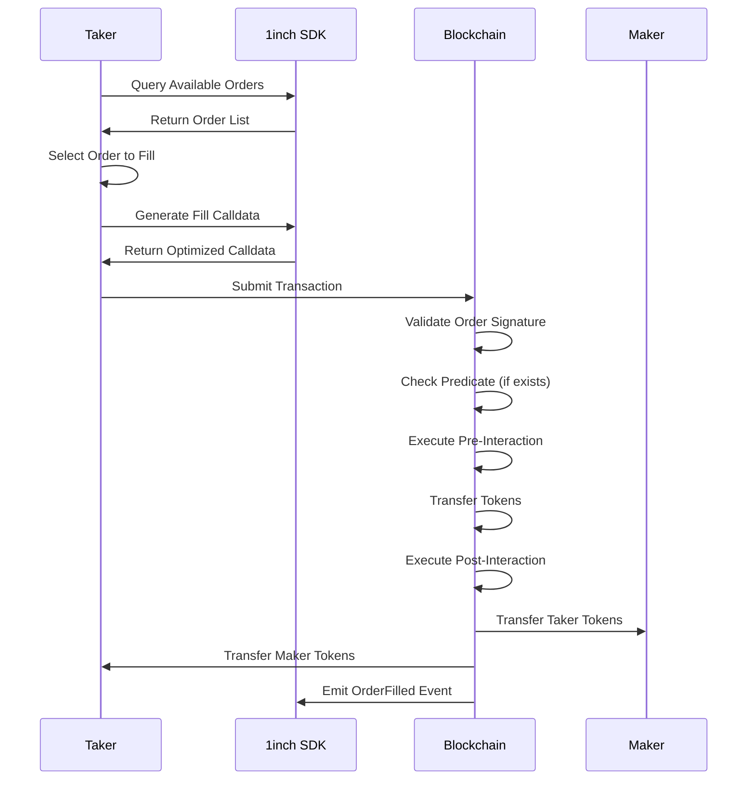

# Limit Order Taker Contract

> **⚡ Order Execution Engine**  
> Master the LimitOrderContract class and its methods for filling limit orders in the 1inch Limit Order Protocol. From simple fills to complex contract interactions.



---

## LimitOrderContract Overview

> **🔧 Calldata Generation Hub**  
> The LimitOrderContract class is your gateway to generating optimized calldata for different order execution scenarios.

### Execution Scenarios

| Scenario               | Order Type     | Extensions                  | Method                             |
| ---------------------- | -------------- | --------------------------- | ---------------------------------- |
| Simple Fill            | EOA Order      | None                        | `getFillOrderCalldata`             |
| Contract Fill          | Contract Order | None                        | `getFillContractOrderCalldata`     |
| Extended Fill          | EOA Order      | Has Extensions/Interactions | `getFillOrderArgsCalldata`         |
| Extended Contract Fill | Contract Order | Has Extensions/Interactions | `getFillContractOrderArgsCalldata` |

---

## Core Filling Methods

> **⚡ Optimized Execution**  
> Each method is optimized for specific use cases, ensuring minimal gas consumption and maximum reliability.

### Method Reference

| Method                           | Purpose                         | Signature                                      | Best For                |
| -------------------------------- | ------------------------------- | ---------------------------------------------- | ----------------------- |
| getFillOrderCalldata             | Simple EOA order filling        | `(order, signature, traits, amount) => string` | Basic trading           |
| getFillContractOrderCalldata     | Simple contract order filling   | `(order, signature, traits, amount) => string` | Smart contract makers   |
| getFillOrderArgsCalldata         | Advanced EOA order filling      | `(order, signature, traits, amount) => string` | Complex strategies      |
| getFillContractOrderArgsCalldata | Advanced contract order filling | `(order, signature, traits, amount) => string` | Enterprise integrations |

### Method Details

#### getFillOrderCalldata

> **⚡ Lightning Fast Fills**  
> Optimized for simple EOA orders without extensions or taker interactions.

```typescript
import { LimitOrderContract, TakerTraits } from "@1inch/limit-order-sdk";

const contract = new LimitOrderContract();

// Simple order fill - maximum gas efficiency
const calldata = contract.getFillOrderCalldata(
  order, // LimitOrderV4Struct
  signature, // "0x..." - EIP-712 signature
  takerTraits, // TakerTraits configuration
  fillAmount, // bigint - amount to fill
);

// Use calldata in transaction
await wallet.sendTransaction({
  to: LIMIT_ORDER_PROTOCOL_ADDRESS,
  data: calldata,
  value: 0,
});
```

**⚡ Gas Optimization**: Most efficient method for standard order fills.

#### getFillContractOrderCalldata

> **🏗️ Smart Contract Integration**  
> Specialized for orders where the maker is a smart contract.

```typescript
// Contract maker order (e.g., DAO treasury, automated strategy)
const calldata = contract.getFillContractOrderCalldata(
  contractOrder, // Order where maker is a contract
  signature, // Contract signature (EIP-1271)
  takerTraits, // Execution preferences
  fillAmount, // Fill amount
);
```

**🔒 Security**: Handles EIP-1271 signature validation for contract makers.

#### getFillOrderArgsCalldata

> **🎭 Advanced Functionality**  
> Full-featured filling with extensions and taker interactions.

```typescript
// Advanced order with extensions/interactions
const advancedTraits = TakerTraits.default()
  .setAmountMode(AmountMode.maker)
  .enableNativeUnwrap()
  .setExtension(orderExtension)
  .setInteraction(takerInteraction);

const calldata = contract.getFillOrderArgsCalldata(
  order,
  signature,
  advancedTraits, // Rich configuration
  fillAmount,
);
```

**🚀 Power**: Supports all protocol features including:

- 🔧 Extensions (predicates, interactions, custom logic)
- 💰 Dynamic amount calculations
- 🔄 Pre/post execution hooks
- 🎯 Custom taker behaviors

#### getFillContractOrderArgsCalldata

> **🌟 Enterprise Grade**  
> Maximum functionality for contract makers with full feature support.

```typescript
// Enterprise-grade contract order execution
const calldata = contract.getFillContractOrderArgsCalldata(
  enterpriseOrder, // Complex contract order
  contractSignature, // EIP-1271 signature
  enterpriseTraits, // Full feature configuration
  strategicAmount, // Calculated fill amount
);
```

**🎯 Use Cases**:

- 🏦 Institutional trading systems
- 🤖 Advanced trading bots
- 🏛️ DAO treasury management
- 🔗 Cross-protocol integrations

---

## Method Selection Guide

> **🎯 Choose the Right Tool**  
> Selecting the optimal method ensures the best gas efficiency and functionality for your use case.

### Decision Tree

```
Is the order maker a contract?
├─ No (EOA) ────────────┬─ Has extensions/interactions?
│                       ├─ No  → getFillOrderCalldata (⚡ Most efficient)
│                       └─ Yes → getFillOrderArgsCalldata (🎭 Full features)
└─ Yes (Contract) ──────┬─ Has extensions/interactions?
                        ├─ No  → getFillContractOrderCalldata (🏢 Contract optimized)
                        └─ Yes → getFillContractOrderArgsCalldata (🌟 Enterprise)
```

### Performance Comparison

| Method                                  | ⛽ Gas Cost | 🚀 Speed   | 🔧 Features | 🎯 Complexity |
| --------------------------------------- | ----------- | ---------- | ----------- | ------------- |
| **🚀 getFillOrderCalldata**             | 🟢 Lowest   | 🟢 Fastest | 🔴 Basic    | 🟢 Simple     |
| **🏢 getFillContractOrderCalldata**     | 🟡 Low      | 🟢 Fast    | 🔴 Basic    | 🟡 Medium     |
| **⚡ getFillOrderArgsCalldata**         | 🟡 Medium   | 🟡 Medium  | 🟢 Full     | 🟡 Medium     |
| **🏗️ getFillContractOrderArgsCalldata** | 🔴 Highest  | 🔴 Slowest | 🟢 Full     | 🔴 Complex    |

---

## Complete Example

> **🎓 Master Class Implementation**  
> Real-world example showcasing different filling scenarios.

```typescript
import {
  LimitOrderContract,
  TakerTraits,
  AmountMode,
  Address,
} from "@1inch/limit-order-sdk";

class OrderFiller {
  private contract = new LimitOrderContract();

  async fillSimpleOrder(order: LimitOrderV4Struct, signature: string) {
    // ⚡ Simple, gas-efficient fill
    const traits = TakerTraits.default().setAmountMode(AmountMode.maker);

    const calldata = this.contract.getFillOrderCalldata(
      order,
      signature,
      traits,
      order.makingAmount / 2n, // Fill 50%
    );

    return calldata;
  }

  async fillWithUnwrapping(order: LimitOrderV4Struct, signature: string) {
    // 🔄 Fill with WETH unwrapping
    const traits = TakerTraits.default()
      .setAmountMode(AmountMode.taker)
      .enableNativeUnwrap(); // Convert WETH to ETH

    const calldata = this.contract.getFillOrderArgsCalldata(
      order,
      signature,
      traits,
      order.takingAmount,
    );

    return calldata;
  }

  async fillContractOrder(order: LimitOrderV4Struct, signature: string) {
    // 🏢 Contract maker with custom receiver
    const traits = TakerTraits.default().setReceiver(new Address("0x1234...")); // Custom recipient

    const calldata = this.contract.getFillContractOrderCalldata(
      order,
      signature,
      traits,
      order.makingAmount,
    );

    return calldata;
  }
}
```

---

## Execution Mastery Complete!

✅ You now have complete mastery over order execution in the 1inch Limit Order Protocol.

### Next Steps

1. **🧪 Test Integration**: Try different fill scenarios on testnets
2. **⚡ Optimize Gas**: Benchmark different methods for your use case
3. **🔧 Build Tools**: Create utilities for your specific trading strategies
4. **📊 Monitor Performance**: Track execution success rates and costs
