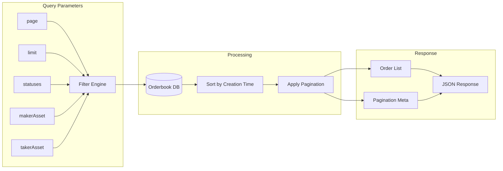

# Get All Orders

Retrieve all orders with optional filtering parameters.



## Endpoint

```
GET https://api.1inch.dev/orderbook/v4.0/{chain}/all
```

## Parameters

### Path Parameters

| Parameter | Type | Required | Description |
| --------- | ---- | -------- | ----------- |
| `chain` | `number` | Yes | Chain ID (1 for Ethereum, 137 for Polygon, etc.) |

### Query Parameters

| Parameter | Type | Required | Description |
| --------- | ---- | -------- | ----------- |
| `page` | `number` | No | Page number for pagination (default: 1) |
| `limit` | `number` | No | Number of items per page (default: 100, max: 1000) |
| `statuses` | `string` | No | Comma-separated order statuses (1,2,3) |
| `takerAsset` | `string` | No | Filter by taker asset address |
| `makerAsset` | `string` | No | Filter by maker asset address |
| `sortBy` | `string` | No | Sort field. One of: `createDateTime`, `takerRate`, `makerRate`, `makerAmount`, `takerAmount` |


## Request Example

```javascript
const axios = require("axios");

async function httpCall() {
  const url = "https://api.1inch.dev/orderbook/v4.0/1/all";

  const config = {
    headers: {
      Authorization: "Bearer {API_KEY}",
    },
    params: {
      page: 1,
      limit: 100,
      statuses: "1,2,3",
      takerAsset: "0xC02aaA39b223FE8D0A0e5C4F27eAD9083C756Cc2",
      makerAsset: "0xdAC17F958D2ee523a2206206994597C13D831ec7",
    },
    paramsSerializer: {
      indexes: null,
    },
  };

  try {
    const response = await axios.get(url, config);
    console.log(response.data);
  } catch (error) {
    console.error(error);
  }
}
```

## Response

### Success (200)

Returns an array of queried limit orders.

### Schema

| Field | Type | Required | Description |
| ----- | ---- | -------- | ----------- |
| `signature` | `string` | Yes | Order signature |
| `orderHash` | `string` | Yes | Unique order identifier |
| `createDateTime` | `string` | Yes | Order creation timestamp |
| `remainingMakerAmount` | `string` | Yes | Remaining amount to be filled |
| `makerBalance` | `string` | Yes | Maker's token balance |
| `makerAllowance` | `string` | Yes | Maker's token allowance |
| `data` | `object` | Yes | Order data structure |
| `data.makerAsset` | `string` | Yes | Maker asset address |
| `data.takerAsset` | `string` | Yes | Taker asset address |
| `data.maker` | `string` | Yes | Maker address |
| `data.receiver` | `string` | No | Receiver address |
| `data.makingAmount` | `string` | Yes | Total making amount |
| `data.takingAmount` | `string` | Yes | Total taking amount |
| `data.salt` | `string` | Yes | Order salt |
| `data.extension` | `string` | No | Order extension data |
| `data.makerTraits` | `string` | No | Maker traits |
| `makerRate` | `string` | Yes | Maker exchange rate |
| `takerRate` | `string` | Yes | Taker exchange rate |
| `isMakerContract` | `boolean` | Yes | Whether maker is a contract |
| `orderInvalidReason` | `string` | Yes | Reason if order is invalid | 

### Example Response

```json
[
  {
    "orderHash": "0xf2637aec6b34381238f8c7c0a2e2e5b1bbcfa62c8e6411c7304f3f10e30d74b4",
    "createDateTime": "2025-07-27T07:27:23.335Z",
    "remainingMakerAmount": "500000000",
    "makerBalance": "1285018081",
    "makerAllowance": "115792089237316195423570985008687907853269984665640564039457584007913129639935",
    "data": {
      "makerAsset": "0xdac17f958d2ee523a2206206994597c13d831ec7",
      "takerAsset": "0xc02aaa39b223fe8d0a0e5c4f27ead9083c756cc2",
      "salt": "5487688115047438160270854460963812119342305034397817101594570438434225671085",
      "receiver": "0xc0dfdb9e7a392c3dbbe7c6fbe8fbc1789c9fe05e",
      "makingAmount": "500000000",
      "takingAmount": "142857142857142850",
      "maker": "0xccede9975db9241bfc54f077b6990aafe8aee6da",
      "extension": "0x000000d400000072000000720000007200000072000000390000000000000000c0dfdb9e7a392c3dbbe7c6fbe8fbc1789c9fe05e00000001f43203b09498030ae3416b66dc74db31d09524fa87b1f7d18bd45f0b94f54a968fc0dfdb9e7a392c3dbbe7c6fbe8fbc1789c9fe05e00000001f43203b09498030ae3416b66dc74db31d09524fa87b1f7d18bd45f0b94f54a968fc0dfdb9e7a392c3dbbe7c6fbe8fbc1789c9fe05e00000000000000000000000000000000000000000090cbe4bdd538d6e9b379bff5fe72c3d67a521de500000001f43203b09498030ae3416b66dc74db31d09524fa87b1f7d18bd45f0b94f54a968f",
      "makerTraits": "0x4e80000000000000000000000000000000006889c95600000000000000000000"
    },
    "makerRate": "285714285.714285700000000000",
    "takerRate": "0.000000003500000000",
    "isMakerContract": false,
    "orderInvalidReason": null,
    "signature": "0x9b2097ae806d5212ea48fd0d79aab10d330cea08ccf8a7e8aceaad24a8f4c3ae5121132fa69c5ef2fe1cbe5d484322d1c5da986516a69ed1be22341a4a8c02a51b"
  },...
]
