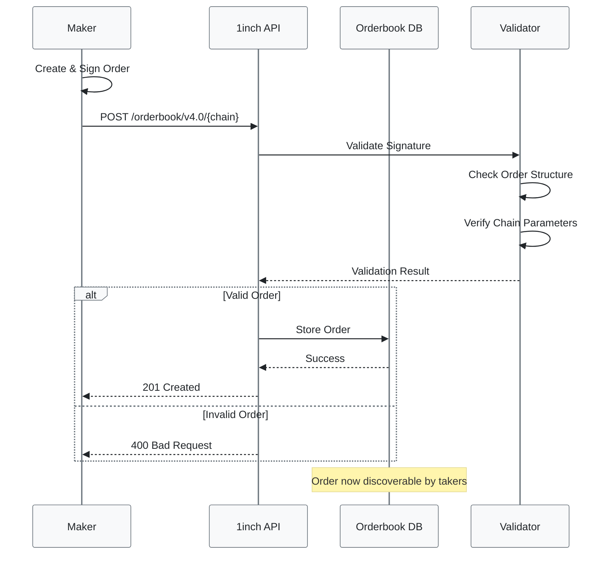

# Submit Order

> **Submit a new limit order to the 1inch Orderbook**  
> This endpoint allows you to submit a cryptographically signed limit order for discovery by takers and resolvers.



---

## Endpoint Details

```http
POST https://api.1inch.dev/orderbook/v4.0/{chain}
```

| Component      | Description                            |
| -------------- | -------------------------------------- |
| Method         | `POST`                                 |
| Base URL       | `https://api.1inch.dev/orderbook/v4.0` |
| Authentication | Bearer token required                  |
| Content-Type   | `application/json`                     |

---

## Parameters

### Path Parameters

| Parameter | Type     | Required | Description           | Example                                           |
| --------- | -------- | :------: | --------------------- | ------------------------------------------------- |
| `chain`   | `number` | **Yes**  | Blockchain network ID | `1` (Ethereum)<br/>`137` (Polygon)<br/>`56` (BSC) |

### Request Body

> ** Important**  
> All orders must be properly signed using EIP-712 standard before submission.

#### Top-level Fields

| Field       | Type     | Required | Description                         |
| ----------- | -------- | :------: | ----------------------------------- |
| `orderHash` | `string` | **Yes**  | Unique hash identifier of the order |
| `signature` | `string` | **Yes**  | EIP-712 signature from the maker    |
| `data`      | `object` | **Yes**  | Complete order data structure       |

#### Order Data Structure

| Field               | Type     | Required  | Description                     | Example                                      |
| ------------------- | -------- | :-------: | ------------------------------- | -------------------------------------------- |
| `data.makerAsset`   | `string` |  **Yes**  | Token address being sold        | `0xdac17f958d2ee523a2206206994597c13d831ec7` |
| `data.takerAsset`   | `string` |  **Yes**  | Token address being bought      | `0xc02aaa39b223fe8d0a0e5c4f27ead9083c756cc2` |
| `data.maker`        | `string` |  **Yes**  | Address of the order creator    | `0xccede9975db9241bfc54f077b6990aafe8aee6da` |
| `data.receiver`     | `string` | ⚪ **No** | Address to receive taker tokens | `0xc0dfdb9e7a392c3dbbe7c6fbe8fbc1789c9fe05e` |
| `data.makingAmount` | `string` |  **Yes**  | Amount of maker tokens (wei)    | `"500000000"`                                |
| `data.takingAmount` | `string` |  **Yes**  | Amount of taker tokens (wei)    | `"142857142857142850"`                       |
| `data.salt`         | `string` |  **Yes**  | Unique order identifier         | Random large number                          |
| `data.extension`    | `string` | ⚪ **No** | Extension data                  | `"0x"` (default)                             |
| `data.makerTraits`  | `string` | ⚪ **No** | Order behavior configuration    | Hex-encoded traits                           |

---

## Request Example

### Using Axios

```javascript
import axios from "axios";

async function submitOrder() {
  const url = "https://api.1inch.dev/orderbook/v4.0/1";

  const config = {
    headers: {
      Authorization: "Bearer YOUR_API_KEY",
      "Content-Type": "application/json",
    },
  };

  const orderData = {
    orderHash:
      "0xf2637aec6b34381238f8c7c0a2e2e5b1bbcfa62c8e6411c7304f3f10e30d74b4",
    signature:
      "0x9b2097ae806d5212ea48fd0d79aab10d330cea08ccf8a7e8aceaad24a8f4c3ae5121132fa69c5ef2fe1cbe5d484322d1c5da986516a69ed1be22341a4a8c02a51b",
    data: {
      makerAsset: "0xdac17f958d2ee523a2206206994597c13d831ec7", // USDT
      takerAsset: "0xc02aaa39b223fe8d0a0e5c4f27ead9083c756cc2", // WETH
      maker: "0xccede9975db9241bfc54f077b6990aafe8aee6da",
      receiver: "0xc0dfdb9e7a392c3dbbe7c6fbe8fbc1789c9fe05e",
      makingAmount: "500000000", // 500 USDT (6 decimals)
      takingAmount: "142857142857142850", // ~0.14 WETH (18 decimals)
      salt: "5487688115047438160270854460963812119342305034397817101594570438434225671085",
      extension: "0x",
      makerTraits:
        "0x4e80000000000000000000000000000000006889c95600000000000000000000",
    },
  };

  try {
    const response = await axios.post(url, orderData, config);
    console.log(" Order submitted successfully:", response.data);
    return response.data;
  } catch (error) {
    console.error(
      " Failed to submit order:",
      error.response?.data || error.message,
    );
    throw error;
  }
}
```

### Using 1inch SDK

```javascript
import { Api, AxiosProviderConnector } from "@1inch/limit-order-sdk";

const api = new Api({
  networkId: 1,
  authKey: process.env.API_KEY,
  httpConnector: new AxiosProviderConnector(),
});

// Submit order using SDK (recommended)
const result = await api.submitOrder(order, signature);
```

---

## Response Format

### Success Response (201 Created)

```json
{
  "success": true,
  "orderHash": "0xf2637aec6b34381238f8c7c0a2e2e5b1bbcfa62c8e6411c7304f3f10e30d74b4"
}
```

| Field       | Type      | Description                               |
| ----------- | --------- | ----------------------------------------- |
| `success`   | `boolean` | Indicates successful submission           |
| `orderHash` | `string`  | Unique identifier for the submitted order |

---

## Error Responses

### 400 Bad Request

> **Common Issues:** Invalid order data, malformed signature, or missing required fields

```json
{
  "statusCode": 400,
  "message": "Invalid signature",
  "error": "Bad Request"
}
```

**Possible Causes:**

- Invalid or malformed EIP-712 signature
- Missing required fields in request body
- Invalid token addresses
- Malformed amounts (not valid numbers)

### 401 Unauthorized

```json
{
  "statusCode": 401,
  "message": "Unauthorized",
  "error": "Invalid API key"
}
```

### 409 Conflict

> **Order Already Exists:** This order hash has already been submitted

```json
{
  "statusCode": 409,
  "message": "Order already exists",
  "error": "Conflict"
}
```

### 422 Unprocessable Entity

```json
{
  "statusCode": 422,
  "message": "Insufficient maker balance or allowance",
  "error": "Unprocessable Entity"
}
```

**Common Validation Failures:**

- Maker has insufficient token balance
- Maker hasn't approved tokens for the limit order contract
- Order has already expired
- Invalid order hash (doesn't match order data)

---

## Important Notes

### Security Requirements

> ** Critical Security Checks**
>
> - Order must be signed using EIP-712 standard
> - `orderHash` must match the actual hash of the order data
> - Signature must be valid and from the specified maker address

### Financial Requirements

> ** Before Submitting**
>
> - Maker must have sufficient balance of the maker asset
> - Maker must have approved the limit order contract to spend tokens
> - Order must not be expired (if expiration is set)

### Best Practices

1. **Use the SDK**: The [@1inch/limit-order-sdk](../../../1inch%20LOP/Limit%20Order%20SDK/install.md) handles order creation and signing automatically
2. **Validate Locally**: Check order validity before submission to avoid API errors
3. **Handle Errors**: Implement proper error handling for different response codes
4. **Monitor Status**: Use other API endpoints to track order status after submission

---

## Related Endpoints

| Endpoint         | Purpose                | Link                                                       |
| ---------------- | ---------------------- | ---------------------------------------------------------- |
| **Get Order**    | Retrieve order details | [GET /order/{hash}](./get-order-by-hash.md)                |
| **List Orders**  | View all orders        | [GET /all](./get-all-orders.md)                            |
| **Order Events** | Track order execution  | [GET /events/{hash}](./get-fill-cancel-events-by-order.md) |

---

## Next Steps

- [ **Order Creation Guide**](../../quickstart.md) - Learn how to create and sign orders
- [ **SDK Integration**](../../../1inch%20LOP/Limit%20Order%20SDK/install.md) - Use the JavaScript SDK
- [ **Order Management**](./get-orders-by-address.md) - Track your submitted orders
