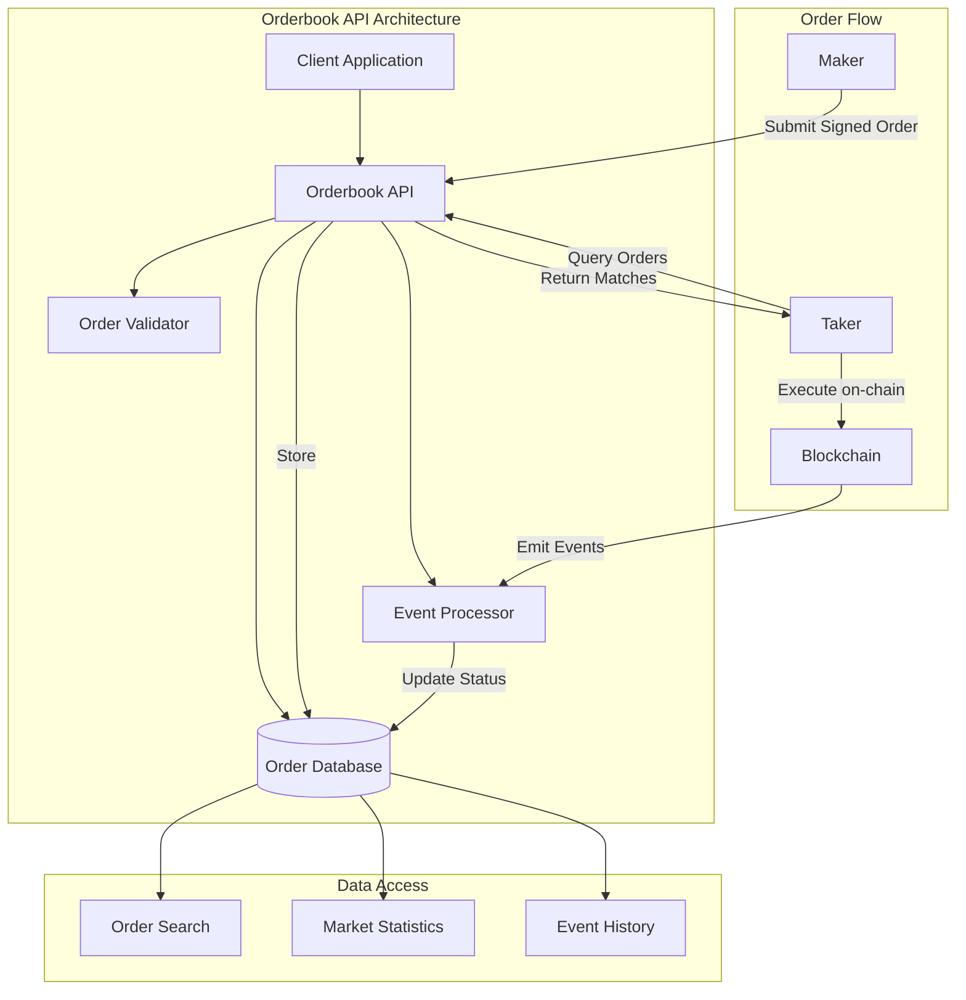

# 1inch Orderbook API Overview

> **🏗️ Your gateway to decentralized limit order trading**  
> The 1inch Orderbook API provides RESTful access to limit orders, enabling efficient discovery and execution while maintaining the decentralized nature of the protocol.



---

## Purpose & Mission

The Orderbook API bridges the gap between off-chain order creation and on-chain execution by providing:

| Function        | Description                                | Benefit               |
| --------------- | ------------------------------------------ | --------------------- |
| Order Storage   | Store signed limit orders from makers      | Centralized discovery |
| Order Discovery | Enable takers and resolvers to find orders | Efficient matching    |
| Status Tracking | Monitor order lifecycle and events         | Real-time insights    |
| Price Discovery | Facilitate market depth analysis           | Better pricing        |

---

## Key Features

### Order Management

> **Complete order lifecycle management**

- **Submit Orders**: Store cryptographically signed orders for public discovery
- **Query Orders**: Advanced search with filters for maker, assets, status, and more
- **Order Status**: Real-time tracking from creation to completion or cancellation
- **Batch Operations**: Efficient handling of multiple orders

### Event Tracking

> **Stay updated with real-time order events**

- **Fill Events**: Monitor partial and complete order executions
- **Cancel Events**: Track order cancellations and invalidations
- **Real-time Updates**: WebSocket support for live order state changes
- **Historical Data**: Access complete event history for analysis

### Market Data & Analytics

> **Deep market insights at your fingertips**

- **Active Pairs**: Discover all trading pairs with active liquidity
- **Order Statistics**: Comprehensive metrics on order distribution
- **Market Depth**: Analyze liquidity across different price levels
- **Volume Metrics**: Track trading volume and activity trends

---

## API Endpoints

### Core Order Operations

| Endpoint                  | Method | Description                  | Use Case           |
| ------------------------- | ------ | ---------------------------- | ------------------ |
| `/{chain}`                | `POST` | Submit new order             | Order creation     |
| `/{chain}/all`            | `GET`  | List all orders with filters | Market scanning    |
| `/{chain}/order/{hash}`   | `GET`  | Get specific order details   | Order verification |
| `/{chain}/address/{addr}` | `GET`  | Get orders by maker          | Portfolio tracking |

### Event & Analytics

| Endpoint                       | Method | Description                   | Use Case         |
| ------------------------------ | ------ | ----------------------------- | ---------------- |
| `/{chain}/events`              | `GET`  | Get all order events          | Market analysis  |
| `/{chain}/events/{hash}`       | `GET`  | Get events for specific order | Order tracking   |
| `/{chain}/count`               | `GET`  | Get order counts with filters | Statistics       |
| `/{chain}/unique-active-pairs` | `GET`  | Get active trading pairs      | Market discovery |

---

## Authentication & Security

### API Key Setup

> **🚀 Get started in minutes**  
> Obtain your API key from the [1inch Developer Portal](https://portal.1inch.dev/)

```bash
# Include in all requests
Authorization: Bearer YOUR_API_KEY
```

### Security Best Practices

> **⚠️ Security Guidelines**
>
> - Never expose API keys in client-side code
> - Use environment variables for key storage
> - Rotate keys regularly for enhanced security
> - Monitor usage patterns for unusual activity

---

## Rate Limits & Performance

### Current Limits

| Limit Type     | Quota           | Scope       |
| -------------- | --------------- | ----------- |
| **Per Second** | 10 requests     | Per API key |
| **Per Minute** | 1,000 requests  | Per API key |
| **Per Hour**   | 50,000 requests | Per API key |
| **Daily**      | 1M requests     | Per API key |

### Optimization Tips

> **💡 Pro Tips for Better Performance**
>
> - Use appropriate filters to reduce response size
> - Implement client-side caching for static data
> - Batch requests when possible
> - Use pagination for large datasets

---

## Response Format & Standards

### Success Response Structure

```json
{
  "data": {...},           // Requested data
  "meta": {                // Metadata (pagination, etc.)
    "totalItems": 1000,
    "currentPage": 1,
    "totalPages": 10
  },
  "timestamp": "2024-01-01T00:00:00Z"
}
```

### Error Response Structure

```json
{
  "error": {
    "code": 400,
    "message": "Invalid request parameters",
    "details": "Chain ID must be a valid number"
  },
  "timestamp": "2024-01-01T00:00:00Z"
}
```

### HTTP Status Codes

| Code  | Status          | Meaning               |
| ----- | --------------- | --------------------- |
| `200` | ✅ OK           | Request successful    |
| `400` | ❌ Bad Request  | Invalid parameters    |
| `401` | 🔒 Unauthorized | Invalid API key       |
| `404` | 🔍 Not Found    | Resource not found    |
| `429` | ⏸️ Rate Limited | Too many requests     |
| `500` | 🔥 Server Error | Internal server issue |

---

## Network Support

### Supported Blockchains

| Network       | Chain ID | Status    | Features        |
| ------------- | -------- | --------- | --------------- |
| **Ethereum**  | `1`      | 🟢 Active | Full support    |
| **Polygon**   | `137`    | 🟢 Active | Full support    |
| **BSC**       | `56`     | 🟢 Active | Full support    |
| **Arbitrum**  | `42161`  | 🟢 Active | Full support    |
| **Optimism**  | `10`     | 🟢 Active | Full support    |
| **Avalanche** | `43114`  | 🟢 Active | Full support    |
| **Base**      | `8453`   | 🟡 Beta   | Limited support |

### Network Configuration

```javascript
// Example: Switch between networks
const networks = {
  ethereum: { chainId: 1, name: "Ethereum Mainnet" },
  polygon: { chainId: 137, name: "Polygon" },
  bsc: { chainId: 56, name: "BSC" },
  arbitrum: { chainId: 42161, name: "Arbitrum One" },
  optimism: { chainId: 10, name: "Optimism" },
};
```

---

## Getting Started

### Quick Setup

```bash
# Install the SDK
bun add @1inch/limit-order-sdk

# Set up environment
echo "API_KEY=your_api_key_here" > .env
```

### First API Call

```javascript
import { Api, AxiosProviderConnector } from "@1inch/limit-order-sdk";

const api = new Api({
  networkId: 1, // Ethereum
  authKey: process.env.API_KEY,
  httpConnector: new AxiosProviderConnector(),
});

// Get all active orders
const orders = await api.getAllOrders({ limit: 10 });
console.log(`Found ${orders.length} active orders`);
```

---

## Additional Resources

### Quick Links

- [🚀 **Quickstart Guide**](./quickstart.md) - Get up and running in 5 minutes
- [📖 **API Reference**](./api-reference/) - Comprehensive endpoint documentation
- [🛠️ **SDK Integration**](../1inch%20LOP/Limit%20Order%20SDK/install.md) - JavaScript/TypeScript SDK
- [🏗️ **Contract Integration**](../1inch%20LOP/limit-order-maker-contract.md) - Direct contract interaction

### Support & Community

- 📚 [**Documentation Portal**](https://docs.1inch.io/) - Complete documentation
- 💬 [**Developer Discord**](https://discord.gg/1inch) - Community support
- 🐛 [**GitHub Issues**](https://github.com/1inch/limit-order-protocol) - Bug reports
- 📧 [**Developer Support**](mailto:dev-support@1inch.io) - Direct assistance

---

> **🎯 Ready to build?**  
> Start with our [Quickstart Guide](./quickstart.md) and have your first order running in minutes!
