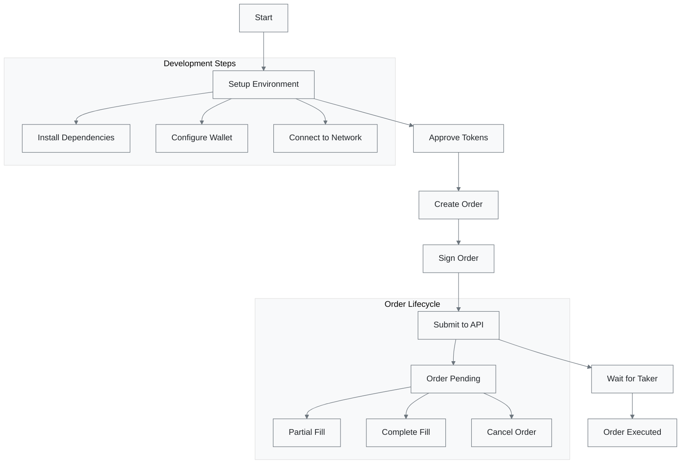

# Quickstart Guide

> **Get started with 1inch Limit Orders in minutes!**  
> This comprehensive guide walks you through creating, signing, and submitting your first Limit Order v4.



## What You'll Learn

This guide demonstrates how to create and submit a Limit Order v4 using the `@1inch/limit-order-sdk` in a JavaScript environment. You'll learn how to:

- Configure your development environment
- Approve token transfers securely
- Construct and sign a limit order
- Submit the signed order to the 1inch Orderbook API

---

## Step 1: Install Dependencies

> **Prerequisites:** Ensure you have Node.js installed (v18 or higher recommended)

Initialize a new project and install the required libraries:

```bash
# Initialize a new project
bun init -y

# Install required dependencies
bun add @1inch/limit-order-sdk ethers
```

### Dependencies Overview

| Package                  | Purpose                                                     | Version |
| ------------------------ | ----------------------------------------------------------- | ------- |
| `@1inch/limit-order-sdk` | Core SDK for creating, signing, and submitting limit orders | Latest  |
| `ethers`                 | Lightweight library for Ethereum blockchain interaction     | v6+     |

---

## Step 2: Set Up Wallet and Network Configuration

Create a new file (e.g., `limitOrder.js`) and set up the basic configuration:

```javascript
import { Wallet, JsonRpcProvider, Contract } from "ethers";
import {
  LimitOrder,
  MakerTraits,
  Address,
  Api,
  getLimitOrderV4Domain,
} from "@1inch/limit-order-sdk";

//  Standard ERC-20 ABI fragment (used for token approval)
const erc20AbiFragment = [
  "function approve(address spender, uint256 amount) external returns (bool)",
  "function allowance(address owner, address spender) external view returns (uint256)",
];
```

### Secure Wallet Setup

> ** Security Warning**  
> Never hardcode private keys in your code. Always use environment variables or secure key management systems.

```javascript
// Use environment variables to manage private keys securely
const privateKey = process.env.PRIVATE_KEY;
const chainId = 1; // Ethereum mainnet

const provider = new JsonRpcProvider("https://cloudflare-eth.com/");
const wallet = new Wallet(privateKey, provider);
```

### Token Configuration

Configure the trading pair and amounts for your limit order:

```javascript
// Token addresses (Ethereum mainnet)
const makerAsset = "0xa0b86991c6218b36c1d19d4a2e9eb0ce3606eb48"; // USDC
const takerAsset = "0x111111111117dc0aa78b770fa6a738034120c302"; // 1INCH

// Trading amounts (use BigInt for precision)
const makingAmount = 1_000_000n; // 1 USDC (6 decimals)
const takingAmount = 1_000_000_000_000_000_000n; // 1 1INCH (18 decimals)

// Order expiration (2 minutes from now)
const expiresIn = 120n; // seconds
const expiration = BigInt(Math.floor(Date.now() / 1000)) + expiresIn;
```

| Token       | Symbol | Address                                      | Decimals |
| ----------- | ------ | -------------------------------------------- | -------- |
| Maker Asset | USDC   | `0xa0b86991c6218b36c1d19d4a2e9eb0ce3606eb48` | 6        |
| Taker Asset | 1INCH  | `0x111111111117dc0aa78b770fa6a738034120c302` | 18       |

---

## Step 3: Check Allowance and Approve Token

> ** Important Note**  
> The 1inch Limit Order smart contract must be authorized to transfer your tokens. This requires an ERC-20 approval transaction.

### Approval Process

```javascript
import { MaxUint256 } from "ethers";

// Get the limit order contract address
const domain = getLimitOrderV4Domain(chainId);
const limitOrderContractAddress = domain.verifyingContract;

// Create contract instance for the maker asset
const makerAssetContract = new Contract(makerAsset, erc20AbiFragment, wallet);

// Check current allowance
const currentAllowance = await makerAssetContract.allowance(
  wallet.address,
  limitOrderContractAddress,
);

// Approve if insufficient allowance
if (currentAllowance < makingAmount) {
  console.log("🔄 Approving token transfer...");

  const approveTx = await makerAssetContract.approve(
    limitOrderContractAddress,
    makingAmount, // or MaxUint256 for unlimited approval
  );

  await approveTx.wait();
  console.log(" Token approval confirmed!");
}
```

### Pro Tips

> **Tip: One-time Approval**  
> To avoid repeated approvals, you can approve the maximum amount:
>
> ```javascript
> await makerAssetContract.approve(limitOrderContractAddress, MaxUint256);
> ```

> **Important: Token-Specific Approvals**  
> ERC-20 allowances are token- and spender-specific. If you change the token or contract, a new approval is required.

---

## Step 4: Define Order Parameters and Traits

The `MakerTraits` define how your order behaves. Configure rules for partial fills, expiration, and reusability:

### Available Trait Methods

| Method                       | Description                     | Use Case                       |
| ---------------------------- | ------------------------------- | ------------------------------ |
| `.withExpiration(timestamp)` | Sets order expiration time      | Time-sensitive trading         |
| `.allowPartialFills()`       | Enables partial order execution | Large orders, better liquidity |
| `.allowMultipleFills()`      | Allows multiple executions      | Market making strategies       |
| `.withNonce(value)`          | Sets unique order identifier    | Order management               |

### Implementation

```javascript
// Configure order traits
const makerTraits = new MakerTraits()
  .withExpiration(expiration)
  .allowPartialFills()
  .allowMultipleFills();

// Create the limit order
const order = new LimitOrder({
  makerAsset: new Address(makerAsset),
  takerAsset: new Address(takerAsset),
  makingAmount,
  takingAmount,
  maker: new Address(wallet.address),
  receiver: new Address(wallet.address),
  salt: BigInt(Math.floor(Math.random() * 1e8)), // Unique identifier
  makerTraits,
});
```

---

## Step 5: Sign the Order (EIP-712)

> **🔐 Security Feature**  
> EIP-712 signing ensures the order can only be executed exactly as specified by the maker.

```javascript
// Generate typed data for signing
const typedData = order.getTypedData(domain);

// Prepare domain for ethers.js
const domainForSignature = {
  ...typedData.domain,
  chainId: chainId,
};

// Sign the order
console.log(" Signing order...");
const signature = await wallet.signTypedData(
  domainForSignature,
  { Order: typedData.types.Order },
  typedData.message,
);

console.log(" Order signed successfully!");
```

### What's Being Signed

The signature includes:

- Order details (amounts, tokens, expiration)
- Maker address and traits
- Unique salt for order identification
- Domain-specific information for security

---

## Step 6: Submit the Signed Order

Submit your order to the 1inch Orderbook to make it discoverable by resolvers:

### API Setup

> ** Get Your API Key**  
> Register at the [1inch Developer Portal](https://portal.1inch.dev/) to obtain your API key.

```javascript
import { AxiosProviderConnector } from "@1inch/limit-order-sdk";

const api = new Api({
  networkId: chainId, // 1 = Ethereum Mainnet
  authKey: process.env.API_KEY, // Load API key securely
  httpConnector: new AxiosProviderConnector(),
});
```

### Order Submission

```javascript
try {
  console.log("📡 Submitting order to 1inch Orderbook...");

  const result = await api.submitOrder(order, signature);

  console.log(" Order submitted successfully!");
  console.log("Order Hash:", result.orderHash);
  console.log("Status:", result.success ? "Active" : "Failed");
} catch (error) {
  console.error(" Failed to submit order:", error.message);

  // Handle common errors
  if (error.message.includes("insufficient allowance")) {
    console.log(" Tip: Check your token approval");
  } else if (error.message.includes("invalid signature")) {
    console.log(" Tip: Verify your order signing process");
  }
}
```

### Frontend Considerations

> **CORS Warning**  
> When calling the API directly from a browser, you may encounter CORS errors. For frontend applications, use a backend proxy server to forward requests securely.

---

## Network Support

The 1inch Limit Order Protocol supports multiple networks:

| Network   | Chain ID | Status    |
| --------- | -------- | --------- |
| Ethereum  | 1        |  Active |
| Polygon   | 137      |  Active |
| BSC       | 56       |  Active |
| Arbitrum  | 42161    |  Active |
| Optimism  | 10       |  Active |
| Avalanche | 43114    |  Active |

---

## Conclusion

Congratulations! You've successfully:

-  Set up the development environment
-  Configured wallet and tokens
-  Approved token transfers
-  Created and signed a limit order
-  Submitted the order to the 1inch Orderbook

Your order is now live and discoverable by resolvers across the network!

### Next Steps

- [ API Reference](./api-reference/) - Explore all available endpoints
- [ Advanced Integration](../1inch%20LOP/limit-order-maker-contract.md) - Learn about contract interactions
- [ SDK Documentation](../1inch%20LOP/Limit%20Order%20SDK/) - Dive deeper into the SDK features

### Need Help?

-  [Documentation Portal](https://docs.1inch.io/)
-  [Developer Community](https://discord.gg/1inch)
- 🐛 [Report Issues](https://github.com/1inch/limit-order-protocol-utils)

---

> ** Pro Tip**  
> For production applications, implement proper error handling, logging, and monitoring to ensure reliable order management.
