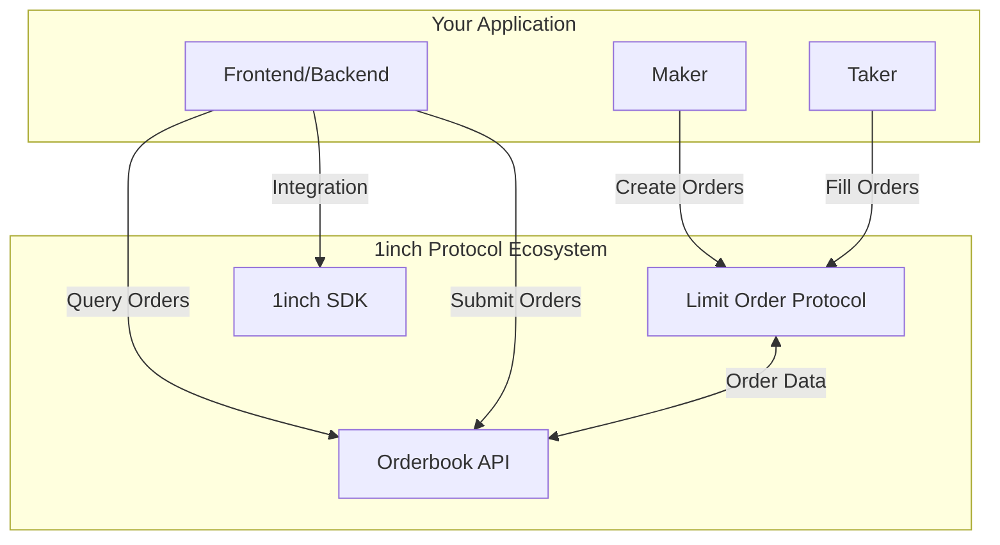
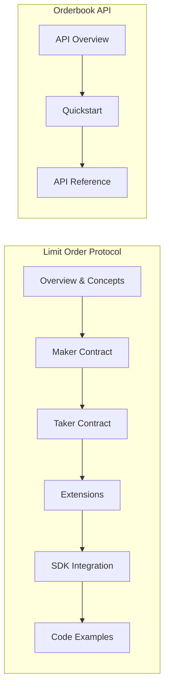
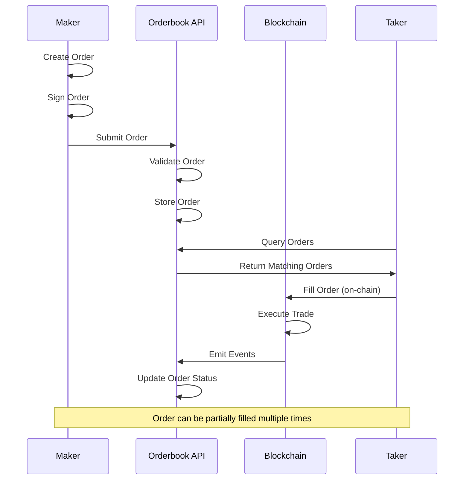

# 1inch Protocol Documentation

Welcome to the comprehensive documentation for 1inch Protocol integration. This documentation covers both the **Limit Order Protocol** and **Orderbook API**, providing everything you need to build advanced trading applications on 1inch.



## Overview

### Limit Order Protocol
The **1inch Limit Order Protocol** is a decentralized protocol that enables off-chain order creation and on-chain order execution. It provides gas-efficient limit orders with advanced features like:

- **Gas-optimized execution** - Orders are stored off-chain, reducing gas costs
- **Advanced order types** - Dutch auctions, stop-loss, take-profit, and more
- **Flexible interactions** - Pre/post execution hooks for complex strategies
- **Partial fills** - Orders can be filled partially over multiple transactions

### Orderbook API
The **Orderbook API** provides a centralized interface for managing limit orders, offering:

- **Order management** - Create, query, and track orders
- **Real-time updates** - WebSocket feeds for order status changes
- **Market data** - Order book depth, recent trades, and statistics
- **Fee estimation** - Calculate fees before order submission

## Documentation Structure



### [Limit Order Protocol](./Limit%20Order%20Protocol/)
- **[Extensions](./Limit%20Order%20Protocol/extensions.md)** - Advanced order features and customization
- **[Maker Contract](./Limit%20Order%20Protocol/limit-order-maker-contract.md)** - Creating and managing orders
- **[Taker Contract](./Limit%20Order%20Protocol/limit-order-taker-contract.md)** - Filling and executing orders
- **[SDK Integration](./Limit%20Order%20Protocol/Limit%20Order%20SDK/)** - Using the official SDK
- **[Examples](./Limit%20Order%20Protocol/Examples/)** - TypeScript implementation examples

### [Orderbook API](./Orderbook%20API/)
- **[Overview](./Orderbook%20API/overview.md)** - API concepts and architecture
- **[Quickstart](./Orderbook%20API/quickstart.md)** - Get started in minutes
- **[API Reference](./Orderbook%20API/api-reference/)** - Complete endpoint documentation

## Quick Start

### 1. Create Your First Limit Order

```typescript
import { LimitOrderBuilder, Web3ProviderConnector } from '@1inch/limit-order-sdk';

// Initialize the SDK
const connector = new Web3ProviderConnector(web3Provider);
const limitOrderBuilder = new LimitOrderBuilder(
  chainId,
  contractAddress,
  connector
);

// Create a limit order
const order = limitOrderBuilder.buildLimitOrder({
  makerAssetAddress: '0x...', // Token to sell
  takerAssetAddress: '0x...', // Token to buy
  makerAmount: '1000000000000000000', // 1 token
  takerAmount: '2000000000000000000', // 2 tokens
  maker: makerAddress,
});

// Sign and submit the order
const signature = await limitOrderBuilder.signLimitOrder(order);
```

### 2. Query Orders via API

```typescript
// Get all orders for a specific token pair
const orders = await fetch('https://limit-orders.1inch.io/v3.0/1/limit-order/all', {
  method: 'POST',
  headers: { 'Content-Type': 'application/json' },
  body: JSON.stringify({
    page: 1,
    limit: 100,
    makerAsset: '0x...',
    takerAsset: '0x...'
  })
});
```

## Order Lifecycle



## Key Features

### Advanced Order Types
- **Limit Orders** - Buy/sell at specific price or better
- **Dutch Auctions** - Price decreases over time
- **Stop Orders** - Trigger when conditions are met
- **Range Orders** - Provide liquidity within price range

### Gas Optimization
- **Off-chain Storage** - Orders stored off-chain until filled
- **Batch Operations** - Multiple orders in single transaction
- **Conditional Execution** - Orders execute only when profitable

### Developer Tools
- **TypeScript SDK** - Full-featured development kit
- **REST API** - Easy integration for any language
- **WebSocket Feeds** - Real-time order updates
- **Comprehensive Examples** - Production-ready code samples

## Integration Patterns

### For DeFi Applications
```typescript
// Integrate limit orders into your DeFi protocol
const tradingBot = new TradingBot({
  limitOrderSDK: limitOrderBuilder,
  orderbook: orderbookAPI,
  strategy: 'arbitrage'
});

await tradingBot.start();
```

### For Wallet Applications
```typescript
// Add limit order functionality to wallets
const walletIntegration = new WalletLimitOrders({
  provider: walletProvider,
  chainId: supportedChainId
});

await walletIntegration.createLimitOrderUI();
```

### For Trading Interfaces
```typescript
// Build professional trading interfaces
const tradingInterface = new TradingInterface({
  orderbook: orderbookAPI,
  realTimeFeeds: websocketConnection,
  chartingLibrary: tradingViewLibrary
});
```

## Quick Links

| Resource | Description | Link |
|----------|-------------|------|
| SDK Installation | Get started with the official SDK | [Install Guide](./Limit%20Order%20Protocol/Limit%20Order%20SDK/install.md) |
| API Quickstart | Make your first API call | [Quickstart](./Orderbook%20API/quickstart.md) |
| Order Examples | Working code examples | [Examples](./Limit%20Order%20Protocol/Examples/) |
| Extensions Guide | Advanced order features | [Extensions](./Limit%20Order%20Protocol/extensions.md) |

## Supported Networks

| Network | Chain ID | Contract Address |
|---------|----------|------------------|
| Ethereum | 1 | `0x119c71D3BbAC22029622cbaEc24854d3D32D2828` |
| Polygon | 137 | `0x94Bc2a1C732BcAd7343B25af48385Fe76E08734f` |
| BSC | 56 | `0x1e38Eff998DF9d3669E32f4ff400031385Bf6362` |
| Arbitrum | 42161 | `0x7F069df72b7A39bCE9806e3AfaF579E54D8CF2b9` |

---

💡 **Need help?** Check out our [examples](./Limit%20Order%20Protocol/Examples/) or refer to the specific documentation sections above.