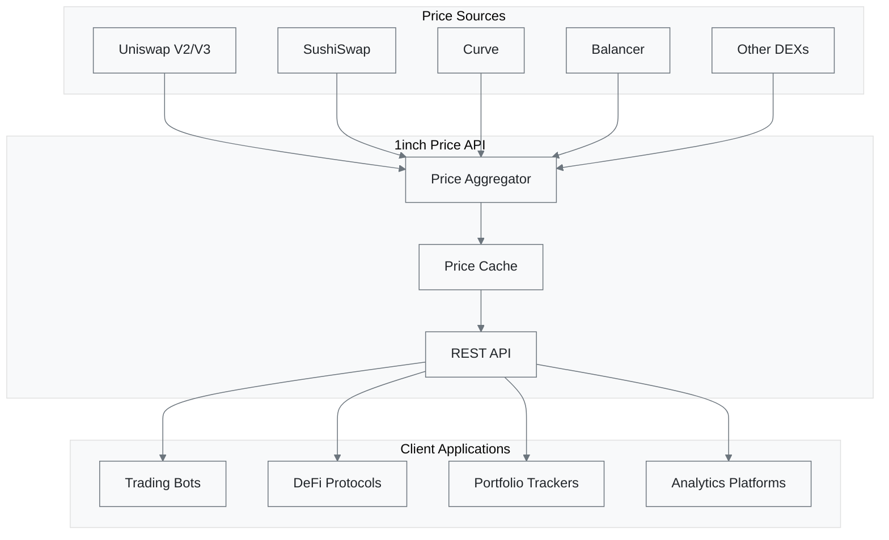

# 1inch Spot Price API Overview

The 1inch Spot Price API provides real-time price data for whitelisted tokens across multiple blockchain networks. This service aggregates pricing information from various decentralized exchanges to deliver accurate and up-to-date token valuations.

## Key Features

- **Multi-chain Support**: Access prices across Ethereum, Polygon, BSC, Arbitrum, and other supported networks
- **Real-time Data**: Get current market prices with minimal latency
- **Batch Requests**: Query multiple tokens in a single API call for optimal performance
- **Currency Flexibility**: Retrieve prices in different base currencies (USD, ETH, etc.)
- **High Availability**: Robust infrastructure with enterprise-grade reliability

## Architecture



## Supported Networks

| Network | Chain ID | Base Currency | Status |
|---------|----------|---------------|--------|
| Ethereum | 1 | ETH | Active |
| Polygon | 137 | MATIC | Active |
| BSC | 56 | BNB | Active |
| Arbitrum | 42161 | ETH | Active |
| Optimism | 10 | ETH | Active |
| Avalanche | 43114 | AVAX | Active |

## API Endpoints

### Core Endpoints

| Endpoint | Method | Description |
|----------|--------|-------------|
| [`/price/v1.1/{chain}`](api-reference/get-all-prices.md) | GET | Get prices for all whitelisted tokens |
| [`/price/v1.1/{chain}`](api-reference/get-prices-by-tokens.md) | POST | Get prices for specific tokens |
| [`/price/v1.1/{chain}/{address}`](api-reference/get-prices-by-tokens.md) | GET | Get price for a single token |
| [`/price/v1.1/{chain}/currencies`](api-reference/get-all-currencies.md) | GET | Get available base currencies |

## Authentication

All requests require authentication using a Bearer token:

```http
Authorization: Bearer YOUR_API_KEY
```

You can obtain an API key from the [1inch Developer Portal](https://portal.1inch.dev/).

## Rate Limits

- **Free Tier**: 100 requests per minute
- **Pro Tier**: 1,000 requests per minute
- **Enterprise**: Custom limits available

## Price Format

Token prices are returned as strings representing the price in the requested currency:

```json
{
  "0xc02aaa39b223fe8d0a0e5c4f27ead9083c756cc2": "3500.123456789",
  "0xa0b86a33e6b2d4d51c7c3a9b78d2f8b9c4d5e6f7": "1.987654321"
}
```

**Important Notes:**
- Prices are denominated in the base currency (USD by default)
- All numeric values are returned as strings to preserve precision
- Token addresses are lowercase and include the `0x` prefix

## Error Handling

The API uses standard HTTP status codes and returns detailed error information:

```json
{
  "error": "Invalid token address",
  "description": "The provided token address is not a valid Ethereum address",
  "statusCode": 400
}
```

Common error codes:
- `400` - Bad Request (invalid parameters)
- `401` - Unauthorized (invalid API key)
- `404` - Not Found (token not whitelisted)
- `429` - Too Many Requests (rate limit exceeded)
- `500` - Internal Server Error

## Best Practices

### Efficient Usage

1. **Batch Requests**: Use POST endpoints to query multiple tokens simultaneously
2. **Caching**: Implement client-side caching to reduce API calls
3. **Error Handling**: Always implement proper error handling and retry logic
4. **Rate Limiting**: Respect rate limits and implement exponential backoff

### Example Implementation

```javascript
class PriceService {
  constructor(apiKey, chainId = 1) {
    this.apiKey = apiKey;
    this.chainId = chainId;
    this.baseUrl = 'https://api.1inch.dev/price/v1.1';
    this.cache = new Map();
  }

  async getTokenPrices(tokenAddresses, currency = 'USD') {
    const cacheKey = `${tokenAddresses.join(',')}-${currency}`;
    const cached = this.cache.get(cacheKey);
    
    if (cached && Date.now() - cached.timestamp < 30000) {
      return cached.data;
    }

    const response = await fetch(`${this.baseUrl}/${this.chainId}`, {
      method: 'POST',
      headers: {
        'Authorization': `Bearer ${this.apiKey}`,
        'Content-Type': 'application/json'
      },
      body: JSON.stringify({
        tokens: tokenAddresses,
        currency: currency
      })
    });

    if (!response.ok) {
      throw new Error(`Price API error: ${response.status}`);
    }

    const data = await response.json();
    this.cache.set(cacheKey, { data, timestamp: Date.now() });
    
    return data;
  }
}
```

## Use Cases

### Portfolio Valuation
Track the total value of token holdings across multiple wallets and networks.

### Trading Algorithms
Power automated trading strategies with real-time price feeds.

### DeFi Protocol Integration
Enable price-aware smart contract functionality for lending, borrowing, and yield farming.

### Analytics and Reporting
Build comprehensive market analysis tools and dashboards.

## Getting Started

1. **Obtain API Key**: Sign up at the [1inch Developer Portal](https://portal.1inch.dev/)
2. **Choose Your Network**: Select the blockchain network for your use case
3. **Review Documentation**: Read the [Quickstart Guide](quickstart.md) for implementation examples
4. **Test Integration**: Start with the sandbox environment before going live

## Related Documentation

- [Quickstart Guide](quickstart.md) - Get up and running quickly
- [API Reference](api-reference/) - Detailed endpoint documentation
- [1inch Orderbook API](/docs/1inch/Orderbook%20API/) - Access to limit order data
- [1edge Integration](/docs/1edge/README.md) - Integration with 1edge platform

## Support

For technical support and questions:
- Documentation: [1inch Docs](https://docs.1inch.io/)
- Developer Portal: [portal.1inch.dev](https://portal.1inch.dev/)
- Community: [Discord](https://discord.gg/1inch)