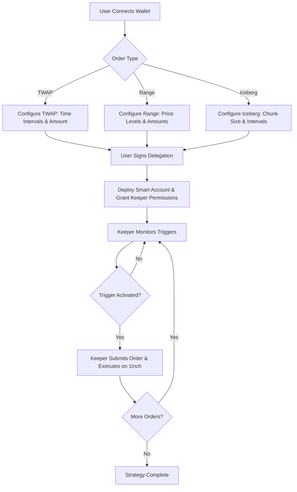
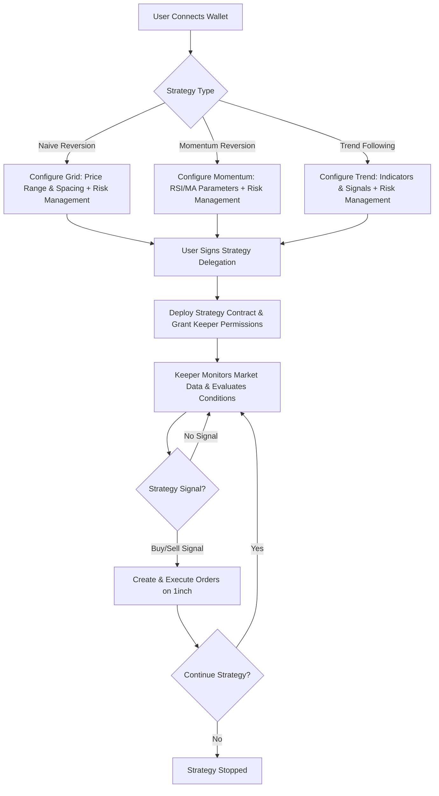

# 1edge Documentation

## Overview

1edge is an advanced trading platform built on top of 1inch's Limit Order Protocol (LOP) that enables users to create sophisticated order types and implement automated market making strategies. The platform combines on-chain smart contracts with off-chain keeper infrastructure to provide a seamless trading experience.

## Architecture

### Core Components

1. **Advanced Order Types** - TWAP, Range Orders, Iceberg Orders
2. **Market Making Strategies** - Naive Reversion, Momentum Reversion, Trend Following
3. **Delegation System** - ERC4337 Smart Accounts with session keys
4. **Keeper Infrastructure** - Off-chain monitoring and order execution
5. **Trigger System** - Price, time, volume, and technical indicator triggers
6. **Frontend Interface** - User-friendly strategy configuration and monitoring

## User Flows

### Advanced Orders Flow



### Market Making Strategy Flow



## Technical Implementation

### On-Chain Components

#### Smart Account Architecture
```
User Wallet � ERC4337 Smart Account � Session Keys � Keeper Contract
```

#### Order Execution Flow
```
Trigger Condition � Keeper Validates � Sign Order � Submit to 1inch LOP � Execution
```

### Off-Chain Components

#### Keeper Infrastructure
- **Market Data Aggregation**: Real-time price feeds from multiple sources
- **Trigger Monitoring**: Continuous evaluation of user-defined conditions
- **Order Management**: Queue and batch order submissions
- **Risk Management**: Position sizing and exposure limits

#### Data Sources
- Primary: Binance, Coinbase Pro APIs for market data
- Secondary: 1inch Orderbook API for order status
- On-chain: Price oracles for validation

## Order Types Specification

### TWAP (Time-Weighted Average Price)
**Purpose**: Execute large orders over time to minimize market impact

**Parameters**:
- `totalAmount`: Total amount to trade
- `timeWindow`: Duration over which to execute
- `intervalCount`: Number of sub-orders
- `priceLimit`: Maximum acceptable price deviation

**Trigger**: Time-based intervals

### Range Orders
**Purpose**: Single-sided grid orders for specific price ranges

**Parameters**:
- `baseAsset`: Asset to trade
- `quoteAsset`: Quote currency
- `priceRange`: [minPrice, maxPrice]
- `gridLevels`: Number of price levels
- `amountPerLevel`: Amount allocated per level

**Trigger**: Price crossing threshold levels

### Iceberg Orders
**Purpose**: Hide large order size by revealing only small portions

**Parameters**:
- `totalAmount`: Total order size
- `visibleAmount`: Amount visible at any time
- `priceLimit`: Limit price for execution
- `refreshThreshold`: When to refresh visible portion

**Trigger**: Volume-based or time-based refresh

## Market Making Strategies

### Naive Reversion
**Assumption**: Prices mean-revert around a central value

**Implementation**:
- Place buy orders below current price
- Place sell orders above current price
- Adjust grid spacing based on volatility

### Momentum Reversion
**Enhancement**: Incorporate momentum indicators

**Features**:
- RSI-based grid adjustment
- Moving average trend confirmation
- Dynamic spread adjustment

### Trend Following
**Approach**: Follow established market trends

**Signals**:
- Moving average crossovers
- Breakout confirmations
- Volume validation

## Risk Management

### Position Limits
- Maximum exposure per asset
- Portfolio-level risk limits
- Leverage constraints

### Stop Loss Mechanisms
- Price-based stops
- Time-based exits
- Drawdown limits

### Emergency Controls
- User override capabilities
- Keeper pause functionality
- Contract upgrade mechanisms

## Gas Optimization

### Batch Operations
- Multiple order submissions in single transaction
- Efficient storage patterns
- Minimal external calls

### Session Keys
- Reduced signature requirements
- Automated execution capabilities
- Granular permission controls

## Security Considerations

### Smart Contract Security
- Comprehensive testing suite
- Formal verification where applicable
- Multi-signature controls for upgrades

### Keeper Security
- Secure key management
- Rate limiting and monitoring
- Fail-safe mechanisms

### User Security
- Non-custodial architecture
- Transparent execution
- Revocable permissions

## Getting Started

1. **For Users**: Visit the web interface to configure your trading strategies
2. **For Developers**: Check the API documentation and smart contract interfaces
3. **For Integrators**: Review the SDK documentation and example implementations

## API Reference

- [1inch LOP Documentation](./1inch%20LOP/)
- [Orderbook API Reference](./Orderbook%20API/)
- Smart Contract Interfaces (Coming Soon)
- Keeper API Documentation (Coming Soon)

## Contributing

Please see the main [CONTRIBUTING.md](../CONTRIBUTING.md) for guidelines on contributing to the 1edge project.

## License

MIT License - see [LICENSE](../LICENSE) for details.